# Gemini Helper for Obsidian

[](https://deepwiki.com/takeshy/obsidian-gemini-helper)

**Free and open-source** AI assistant for Obsidian with **Chat**, **Workflow Automation**, and **RAG** powered by Google Gemini.

> **Since v1.11.0, this plugin focuses exclusively on Gemini-related features.**
> CLI support has been removed. A new plugin [obsidian-llm-hub](https://github.com/takeshy/obsidian-llm-hub) has been created with CLI and multiple LLM provider support (OpenAI, Claude, OpenRouter, Local LLM).

### Related Plugins

| Plugin | Description |
|--------|-------------|
| obsidian-gemini-helper | Gemini-focused (RAG via File Search API) |
| obsidian-llm-hub | Multi-LLM support, Desktop Only (RAG via Embedding, supports gemini-embedding-2-preview) |
| obsidian-local-llm-hub | Local LLM only (RAG via local embeddings only) |

---

> **This plugin is completely free.** You only need a Google Gemini API key (free or paid) from [ai.google.dev](https://ai.google.dev).

## Highlights

- **AI Chat** - Streaming responses, file attachments, vault operations, slash commands
- **Workflow Builder** - Automate multi-step tasks with visual node editor and 24 node types
- **Edit History** - Track and restore AI-made changes with diff view
- **RAG** - Retrieval-Augmented Generation for intelligent search across your vault
- **Web Search** - Access up-to-date information via Google Search
- **Image Generation** - Create images with Gemini image models
- **Encryption** - Password-protect chat history and workflow execution logs

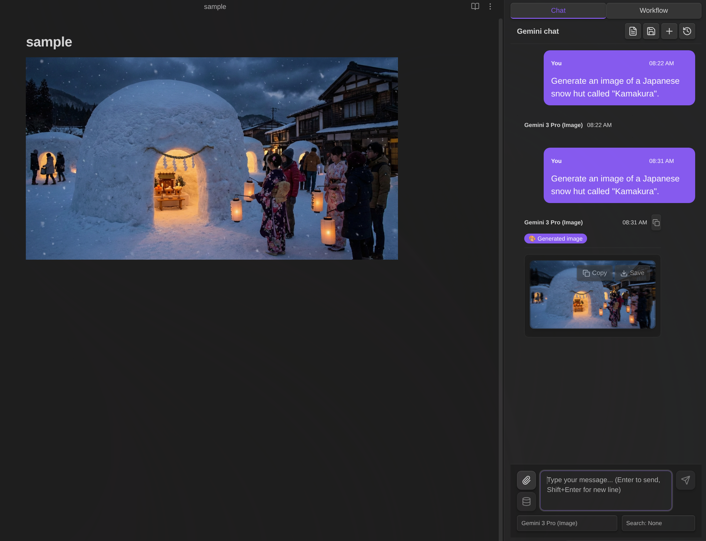

## API Key

This plugin requires a Google Gemini API key. You can choose between:

| Feature | Free API Key | Paid API Key |
|---------|--------------|--------------|
| Basic chat | ✅ | ✅ |
| Vault operations | ✅ | ✅ |
| Web Search | ✅ | ✅ |
| RAG | ✅ (limited) | ✅ |
| Workflow | ✅ | ✅ |
| Image Generation | ❌ | ✅ |
| Models | Flash, Gemma | Flash, Pro, Image |
| Cost | **Free** | Pay per use |

### Free API Key Tips

- **Rate limits** are per-model and reset daily. Switch models to continue working.
- **RAG sync** is limited. Run "Sync Vault" daily - already uploaded files are skipped.

---

# AI Chat

The AI Chat feature provides an interactive conversation interface with Google Gemini, integrated with your Obsidian vault.

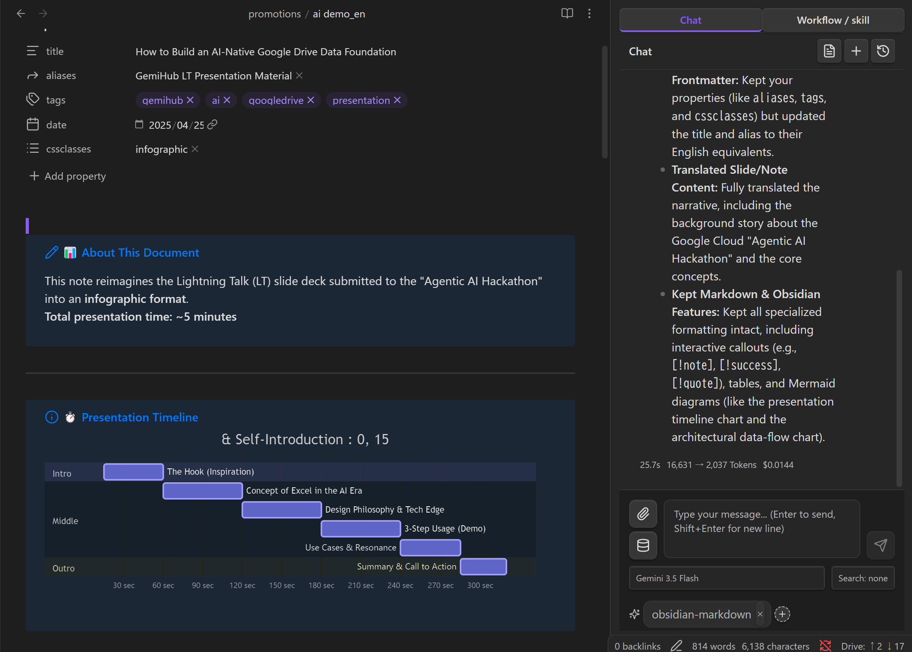

## Opening Chat
- Click Gemini icon in ribbon
- Command: "Gemini Helper: Open chat"
- Toggle: "Gemini Helper: Toggle chat / editor"

## Chat Controls
- **Enter** - Send message
- **Shift+Enter** - New line
- **Stop button** - Stop generation
- **+ button** - New chat
- **History button** - Load previous chats

## Slash Commands

Create reusable prompt templates triggered by `/`:

- Define templates with `{selection}` (selected text) and `{content}` (active note)
- Optional model and search override per command
- Type `/` to see available commands

**Default:** `/infographic` - Converts content to HTML infographic

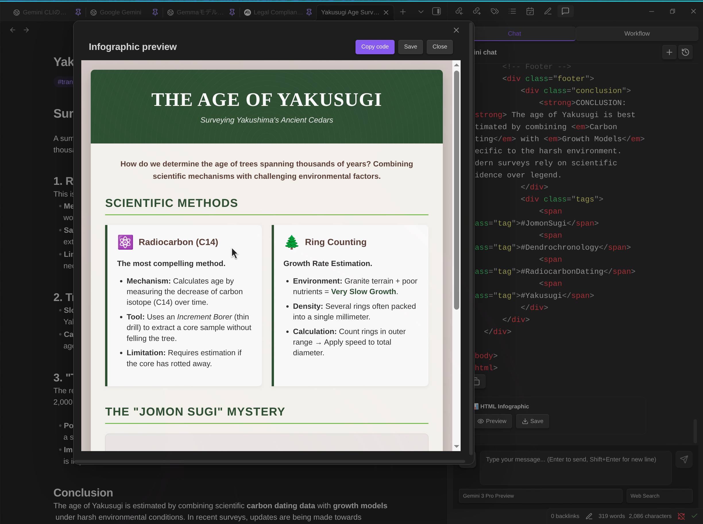

## @ Mentions

Reference files and variables by typing `@`:

- `{selection}` - Selected text
- `{content}` - Active note content
- Any vault file - Browse and insert (path only; AI reads content via tools)

> [!NOTE]
> **How `{selection}` and `{content}` work:** When you switch from Markdown View to Chat View, the selection would normally be cleared due to focus change. To preserve your selection, the plugin captures it when switching views and highlights the selected area with a background color in the Markdown View. The `{selection}` option only appears in @ suggestions when text was selected.
>
> Both `{selection}` and `{content}` are intentionally **not expanded** in the input area—since the chat input is compact, expanding long text would make typing difficult. The content is expanded when you send the message, which you can verify by checking your sent message in the chat.

> [!NOTE]
> Vault file @mentions insert only the file path — the AI reads content via tools.

## File Attachments

Attach files directly: Images (PNG, JPEG, GIF, WebP), PDFs, Text files, Audio (MP3, WAV, FLAC, AAC, Opus, OGG), Video (MP4, WebM, MOV, AVI, MKV)

## Function Calling (Vault Operations)

The AI can interact with your vault using these tools:

| Tool | Description |
|------|-------------|
| `read_note` | Read note content |
| `create_note` | Create new notes |
| `propose_edit` | Edit with confirmation dialog |
| `propose_delete` | Delete with confirmation dialog |
| `bulk_propose_edit` | Bulk edit multiple files with selection dialog |
| `bulk_propose_delete` | Bulk delete multiple files with selection dialog |
| `search_notes` | Search vault by name or content |
| `list_notes` | List notes in folder |
| `rename_note` | Rename/move notes |
| `create_folder` | Create new folders |
| `list_folders` | List folders in vault |
| `get_active_note_info` | Get info about active note |
| `get_rag_sync_status` | Check RAG sync status |
| `bulk_propose_rename` | Bulk rename multiple files with selection dialog |

### Vault Tool Mode

When the AI handles notes in Chat, it uses Vault tools. Control which vault tools the AI can use via the Database icon (📦) below the attachment button:

| Mode | Description | Tools Available |
|------|-------------|-----------------|
| **Vault: All** | Full vault access | All tools |
| **Vault: No search** | Exclude search tools | All except `search_notes`, `list_notes` |
| **Vault: Off** | No vault access | None |

**When to use each mode:**

- **Vault: All** - Default mode for general use. The AI can read, write, and search your vault.
- **Vault: No search** - Use when you want to search only with RAG, or when you already know the target file. This avoids redundant vault searches, saving tokens and improving response time.
- **Vault: Off** - Use when you don't need vault access at all.

> **Note:** RAG, Web Search, Vault tools, and MCP can all be used simultaneously via the Interactions API.

## Safe Editing

When AI uses `propose_edit`:
1. A confirmation dialog shows the proposed changes
2. Click **Apply** to write changes to the file
3. Click **Discard** to cancel without modifying the file

> Changes are NOT written until you confirm.

## Edit History

Track and restore changes made to your notes:

- **Automatic tracking** - All AI edits (chat, workflow) and manual changes are recorded
- **File menu access** - Right-click on a markdown file to access:
  - **Snapshot** - Save current state as a snapshot
  - **History** - Open edit history modal

- **Command palette** - Also available via "Show edit history" command
- **Diff view** - See exactly what changed with color-coded additions/deletions
- **Restore** - Revert to any previous version with one click
- **Copy** - Save a historical version as a new file (default name: `{filename}_{datetime}.md`)
- **Resizable modal** - Drag to move, resize from corners

**Diff display:**
- `+` lines existed in the older version
- `-` lines were added in the newer version

**How it works:**

Edit history uses a snapshot-based approach:

1. **Snapshot creation** - When a file is first opened or modified by AI, a snapshot of its content is saved
2. **Diff recording** - When the file is modified, the difference between the new content and the snapshot is recorded as a history entry
3. **Snapshot update** - The snapshot is updated to the new content after each modification
4. **Restore** - To restore to a previous version, diffs are applied in reverse from the snapshot

**When history is recorded:**
- AI chat edits (`propose_edit` tool)
- Workflow note modifications (`note` node)
- Manual saves via command
- Auto-detection when file differs from snapshot on open

**Storage:** Edit history is stored in memory and cleared on Obsidian restart. Obsidian's built-in file recovery covers persistent version tracking.

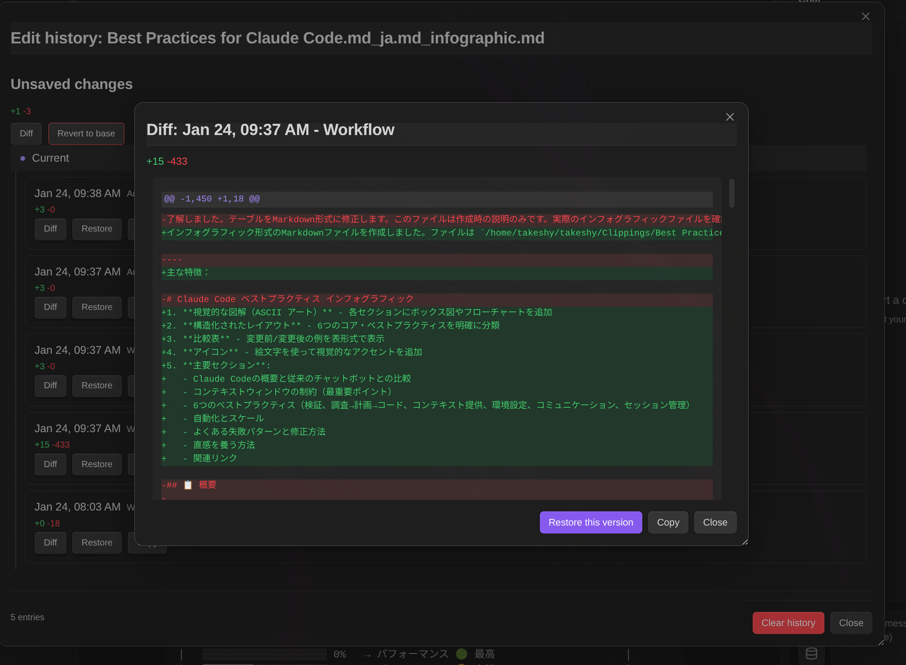

## RAG

Retrieval-Augmented Generation for intelligent vault search:

- **Supported files** - Markdown, PDF, Office documents (Doc, Docx, XLS, XLSX, PPTX)
- **Internal mode** - Sync vault files to Google File Search
- **External mode** - Use existing store IDs
- **Incremental sync** - Only upload changed files
- **Target folders** - Specify folders to include
- **Exclude patterns** - Regex patterns to exclude files

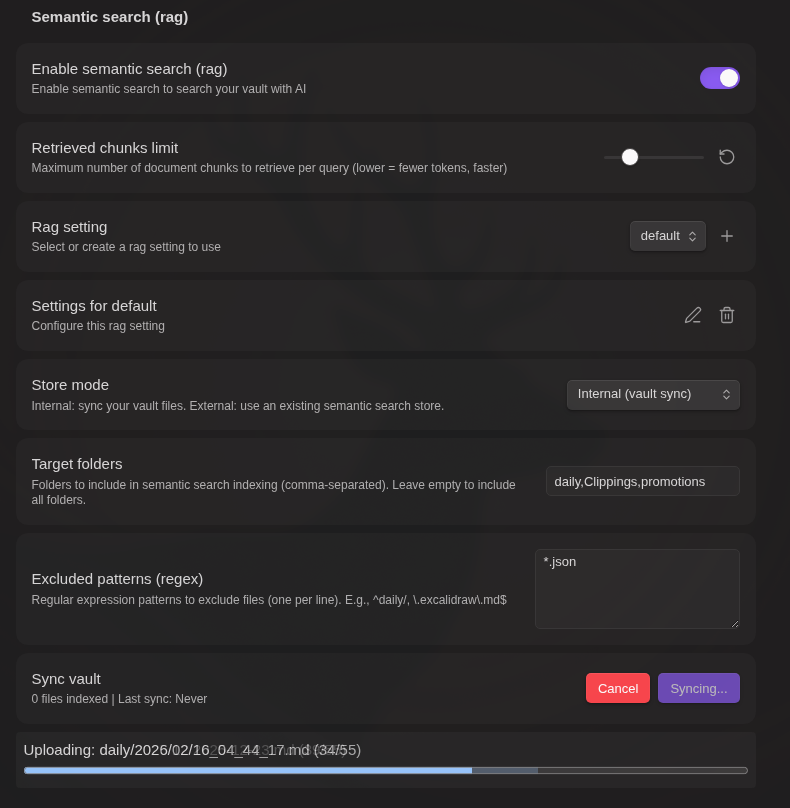

## MCP Servers

MCP (Model Context Protocol) servers provide additional tools that extend the AI's capabilities beyond vault operations.

**Setup:**

1. Open plugin settings → **MCP Servers** section
2. Click **Add server**
3. Enter server name and URL
4. Configure optional headers (JSON format) for authentication
5. Click **Test connection** to verify and retrieve available tools
6. Save the server configuration

> **Note:** Test connection is required before saving. This ensures the server is reachable and displays available tools.

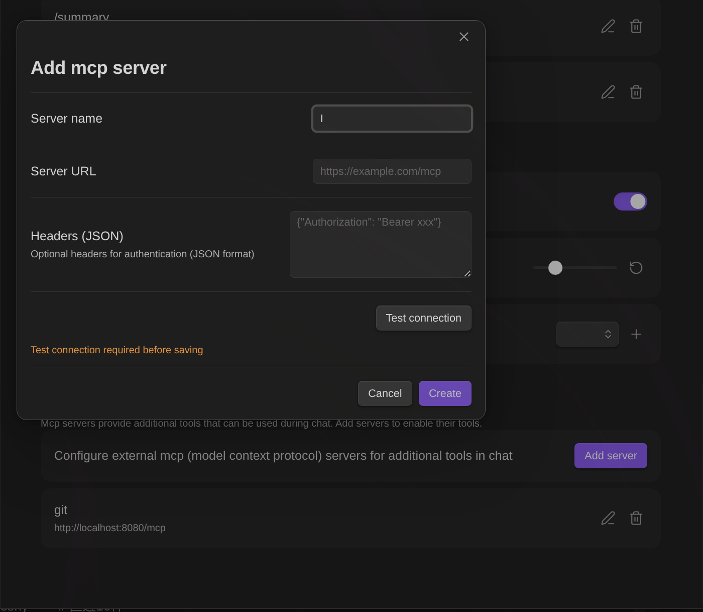

**Using MCP tools:**

- **In Chat:** Click the Database icon (📦) to open tool settings. Enable/disable MCP servers per conversation.
- **In Workflows:** Use the `mcp` node to call MCP server tools.

**Tool hints:** After successful connection test, available tool names are saved and displayed in both settings and chat UI for easy reference.

### MCP Apps (Interactive UI)

Some MCP tools return interactive UI that allows you to interact with the tool results visually. This feature is based on the [MCP Apps specification](https://github.com/anthropics/anthropic-cookbook/tree/main/misc/mcp_apps).

**How it works:**

- When an MCP tool returns a `ui://` resource URI in its response metadata, the plugin fetches and renders the HTML content
- The UI is displayed in a sandboxed iframe for security (`sandbox="allow-scripts allow-forms"`)
- Interactive apps can call additional MCP tools and update context through a JSON-RPC bridge

**In Chat:**
- MCP Apps appear inline in assistant messages with an expand/collapse button
- Click ⊕ to expand the app to full screen, ⊖ to collapse

**In Workflows:**
- MCP Apps are displayed in a modal dialog during workflow execution
- The workflow pauses to allow user interaction, then continues when the modal is closed

> **Security:** All MCP App content runs in a sandboxed iframe with restricted permissions. The iframe cannot access the parent page's DOM, cookies, or local storage. Only `allow-scripts` and `allow-forms` are enabled.

## Agent Skills

Extend the AI with custom instructions, reference materials, and executable workflows. Skills follow the industry-standard agent skills pattern (e.g., [OpenAI Codex](https://github.com/openai/codex) `.codex/skills/`).

- **Built-in skills** - Obsidian-specific knowledge (Markdown, Canvas, Bases) included out of the box. Based on [kepano/obsidian-skills](https://github.com/kepano/obsidian-skills)
- **Custom instructions** - Define domain-specific behavior via `SKILL.md` files
- **Reference materials** - Include style guides, templates, and checklists in `references/`
- **Workflow integration** - Skills can expose workflows as function calling tools
- **Slash command** - Type `/folder-name` to instantly invoke a skill and send
- **Selective activation** - Choose which skills are active per conversation
- **Clickable skill chips** - Active skill chips in the input area and on assistant messages are clickable and jump to the matching `SKILL.md` (built-in skills are shown as static labels)
- **Workflow error recovery** - If a skill workflow fails during a chat, the failing tool call shows an **Open workflow** button that opens the file *and* switches the Gemini view to the Workflow / skill tab so you can immediately edit and re-run

Create skills the same way as workflows — select **+ New (AI)**, check **"Create as agent skill"**, and describe what you want. The AI generates both the `SKILL.md` instructions and the workflow. To edit an existing skill, open its `SKILL.md` and click **Modify skill with AI** in the Workflow / skill tab — the AI updates both the instructions body and the referenced workflow together.

> **For setup instructions and examples, see [SKILLS.md](docs/SKILLS.md)**

---

# Workflow Builder

Build automated multi-step workflows directly in Markdown files. **No programming knowledge required** - just describe what you want in natural language, and the AI will create the workflow for you.

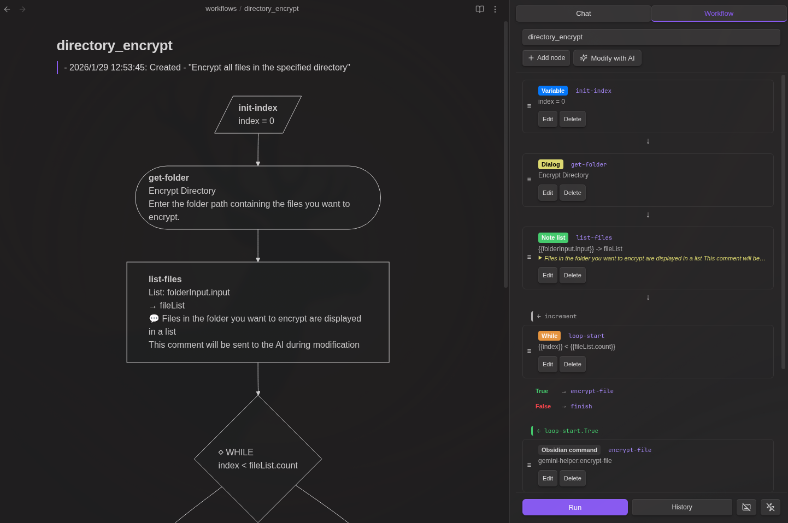

## Running Workflows

**From Sidebar:**
1. Open **Workflow / skill** tab in sidebar
2. Open a file with a `workflow` code block (each file holds exactly one workflow — the filename is its display name)
3. Choose **Browse all workflows** from the dropdown to switch to another workflow file anywhere in the vault
4. Click **Run** to execute
5. Click **History** to view past runs

> **Migrating legacy files:** If you open a file that still contains multiple `workflow` code blocks (from before the 1-file-1-workflow redesign), the panel shows a **Split into individual files** button that writes blocks 2..N to sibling files. Skill capabilities, hotkeys, and event triggers bound to the original path stay attached to the first workflow — rebind them manually if needed.

**From Command Palette (Run Workflow):**

Use the command "Gemini Helper: Run Workflow" to browse and execute workflows from anywhere:

1. Open command palette and search "Run Workflow"
2. Browse all vault files with workflow code blocks (files in `workflows/` folder are shown first)
3. Preview the workflow content and AI generation history
4. Select a workflow and click **Run** to execute

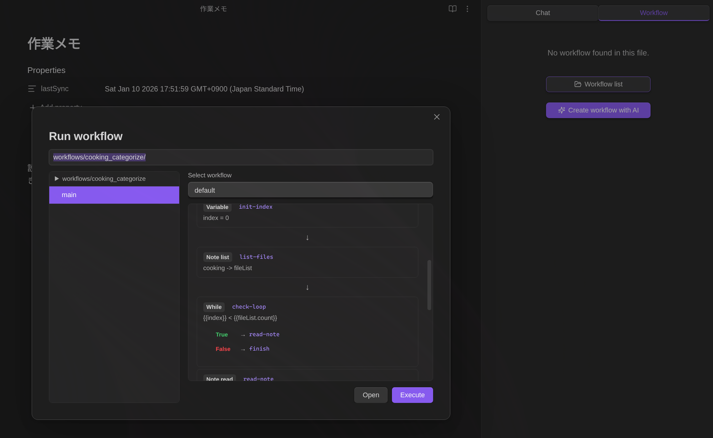

This is useful for quickly running workflows without navigating to the workflow file first.

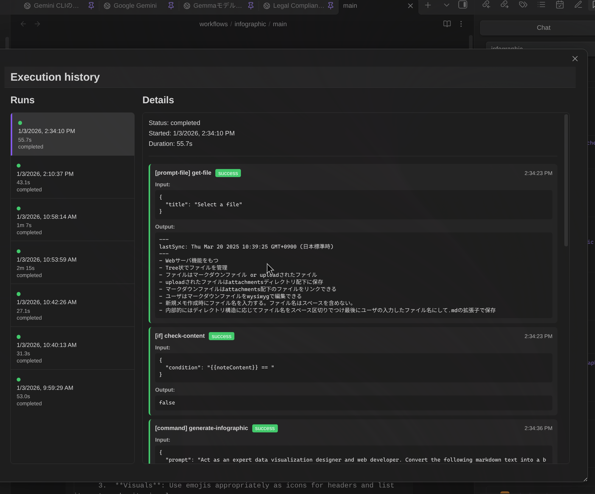

## AI-Powered Workflow & Skill Creation

**You don't need to learn YAML syntax or node types.** Simply describe your workflow in plain language:

1. Open the **Workflow / skill** tab in the Gemini sidebar
2. Select **+ New (AI)** from the dropdown
3. Describe what you want: *"Create a workflow that summarizes the selected note and saves it to a summaries folder"*
4. Check **"Create as agent skill"** if you want to create an agent skill instead of a standalone workflow
5. Select a model and click **Generate**
6. The AI produces a plain-language **plan** first — review it and click **OK** to proceed, **Re-plan** to give feedback and regenerate the plan, or **Cancel** to abort
7. After generation, the AI runs a **review** over the result. If issues are found you can **OK** (with a confirmation prompt), **Refine** (regenerate using the review feedback), or **Cancel**. Clean reviews proceed automatically
8. The workflow is saved once you accept the final preview

> **Tip:** When using **+ New (AI)** from the dropdown on a file that already has a workflow block, the output path defaults to the current file's path. Because each file can only hold one workflow, the modal asks you to pick a different output path if that target is already taken.

**Create workflow from any file:**

When opening the Workflow / skill tab with a file that has no workflow code block, a **"Create workflow with AI"** button is displayed. Click it to generate a new workflow (default output: `workflows/{{name}}.md`).

**@ File References:**

Type `@` in the description field to reference files:
- `@{selection}` - Current editor selection
- `@{content}` - Active note content
- `@path/to/file.md` - Any vault file

When you click Generate, file content is embedded directly into the AI request. YAML frontmatter is automatically stripped.

> **Tip:** This is useful for creating workflows based on existing workflow examples or templates in your vault.

**File Attachments:**

Click the attachment button to attach files (images, PDFs, text files) to your workflow generation request. This is useful for providing visual context or examples to the AI.

**Using External LLMs (Copy Prompt / Paste Response):**

You can use any external LLM (Claude, GPT, etc.) to generate workflows:

1. Enter the workflow name and description as usual
2. Click **Copy Prompt** - the full prompt is copied to your clipboard
3. Paste the prompt into your preferred LLM
4. Copy the LLM's response
5. Paste it into the **Paste Response** textarea that appears
6. Click **Apply** to create the workflow

The pasted response can be either raw YAML or a full Markdown document with `` ```workflow `` code blocks. Markdown responses are saved as-is, preserving any documentation the LLM included.

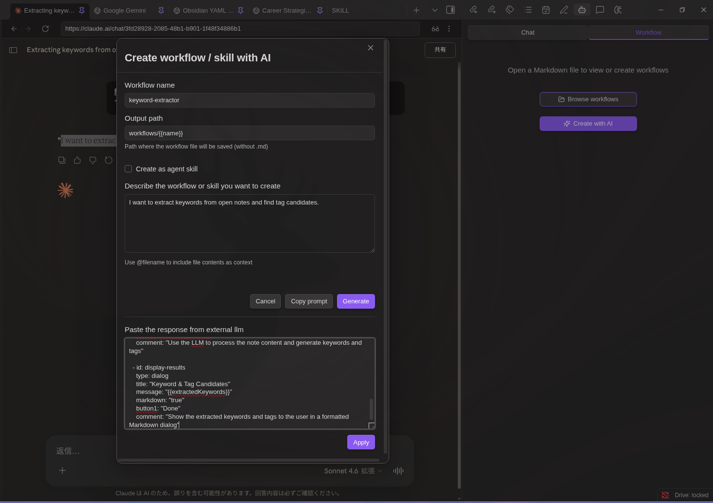

**Modal Controls:**

The AI workflow modal supports drag-and-drop positioning and corner resizing for a better editing experience.

**Request History:**

Each AI-generated workflow saves a history entry above the workflow code block, including:
- Timestamp and action (Created/Modified)
- Your request description
- Referenced file contents (in collapsible sections)
**Modify existing workflows the same way:**
1. Load any workflow
2. Click the **AI Modify** button (sparkle icon)
3. Describe changes: *"Add a step to translate the summary to Japanese"*
4. The same plan → generate → review flow runs. You can **Refine** the review result as many times as you want; each Refine triggers a new generation pass and a fresh review so the review always matches the final YAML
5. Review the before/after diff
6. Click **Apply Changes** to update

**Modify Skill with AI:**

When the active file is a `SKILL.md`, the Workflow / skill tab shows a **"Modify skill with AI"** button instead of (or alongside) the regular workflow modifier. It edits the skill as a whole — both the SKILL.md instructions body *and* the referenced workflow file — in one pass, preserving the skill's frontmatter (name, description, workflow entries).

**Execution History Reference:**

When modifying a workflow with AI, you can reference previous execution results to help the AI understand issues:

1. Click **Reference execution history** button
2. Select an execution run from the list (error runs are highlighted)
3. Choose which steps to include (error steps are pre-selected)
4. The AI receives the step input/output data to understand what went wrong

This is especially useful for debugging workflows - you can tell the AI "Fix the error in step 2" and it will see exactly what input caused the failure.

**Request History:**

When regenerating a workflow (clicking "No" on the preview), all previous requests in the session are passed to the AI. This helps the AI understand the full context of your modifications across multiple iterations.

**Manual Workflow Editing:**

Edit workflows directly in the visual node editor with drag-and-drop interface.

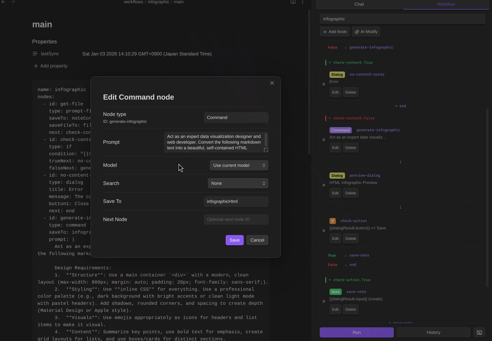

**Reload from File:**
- Select **Reload from file** from the dropdown to re-import workflow from the markdown file

## Available Node Types

24 node types are available for building workflows:

| Category | Nodes |
|----------|-------|
| Variables | `variable`, `set` |
| Control | `if`, `while` |
| LLM | `command` |
| Data | `http`, `json`, `script` |
| Notes | `note`, `note-read`, `note-search`, `note-list`, `folder-list`, `open` |
| Files | `file-explorer`, `file-save` |
| Prompts | `prompt-file`, `prompt-selection`, `dialog` |
| Composition | `workflow` |
| RAG | `rag-sync` |
| External | `mcp`, `obsidian-command` |
| Utility | `sleep` |

> **For detailed node specifications and examples, see [WORKFLOW_NODES.md](docs/WORKFLOW_NODES.md)**

## Hotkey Mode

Assign keyboard shortcuts to run workflows instantly:

1. Open the workflow file (the filename becomes the hotkey's display name)
2. Click the keyboard icon (⌨️) in the Workflow panel footer
3. Go to Settings → Hotkeys → search "Workflow: [filename]"
4. Assign a hotkey (e.g., `Ctrl+Shift+T`)

When triggered by hotkey:
- `prompt-file` uses the active file automatically (no dialog)
- `prompt-selection` uses the current selection, or full file content if no selection

## Event Triggers

Workflows can be automatically triggered by Obsidian events:

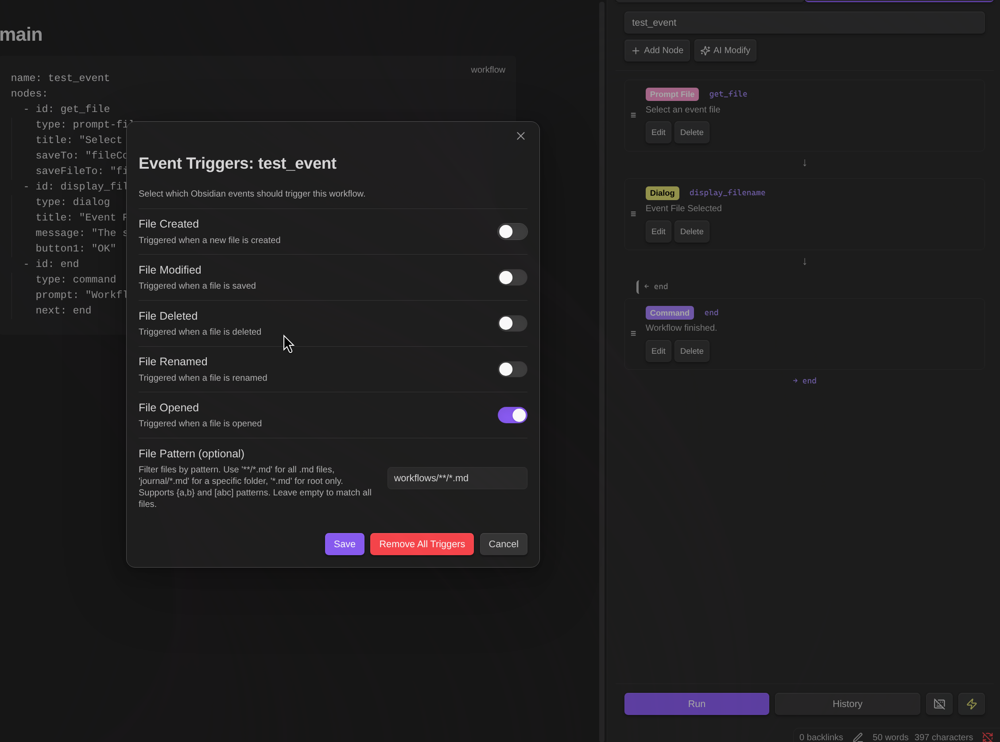

| Event | Description |
|-------|-------------|
| File Created | Triggered when a new file is created |
| File Modified | Triggered when a file is saved (debounced 5s) |
| File Deleted | Triggered when a file is deleted |
| File Renamed | Triggered when a file is renamed |
| File Opened | Triggered when a file is opened |

**Event trigger setup:**
1. Open the workflow file (the filename is used as the trigger's display name)
2. Click the zap icon (⚡) in the Workflow panel footer
3. Select which events should trigger the workflow
4. Optionally add a file pattern filter

**File pattern examples:**
- `**/*.md` - All Markdown files in any folder
- `journal/*.md` - Markdown files in journal folder only
- `*.md` - Markdown files in root folder only
- `**/{daily,weekly}/*.md` - Files in daily or weekly folders
- `projects/[a-z]*.md` - Files starting with lowercase letter

**Event variables:** When triggered by an event, these variables are set automatically:

| Variable | Description |
|----------|-------------|
| `_eventType` | Event type: `create`, `modify`, `delete`, `rename`, `file-open` |
| `_eventFilePath` | Path of the affected file |
| `_eventFile` | JSON with file info (path, basename, name, extension) |
| `_eventFileContent` | File content (for create/modify/file-open events) |
| `_eventOldPath` | Previous path (for rename events only) |

> **Note:** `prompt-file` and `prompt-selection` nodes automatically use the event file when triggered by events. `prompt-selection` uses the entire file content as the selection.

---

# Common

## Supported Models

### Paid Plan
| Model | Description |
|-------|-------------|
| Gemini 3.1 Pro Preview | Latest flagship model, 1M context (recommended) |
| Gemini 3.1 Pro Preview (Custom Tools) | Optimized for agentic workflows with custom tools and bash |
| Gemini 3 Flash Preview | Fast model, 1M context, best cost-performance |
| Gemini 3.1 Flash Lite Preview | Most cost-effective model with high performance |
| Gemini 2.5 Flash | Fast model, 1M context |
| Gemini 2.5 Pro | Pro model, 1M context |
| Gemini 3 Pro (Image) | Pro image generation, 4K |
| Gemini 3.1 Flash (Image) | Fast, low-cost image generation |

> **Thinking mode:** In Chat, thinking mode is triggered by keywords like "think", "analyze", or "consider" in your message. However, **Gemini 3.1 Pro** always uses thinking mode regardless of keywords — this model does not support disabling thinking.

**Always Think toggle:**

You can force thinking mode ON for Flash models without using keywords. Click the Database icon (📦) to open the tool menu, and check the toggles under **Always Think**:

- **Flash** — OFF by default. Check to always enable thinking for Flash models.
- **Flash Lite** — ON by default. Flash Lite has minimal cost and speed difference with thinking enabled, so it is recommended to keep this on.

When a toggle is ON, thinking is always active for that model family regardless of message content. When OFF, the existing keyword-based detection is used.

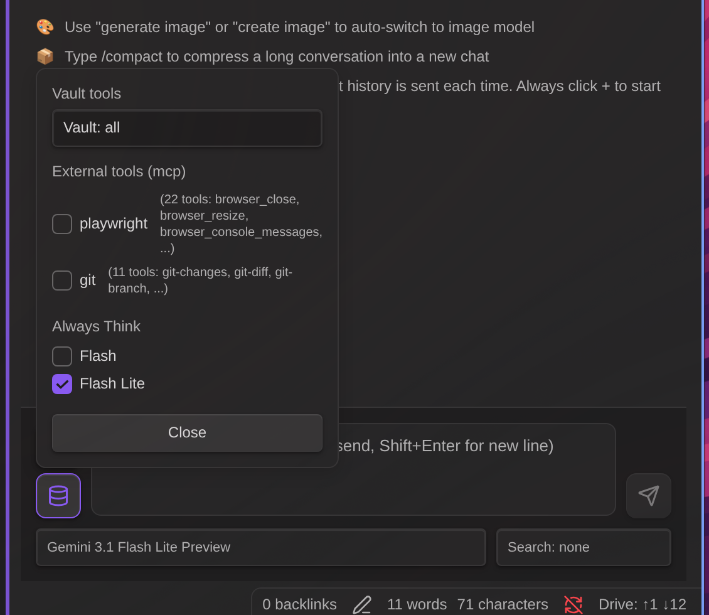

### Free Plan
| Model | Vault Operations |
|-------|------------------|
| Gemini 2.5 Flash | ✅ |
| Gemini 2.5 Flash Lite | ✅ |
| Gemini 3 Flash Preview | ✅ |
| Gemini 3.1 Flash Lite Preview | ✅ |
| Gemma 4 (31B, 26B A4B MoE) | ✅ |

## Installation

### BRAT (Recommended)
1. Install [BRAT](https://github.com/TfTHacker/obsidian42-brat) plugin
2. Open BRAT settings → "Add Beta plugin"
3. Enter: `https://github.com/takeshy/obsidian-gemini-helper`
4. Enable the plugin in Community plugins settings

### Manual
1. Download `main.js`, `manifest.json`, `styles.css` from releases
2. Create `gemini-helper` folder in `.obsidian/plugins/`
3. Copy files and enable in Obsidian settings

### From Source
```bash
git clone https://github.com/takeshy/obsidian-gemini-helper
cd obsidian-gemini-helper
npm install
npm run build
```

## Configuration

### API Settings
1. Get API key from [ai.google.dev](https://ai.google.dev)
2. Enter in plugin settings
3. Select API plan (Free/Paid)

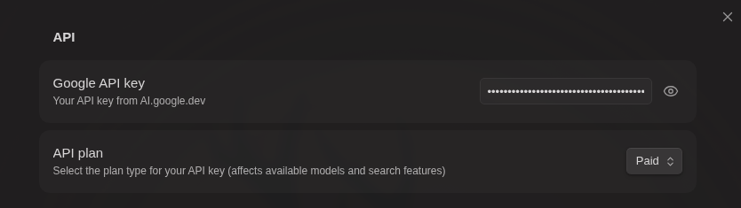

### Workspace Settings
- **System Prompt** - Additional AI instructions
- **Tool Limits** - Control function call limits

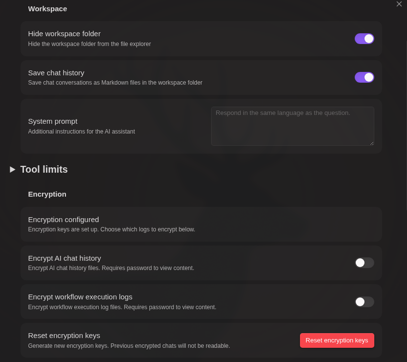

### Encryption

Password-protect your chat history and workflow execution logs separately.

**Setup:**

1. Set a password in plugin settings (stored securely using public-key cryptography)

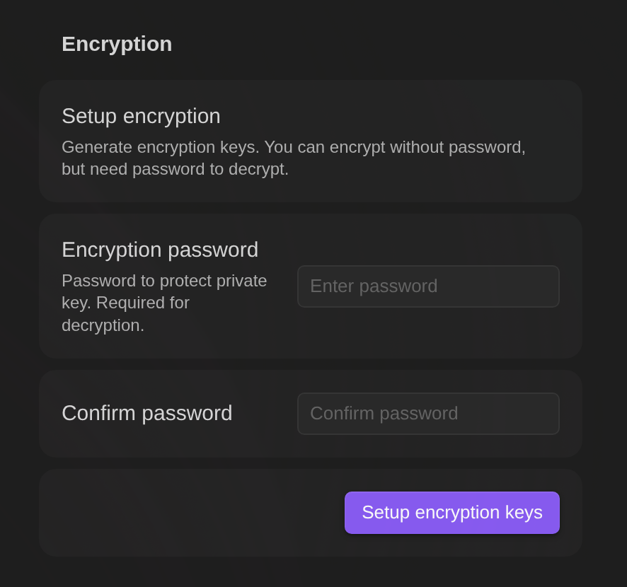

2. After setup, toggle encryption for each log type:
   - **Encrypt AI chat history** - Encrypt chat conversation files
   - **Encrypt workflow execution logs** - Encrypt workflow history files

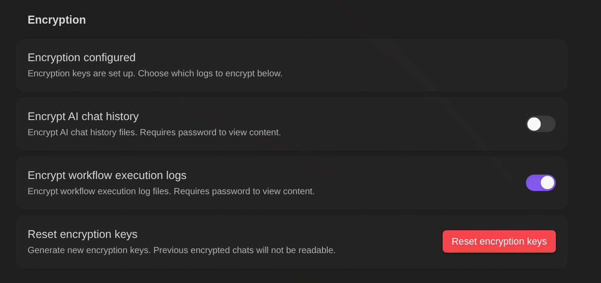

Each setting can be enabled/disabled independently.

**Features:**
- **Separate controls** - Choose which logs to encrypt (chat, workflow, or both)
- **Automatic encryption** - New files are encrypted when saved based on settings
- **Password caching** - Enter password once per session
- **Dedicated viewer** - Encrypted files open in a secure editor with preview
- **Decrypt option** - Remove encryption from individual files when needed

**How it works:**

```
[Setup - once when setting password]
Password → Generate key pair (RSA) → Encrypt private key → Store in settings

[Encryption - for each file]
File content → Encrypt with new AES key → Encrypt AES key with public key
→ Save to file: encrypted data + encrypted private key (from settings) + salt

[Decryption]
Password + salt → Restore private key → Decrypt AES key → Decrypt file content
```

- Key pair is generated once (RSA generation is slow), AES key is generated per file
- Each file stores: encrypted content + encrypted private key (copied from settings) + salt
- Files are self-contained — decryptable with just the password, no plugin dependency

<details>
<summary>Python decryption script (click to expand)</summary>

```python
#!/usr/bin/env python3
"""Decrypt Gemini Helper encrypted files without the plugin."""
import base64, sys, re, getpass
from cryptography.hazmat.primitives import hashes, serialization
from cryptography.hazmat.primitives.kdf.pbkdf2 import PBKDF2HMAC
from cryptography.hazmat.primitives.ciphers.aead import AESGCM
from cryptography.hazmat.primitives.asymmetric import padding

def decrypt_file(filepath: str, password: str) -> str:
    with open(filepath, 'r') as f:
        content = f.read()

    # Parse YAML frontmatter
    match = re.match(r'^---\n([\s\S]*?)\n---\n([\s\S]*)$', content)
    if not match:
        raise ValueError("Invalid encrypted file format")

    frontmatter, encrypted_data = match.groups()
    key_match = re.search(r'key:\s*(.+)', frontmatter)
    salt_match = re.search(r'salt:\s*(.+)', frontmatter)
    if not key_match or not salt_match:
        raise ValueError("Missing key or salt in frontmatter")

    enc_private_key = base64.b64decode(key_match.group(1).strip())
    salt = base64.b64decode(salt_match.group(1).strip())
    data = base64.b64decode(encrypted_data.strip())

    # Derive key from password
    kdf = PBKDF2HMAC(algorithm=hashes.SHA256(), length=32, salt=salt, iterations=100000)
    derived_key = kdf.derive(password.encode())

    # Decrypt private key
    iv, enc_priv = enc_private_key[:12], enc_private_key[12:]
    private_key_pem = AESGCM(derived_key).decrypt(iv, enc_priv, None)
    private_key = serialization.load_der_private_key(base64.b64decode(private_key_pem), None)

    # Parse encrypted data: key_length(2) + enc_aes_key + iv(12) + enc_content
    key_len = (data[0] << 8) | data[1]
    enc_aes_key = data[2:2+key_len]
    content_iv = data[2+key_len:2+key_len+12]
    enc_content = data[2+key_len+12:]

    # Decrypt AES key with RSA private key
    aes_key = private_key.decrypt(enc_aes_key, padding.OAEP(
        mgf=padding.MGF1(algorithm=hashes.SHA256()), algorithm=hashes.SHA256(), label=None))

    # Decrypt content
    return AESGCM(aes_key).decrypt(content_iv, enc_content, None).decode('utf-8')

if __name__ == "__main__":
    if len(sys.argv) != 2:
        print(f"Usage: {sys.argv[0]} <encrypted_file>")
        sys.exit(1)
    password = getpass.getpass("Password: ")
    print(decrypt_file(sys.argv[1], password))
```

Requires: `pip install cryptography`

</details>

> **Warning:** If you forget your password, encrypted files cannot be recovered. Keep your password safe.

> **Tip:** To encrypt all files in a directory at once, use a workflow. See the "Encrypt all files in a directory" example in [WORKFLOW_NODES.md](docs/WORKFLOW_NODES.md#obsidian-command).


**Security benefits:**
- **Protected from AI chat** - Encrypted files cannot be read by AI vault operations (`read_note` tool). This keeps sensitive data like API keys safe from accidental exposure during chat.
- **Workflow access with password** - Workflows can read encrypted files using the `note-read` node. When accessed, a password dialog appears, and the password is cached for the session.
- **Store secrets safely** - Instead of writing API keys directly in workflows, store them in encrypted files. The workflow reads the key at runtime after password verification.

### Slash Commands
- Define custom prompt templates triggered by `/`
- Optional model and search override per command

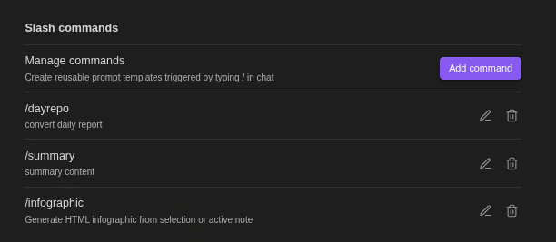

## Requirements

- Obsidian v0.15.0+
- Google AI API key
- Desktop and mobile supported

## Privacy

**Data stored locally:**
- API key (stored in Obsidian settings)
- Chat history (as Markdown files, optionally encrypted)
- Workflow execution history (optionally encrypted)
- Encryption keys (private key encrypted with your password)

**Data sent to Google:**
- All chat messages and file attachments are sent to Google Gemini API for processing
- When RAG is enabled, vault files are uploaded to Google File Search
- When Web Search is enabled, queries are sent to Google Search

**Data sent to third-party services:**
- Workflow `http` nodes can send data to any URL specified in the workflow

**MCP servers (optional):**
- MCP (Model Context Protocol) servers can be configured in plugin settings for workflow `mcp` nodes
- MCP servers are external services that provide additional tools and capabilities

**Security notes:**
- Review workflows before running - `http` nodes can transmit vault data to external endpoints
- Workflow `note` nodes show a confirmation dialog before writing files (default behavior)
- Slash commands with `confirmEdits: false` will auto-apply file edits without showing Apply/Discard buttons
- Sensitive credentials: Do not store API keys or tokens directly in workflow YAML (`http` headers, `mcp` settings, etc.). Instead, store them in encrypted files and use `note-read` node to retrieve them at runtime. Workflows can read encrypted files with password prompt.

See [Google AI Terms of Service](https://ai.google.dev/terms) for data retention policies.

## License

MIT

## Links

- [Gemini API Docs](https://ai.google.dev/docs)
- [Obsidian Plugin Docs](https://docs.obsidian.md/Plugins/Getting+started/Build+a+plugin)

## Support

If you find this plugin useful, consider buying me a coffee!

[](https://buymeacoffee.com/takeshy)
