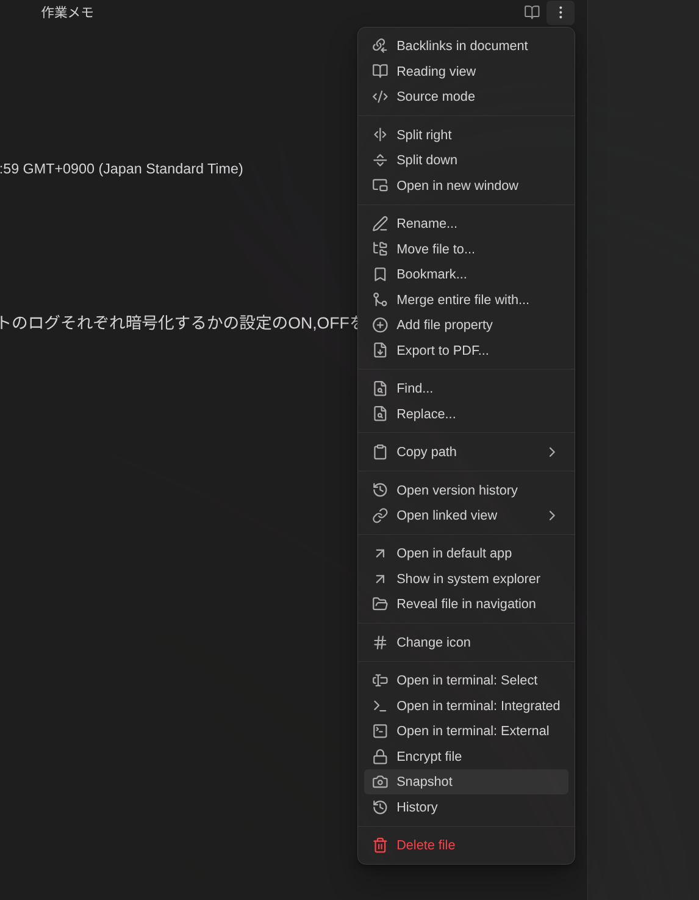
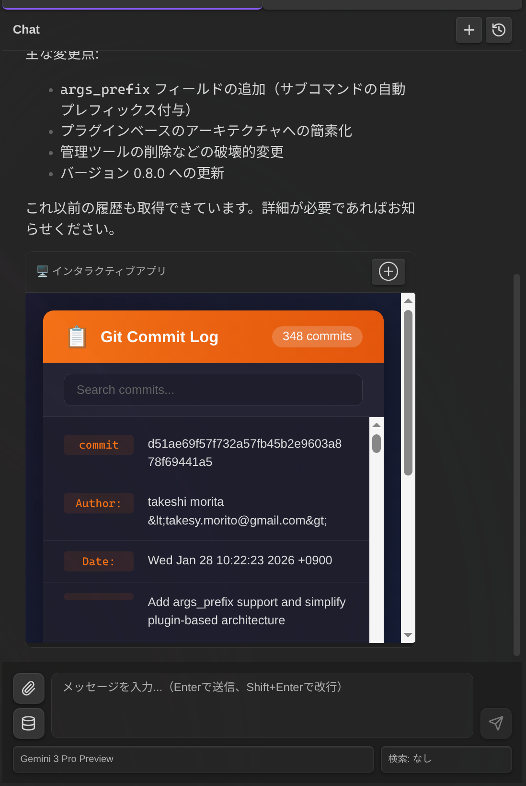
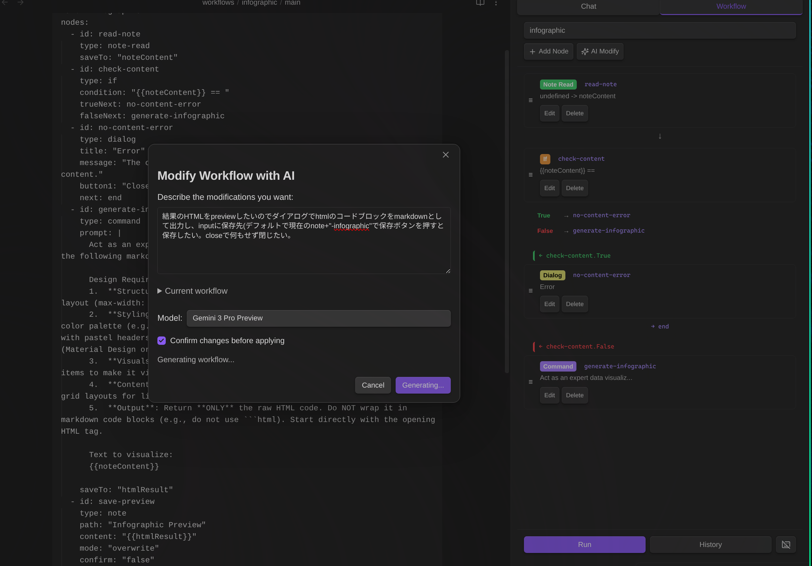
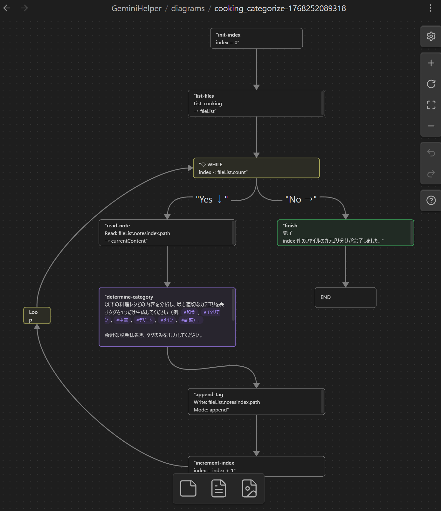
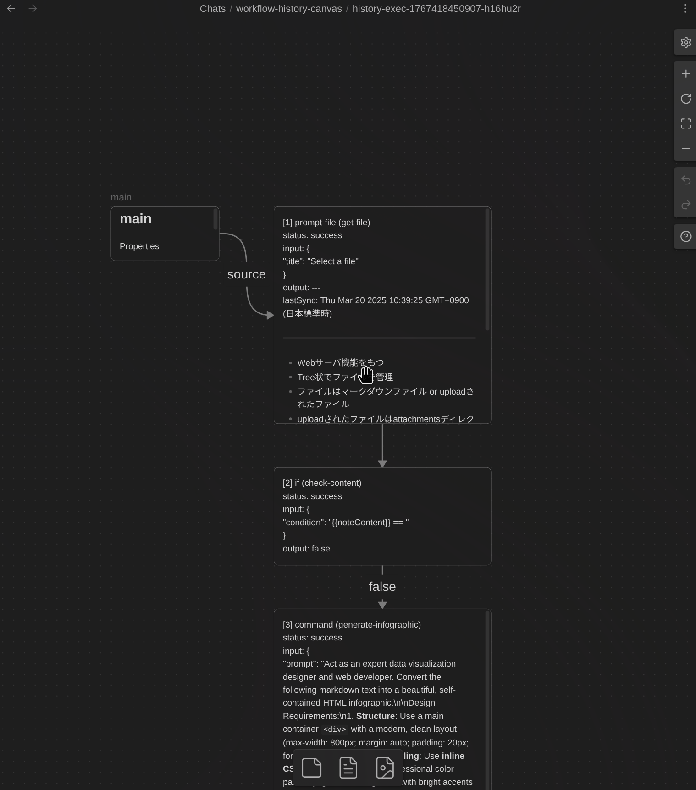
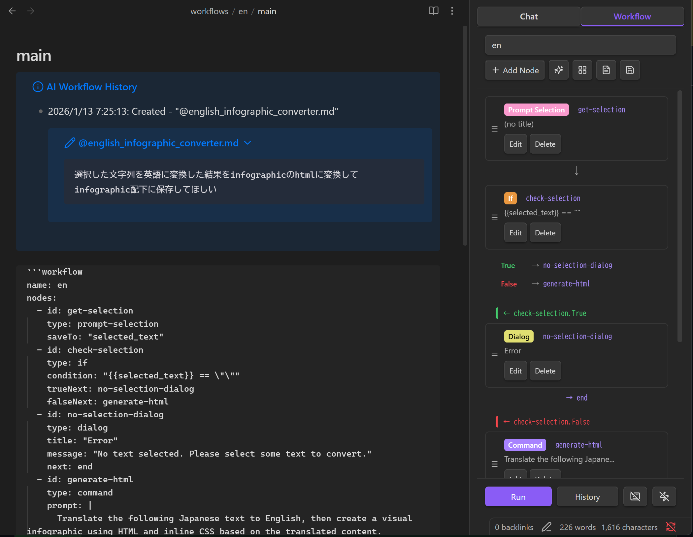
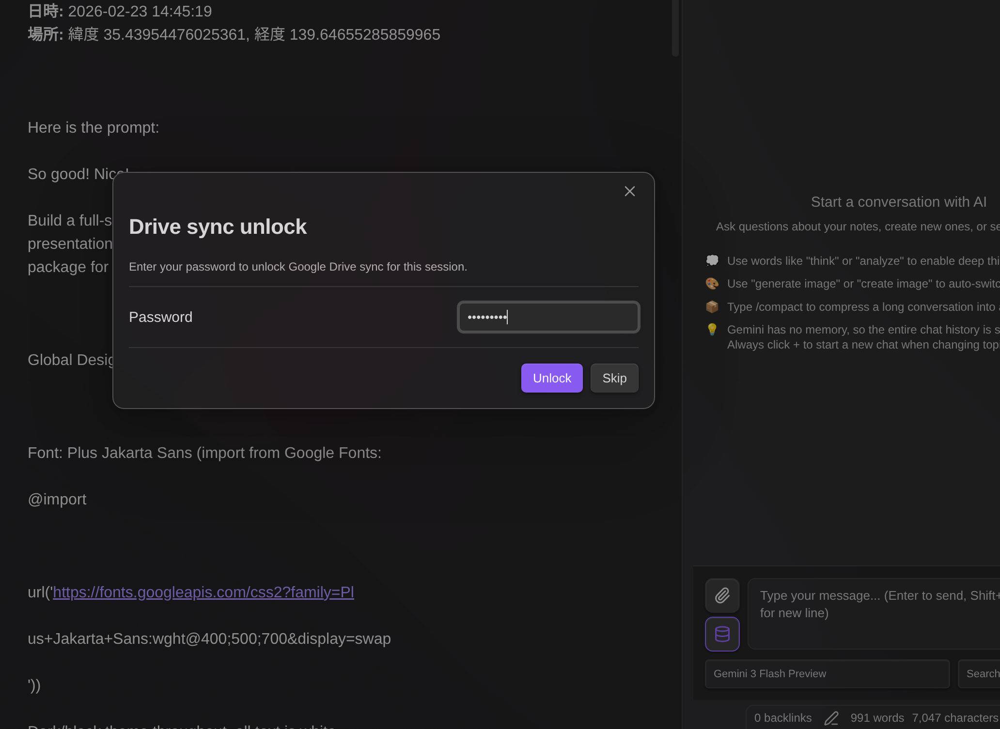

# Gemini Helper para Obsidian

[](https://deepwiki.com/takeshy/obsidian-gemini-helper)

Asistente de IA **gratuito y de código abierto** para Obsidian con **Chat**, **Automatización de Flujos de Trabajo** y **RAG** impulsado por Google Gemini.

> **Este plugin es completamente gratuito.** Solo necesitas una clave API de Google Gemini (gratuita o de pago) de [ai.google.dev](https://ai.google.dev), o usar herramientas CLI: [Gemini CLI](https://github.com/google-gemini/gemini-cli), [Claude Code](https://github.com/anthropics/claude-code) o [Codex CLI](https://github.com/openai/codex).

## Características Principales

- **Chat con IA** - Respuestas en streaming, archivos adjuntos, operaciones en el vault, comandos slash
- **Constructor de Flujos de Trabajo** - Automatiza tareas de múltiples pasos con editor visual de nodos y 23 tipos de nodos
- **Historial de Edición** - Rastrea y restaura cambios hechos por IA con vista de diferencias
- **RAG** - Generación Aumentada por Recuperación para búsqueda inteligente en tu vault
- **Búsqueda Web** - Accede a información actualizada a través de Google Search
- **Generación de Imágenes** - Crea imágenes con los modelos de imagen de Gemini
- **Cifrado** - Protege con contraseña el historial de chat y los registros de ejecución de workflows


## Opciones de Clave API / CLI

Este plugin requiere una clave API de Google Gemini o una herramienta CLI. Puedes elegir entre:

| Característica | Clave API Gratuita | Clave API de Pago | CLI |
|----------------|--------------------|--------------------|-----|
| Chat básico | ✅ | ✅ | ✅ |
| Operaciones en vault | ✅ | ✅ | Solo Lectura/Búsqueda |
| Búsqueda Web | ✅ | ✅ | ❌ |
| RAG | ✅ (limitado) | ✅ | ❌ |
| Flujos de trabajo | ✅ | ✅ | ✅ |
| Generación de imágenes | ❌ | ✅ | ❌ |
| Modelos | Flash, Gemma | Flash, Pro, Image | Gemini CLI, Claude Code, Codex |
| Costo | **Gratis** | Pago por uso | **Gratis** |

> [!TIP]
> ¡Las **Opciones CLI** te permiten usar modelos de última generación solo con una cuenta - sin necesidad de clave API!
> - **Gemini CLI**: Instala [Gemini CLI](https://github.com/google-gemini/gemini-cli), ejecuta `gemini` y autentícate con `/auth`
> - **Claude CLI**: Instala [Claude Code](https://github.com/anthropics/claude-code) (`npm install -g @anthropic-ai/claude-code`), ejecuta `claude` y autentícate
> - **Codex CLI**: Instala [Codex CLI](https://github.com/openai/codex) (`npm install -g @openai/codex`), ejecuta `codex` y autentícate

### Consejos para la Clave API Gratuita

- Los **límites de frecuencia** son por modelo y se reinician diariamente. Cambia de modelo para continuar trabajando.
- La **sincronización RAG** es limitada. Ejecuta "Sync Vault" diariamente - los archivos ya subidos se omiten.
- Los **modelos Gemma** y **Gemini CLI** no soportan operaciones en el vault en Chat, pero **los Flujos de Trabajo aún pueden leer/escribir notas** usando los tipos de nodo `note`, `note-read` y otros. Las variables `{content}` y `{selection}` también funcionan.

---

# Chat con IA

La función de Chat con IA proporciona una interfaz de conversación interactiva con Google Gemini, integrada con tu vault de Obsidian.


## Comandos Slash

Crea plantillas de prompts reutilizables activadas con `/`:

- Define plantillas con `{selection}` (texto seleccionado) y `{content}` (nota activa)
- Modelo opcional y anulación de búsqueda por comando
- Escribe `/` para ver los comandos disponibles

**Por defecto:** `/infographic` - Convierte contenido en infografía HTML


## Menciones con @

Referencia archivos y variables escribiendo `@`:

- `{selection}` - Texto seleccionado
- `{content}` - Contenido de la nota activa
- Cualquier archivo del vault - Navega e inserta (solo ruta; la IA lee el contenido mediante herramientas)

> [!NOTE]
> **Cómo funcionan `{selection}` y `{content}`:** Cuando cambias de la Vista Markdown a la Vista de Chat, la selección normalmente se borraría debido al cambio de foco. Para preservar tu selección, el plugin la captura al cambiar de vista y resalta el área seleccionada con un color de fondo en la Vista Markdown. La opción `{selection}` solo aparece en las sugerencias de @ cuando hay texto seleccionado.
>
> Tanto `{selection}` como `{content}` **no se expanden** intencionalmente en el área de entrada—dado que la entrada del chat es compacta, expandir texto largo dificultaría la escritura. El contenido se expande cuando envías el mensaje, lo cual puedes verificar revisando tu mensaje enviado en el chat.

> [!NOTE]
> Las menciones @ de archivos del vault insertan solo la ruta del archivo - la IA lee el contenido mediante herramientas. Esto no funciona con modelos Gemma (sin soporte de herramientas del vault). Gemini CLI puede leer archivos a través de shell, pero el formato de respuesta puede diferir.

## Archivos Adjuntos

Adjunta archivos directamente: Imágenes (PNG, JPEG, GIF, WebP), PDFs, Archivos de texto

## Llamada a Funciones (Operaciones en el Vault)

La IA puede interactuar con tu vault usando estas herramientas:

| Herramienta | Descripción |
|-------------|-------------|
| `read_note` | Leer contenido de nota |
| `create_note` | Crear nuevas notas |
| `propose_edit` | Editar con diálogo de confirmación |
| `propose_delete` | Eliminar con diálogo de confirmación |
| `bulk_propose_edit` | Edición masiva de múltiples archivos con diálogo de selección |
| `bulk_propose_delete` | Eliminación masiva de múltiples archivos con diálogo de selección |
| `search_notes` | Buscar en el vault por nombre o contenido |
| `list_notes` | Listar notas en carpeta |
| `rename_note` | Renombrar/mover notas |
| `create_folder` | Crear nuevas carpetas |
| `list_folders` | Listar carpetas en el vault |
| `get_active_note_info` | Obtener información sobre la nota activa |
| `get_rag_sync_status` | Verificar estado de sincronización RAG |

### Modo de Herramientas del Vault

Cuando la IA maneja notas en el Chat, usa herramientas del Vault. Controla qué herramientas del vault puede usar la IA mediante el icono de base de datos (📦) debajo del botón de adjuntos:

| Modo | Descripción | Herramientas Disponibles |
|------|-------------|--------------------------|
| **Vault: Todo** | Acceso completo al vault | Todas las herramientas |
| **Vault: Sin búsqueda** | Excluir herramientas de búsqueda | Todas excepto `search_notes`, `list_notes` |
| **Vault: Desactivado** | Sin acceso al vault | Ninguna |

**Cuándo usar cada modo:**

- **Vault: Todo** - Modo predeterminado para uso general. La IA puede leer, escribir y buscar en tu vault.
- **Vault: Sin búsqueda** - Úsalo cuando quieras buscar solo con RAG, o cuando ya conoces el archivo objetivo. Esto evita búsquedas redundantes en el vault, ahorrando tokens y mejorando el tiempo de respuesta.
- **Vault: Desactivado** - Úsalo cuando no necesitas acceso al vault en absoluto.

**Selección automática de modo:**

| Condición | Modo Predeterminado | Modificable |
|-----------|---------------------|-------------|
| Modelos CLI (Gemini/Claude/Codex CLI) | Vault: Desactivado | No |
| Modelos Gemma | Vault: Desactivado | No |
| Web Search habilitado | Vault: Desactivado | No |
| RAG habilitado | Vault: Desactivado | No |
| Sin RAG | Vault: Todo | Sí |

**Por qué algunos modos son forzados:**

- **Modelos CLI/Gemma**: Estos modelos no soportan llamadas a funciones, por lo que las herramientas del Vault no se pueden usar.
- **Web Search**: Por diseño, las herramientas del Vault están deshabilitadas cuando Web Search está habilitado.
- **RAG habilitado**: La API de Gemini no soporta combinar File Search (RAG) con llamadas a funciones. Cuando RAG está habilitado, las herramientas del Vault y MCP se deshabilitan automáticamente.

## Edición Segura

Cuando la IA usa `propose_edit`:
1. Un diálogo de confirmación muestra los cambios propuestos
2. Haz clic en **Apply** para escribir los cambios en el archivo
3. Haz clic en **Discard** para cancelar sin modificar el archivo

> Los cambios NO se escriben hasta que confirmes.

## Historial de Edición

Rastrea y restaura cambios hechos a tus notas:

- **Seguimiento automático** - Todas las ediciones de IA (chat, flujo de trabajo) y cambios manuales se registran
- **Acceso desde menú de archivo** - Clic derecho en un archivo markdown para acceder a:
  - **Snapshot** - Guardar el estado actual como instantánea
  - **History** - Abrir el modal de historial de edición



- **Paleta de comandos** - También disponible via comando "Show edit history"
- **Vista de diferencias** - Ve exactamente qué cambió con adiciones/eliminaciones codificadas por color
- **Restaurar** - Revierte a cualquier versión anterior con un clic
- **Copiar** - Guarda una versión histórica como un nuevo archivo (nombre predeterminado: `{filename}_{datetime}.md`)
- **Modal redimensionable** - Arrastra para mover, redimensiona desde las esquinas

**Visualización de diferencias:**
- Las líneas `+` existían en la versión anterior
- Las líneas `-` fueron añadidas en la versión más nueva

**Cómo funciona:**

El historial de edición usa un enfoque basado en instantáneas:

1. **Creación de instantánea** - Cuando un archivo se abre por primera vez o es modificado por IA, se guarda una instantánea de su contenido
2. **Registro de diferencias** - Cuando el archivo se modifica, la diferencia entre el nuevo contenido y la instantánea se registra como una entrada de historial
3. **Actualización de instantánea** - La instantánea se actualiza al nuevo contenido después de cada modificación
4. **Restaurar** - Para restaurar a una versión anterior, las diferencias se aplican en reversa desde la instantánea

**Cuándo se registra el historial:**
- Ediciones de chat IA (herramienta `propose_edit`)
- Modificaciones de notas en flujos de trabajo (nodo `note`)
- Guardados manuales vía comando
- Auto-detección cuando el archivo difiere de la instantánea al abrir

**Almacenamiento:** El historial de edición se almacena en memoria y se borra al reiniciar Obsidian. El seguimiento persistente de versiones está cubierto por la recuperación de archivos integrada de Obsidian.

**Configuración:**
- Habilitar/deshabilitar en configuración del plugin
- Configurar líneas de contexto para diferencias


## RAG

Generación Aumentada por Recuperación para búsqueda inteligente en el vault:

- **Archivos soportados** - Markdown, PDF, Imágenes (PNG, JPEG, GIF, WebP)
- **Modo interno** - Sincroniza archivos del vault con Google File Search
- **Modo externo** - Usa IDs de almacenes existentes
- **Sincronización incremental** - Solo sube archivos modificados
- **Carpetas objetivo** - Especifica carpetas a incluir
- **Patrones de exclusión** - Patrones regex para excluir archivos


## Servidores MCP

Los servidores MCP (Model Context Protocol) proporcionan herramientas adicionales que extienden las capacidades de la IA más allá de las operaciones del vault.

**Configuración:**

1. Abre la configuración del plugin → sección **Servidores MCP**
2. Haz clic en **Agregar servidor**
3. Ingresa el nombre y URL del servidor
4. Configura encabezados opcionales (formato JSON) para autenticación
5. Haz clic en **Probar conexión** para verificar y obtener las herramientas disponibles
6. Guarda la configuración del servidor

> **Nota:** La prueba de conexión es obligatoria antes de guardar. Esto asegura que el servidor sea accesible y muestra las herramientas disponibles.


**Uso de herramientas MCP:**

- **En el chat:** Haz clic en el ícono de base de datos (📦) para abrir la configuración de herramientas. Habilita/deshabilita servidores MCP por conversación.
- **En flujos de trabajo:** Usa el nodo `mcp` para llamar herramientas del servidor MCP.

**Sugerencias de herramientas:** Después de una prueba de conexión exitosa, los nombres de las herramientas disponibles se guardan y se muestran tanto en la configuración como en la interfaz del chat.

### MCP Apps (UI Interactiva)

Algunas herramientas MCP devuelven UI interactiva que te permite interactuar visualmente con los resultados de la herramienta. Esta función se basa en la [especificación MCP Apps](https://github.com/anthropics/anthropic-cookbook/tree/main/misc/mcp_apps).



**Cómo funciona:**

- Cuando una herramienta MCP devuelve un URI de recurso `ui://` en los metadatos de su respuesta, el plugin obtiene y renderiza el contenido HTML
- La UI se muestra en un iframe aislado por seguridad (`sandbox="allow-scripts allow-forms"`)
- Las aplicaciones interactivas pueden llamar a herramientas MCP adicionales y actualizar el contexto a través de un puente JSON-RPC

**En el Chat:**
- MCP Apps aparece en línea en los mensajes del asistente con un botón para expandir/colapsar
- Haz clic en ⊕ para expandir a pantalla completa, ⊖ para colapsar

**En Flujos de Trabajo:**
- MCP Apps se muestra en un diálogo modal durante la ejecución del flujo de trabajo
- El flujo de trabajo se pausa para permitir la interacción del usuario, luego continúa cuando se cierra el modal

> **Seguridad:** Todo el contenido de MCP App se ejecuta en un iframe aislado con permisos restringidos. El iframe no puede acceder al DOM, cookies o almacenamiento local de la página principal. Solo están habilitados `allow-scripts` y `allow-forms`.

---

# Constructor de Flujos de Trabajo

Construye flujos de trabajo automatizados de múltiples pasos directamente en archivos Markdown. **No se requiere conocimiento de programación** - simplemente describe lo que quieres en lenguaje natural, y la IA creará el flujo de trabajo por ti.


## Creación de Flujos de Trabajo con IA

**No necesitas aprender sintaxis YAML ni tipos de nodos.** Simplemente describe tu flujo de trabajo en lenguaje natural:

1. Abre la pestaña **Workflow** en la barra lateral de Gemini
2. Selecciona **+ New (AI)** del menú desplegable
3. Describe lo que quieres: *"Crea un flujo de trabajo que resuma la nota seleccionada y la guarde en una carpeta de resúmenes"*
4. Haz clic en **Generate** - la IA crea el flujo de trabajo completo


**Modifica flujos de trabajo existentes de la misma manera:**
1. Carga cualquier flujo de trabajo
2. Haz clic en el botón **AI Modify**
3. Describe los cambios: *"Añade un paso para traducir el resumen al japonés"*
4. Revisa y aplica



## Inicio Rápido (Manual)

También puedes escribir flujos de trabajo manualmente. Añade un bloque de código workflow a cualquier archivo Markdown:

````markdown
```workflow
name: Quick Summary
nodes:
  - id: input
    type: dialog
    title: Enter topic
    inputTitle: Topic
    saveTo: topic
  - id: generate
    type: command
    prompt: "Write a brief summary about {{topic.input}}"
    saveTo: result
  - id: save
    type: note
    path: "summaries/{{topic.input}}.md"
    content: "{{result}}"
    mode: create
```
````

Abre la pestaña **Workflow** en la barra lateral de Gemini para ejecutarlo.

## Tipos de Nodos Disponibles

Hay 23 tipos de nodos disponibles para construir flujos de trabajo:

| Categoría | Nodos |
|-----------|-------|
| Variables | `variable`, `set` |
| Control | `if`, `while` |
| LLM | `command` |
| Datos | `http`, `json` |
| Notas | `note`, `note-read`, `note-search`, `note-list`, `folder-list`, `open` |
| Archivos | `file-explorer`, `file-save` |
| Prompts | `prompt-file`, `prompt-selection`, `dialog` |
| Composición | `workflow` |
| RAG | `rag-sync` |
| Externos | `mcp`, `obsidian-command` |
| Utilidad | `sleep` |

> **Para especificaciones detalladas de nodos y ejemplos, consulta [WORKFLOW_NODES_es.md](docs/WORKFLOW_NODES_es.md)**

## Modo de Atajo de Teclado

Asigna atajos de teclado para ejecutar flujos de trabajo instantáneamente:

1. Añade un campo `name:` a tu flujo de trabajo
2. Abre el archivo del flujo de trabajo y selecciona el flujo del menú desplegable
3. Haz clic en el icono de teclado (⌨️) en el pie del panel de Workflow
4. Ve a Configuración → Teclas de acceso rápido → busca "Workflow: [Nombre de Tu Flujo de Trabajo]"
5. Asigna un atajo de teclado (ej., `Ctrl+Shift+T`)

Cuando se activa por atajo de teclado:
- `prompt-file` usa el archivo activo automáticamente (sin diálogo)
- `prompt-selection` usa la selección actual, o el contenido completo del archivo si no hay selección

## Disparadores de Eventos

Los flujos de trabajo pueden activarse automáticamente por eventos de Obsidian:


| Evento | Descripción |
|--------|-------------|
| File Created | Se activa cuando se crea un nuevo archivo |
| File Modified | Se activa cuando se guarda un archivo (con debounce de 5s) |
| File Deleted | Se activa cuando se elimina un archivo |
| File Renamed | Se activa cuando se renombra un archivo |
| File Opened | Se activa cuando se abre un archivo |

**Configuración de disparadores de eventos:**
1. Añade un campo `name:` a tu flujo de trabajo
2. Abre el archivo del flujo de trabajo y selecciona el flujo del menú desplegable
3. Haz clic en el icono de rayo (⚡) en el pie del panel de Workflow
4. Selecciona qué eventos deben activar el flujo de trabajo
5. Opcionalmente añade un filtro de patrón de archivo

**Ejemplos de patrones de archivo:**
- `**/*.md` - Todos los archivos Markdown en cualquier carpeta
- `journal/*.md` - Archivos Markdown solo en la carpeta journal
- `*.md` - Archivos Markdown solo en la carpeta raíz
- `**/{daily,weekly}/*.md` - Archivos en carpetas daily o weekly
- `projects/[a-z]*.md` - Archivos que empiezan con letra minúscula

**Variables de evento:** Cuando se activa por un evento, estas variables se establecen automáticamente:

| Variable | Descripción |
|----------|-------------|
| `__eventType__` | Tipo de evento: `create`, `modify`, `delete`, `rename`, `file-open` |
| `__eventFilePath__` | Ruta del archivo afectado |
| `__eventFile__` | JSON con información del archivo (path, basename, name, extension) |
| `__eventFileContent__` | Contenido del archivo (para eventos create/modify/file-open) |
| `__eventOldPath__` | Ruta anterior (solo para eventos rename) |

> **Nota:** Los nodos `prompt-file` y `prompt-selection` usan automáticamente el archivo del evento cuando se activan por eventos. `prompt-selection` usa el contenido completo del archivo como la selección.

---

# Común

## Modelos Soportados

### Plan de Pago
| Modelo | Descripción |
|--------|-------------|
| Gemini 3.1 Pro Preview | Último modelo insignia, contexto de 1M (recomendado) |
| Gemini 3.1 Pro Preview (Custom Tools) | Optimizado para workflows agénticos con herramientas personalizadas y bash |
| Gemini 3 Flash Preview | Modelo rápido, contexto de 1M, mejor relación coste-rendimiento |
| Gemini 3 Pro Preview | Modelo insignia, contexto de 1M |
| Gemini 2.5 Flash | Modelo rápido, contexto de 1M |
| Gemini 2.5 Pro | Modelo Pro, contexto de 1M |
| Gemini 2.5 Flash Lite | Modelo flash ligero |
| Gemini 2.5 Flash (Image) | Generación de imágenes, 1024px |
| Gemini 3 Pro (Image) | Generación de imágenes Pro, 4K |

> **Modo Thinking:** En el chat, el modo thinking se activa con palabras clave como "piensa", "analiza" o "reflexiona" en tu mensaje. Sin embargo, **Gemini 3 Pro** y **Gemini 3.1 Pro** siempre usan el modo thinking independientemente de las palabras clave — estos modelos no permiten desactivar thinking.

**Toggle Always Think:**

Puedes forzar el modo thinking a ACTIVADO para los modelos Flash sin usar palabras clave. Haz clic en el icono de base de datos (📦) para abrir el menú de herramientas, y marca los toggles bajo **Always Think**:

- **Flash** — DESACTIVADO por defecto. Marca para activar siempre el thinking para los modelos Flash.
- **Flash Lite** — ACTIVADO por defecto. Flash Lite tiene una diferencia mínima de coste y velocidad con el thinking activado, por lo que se recomienda mantenerlo activado.

Cuando un toggle está ACTIVADO, el thinking siempre está activo para esa familia de modelos independientemente del contenido del mensaje. Cuando está DESACTIVADO, se usa la detección basada en palabras clave existente.


### Plan Gratuito
| Modelo | Operaciones en Vault |
|--------|----------------------|
| Gemini 2.5 Flash | ✅ |
| Gemini 2.5 Flash Lite | ✅ |
| Gemini 3 Flash Preview | ✅ |
| Gemma 3 (27B/12B/4B/1B) | ❌ |

## Instalación

### BRAT (Recomendado)
1. Instala el plugin [BRAT](https://github.com/TfTHacker/obsidian42-brat)
2. Abre configuración de BRAT → "Add Beta plugin"
3. Ingresa: `https://github.com/takeshy/obsidian-gemini-helper`
4. Habilita el plugin en la configuración de Community plugins

### Manual
1. Descarga `main.js`, `manifest.json`, `styles.css` de releases
2. Crea la carpeta `gemini-helper` en `.obsidian/plugins/`
3. Copia los archivos y habilita en la configuración de Obsidian

### Desde el Código Fuente
```bash
git clone https://github.com/takeshy/obsidian-gemini-helper
cd obsidian-gemini-helper
npm install
npm run build
```

## Configuración

### Configuración de API
1. Obtén la clave API de [ai.google.dev](https://ai.google.dev)
2. Ingrésala en la configuración del plugin
3. Selecciona el plan de API (Gratuito/De Pago)


### Modo CLI (Gemini / Claude / Codex)

**Gemini CLI:**
1. Instala [Gemini CLI](https://github.com/google-gemini/gemini-cli)
2. Autentícate con `gemini` → `/auth`
3. Haz clic en "Verify" en la sección Gemini CLI

**Claude CLI:**
1. Instala [Claude Code](https://github.com/anthropics/claude-code): `npm install -g @anthropic-ai/claude-code`
2. Autentícate con `claude`
3. Haz clic en "Verify" en la sección Claude CLI

**Codex CLI:**
1. Instala [Codex CLI](https://github.com/openai/codex): `npm install -g @openai/codex`
2. Autentícate con `codex`
3. Haz clic en "Verify" en la sección Codex CLI

**Limitaciones de CLI:** Operaciones de vault solo lectura, sin búsqueda semántica/web

> [!NOTE]
> **Uso solo con CLI:** Puedes usar el modo CLI sin una clave API de Google. Solo instala y verifica una herramienta CLI, no se requiere clave API.

**Ruta CLI personalizada:** Si la detección automática de CLI falla, haz clic en el icono de engranaje (⚙️) junto al botón Verify para especificar manualmente la ruta del CLI. El plugin busca automáticamente rutas de instalación comunes, incluyendo gestores de versiones (nodenv, nvm, volta, fnm, asdf, mise).

<details>
<summary><b>Windows: Cómo encontrar la ruta del CLI</b></summary>

1. Abre PowerShell y ejecuta:
   ```powershell
   Get-Command gemini
   ```
2. Esto muestra la ruta del script (ej: `C:\Users\YourName\AppData\Roaming\npm\gemini.ps1`)
3. Navega desde la carpeta `npm` hasta el `index.js` real:
   ```
   C:\Users\YourName\AppData\Roaming\npm\node_modules\@google\gemini-cli\dist\index.js
   ```
4. Ingresa esta ruta completa en la configuración de ruta del CLI

Para Claude CLI, usa `Get-Command claude` y navega a `node_modules\@anthropic-ai\claude-code\dist\index.js`.
</details>

<details>
<summary><b>macOS / Linux: Cómo encontrar la ruta del CLI</b></summary>

1. Abre un terminal y ejecuta:
   ```bash
   which gemini
   ```
2. Ingresa la ruta mostrada (ej: `/home/user/.local/bin/gemini`) en la configuración de ruta del CLI

Para Claude CLI, usa `which claude`. Para Codex CLI, usa `which codex`.

**Gestores de versiones Node.js:** Si usas nodenv, nvm, volta, fnm, asdf o mise, el plugin detecta automáticamente el binario de node desde ubicaciones comunes. Si la detección falla, especifica la ruta del script CLI directamente (ej: `~/.npm-global/lib/node_modules/@google/gemini-cli/dist/index.js`).
</details>

> [!TIP]
> **Consejo de Claude CLI:** Las sesiones de chat de Gemini Helper se almacenan localmente. Puedes continuar las conversaciones fuera de Obsidian ejecutando `claude --resume` en el directorio de tu vault para ver y reanudar sesiones anteriores.

### Configuración del Espacio de Trabajo
- **Workspace Folder** - Ubicación del historial de chat y configuración
- **System Prompt** - Instrucciones adicionales para la IA
- **Tool Limits** - Controla los límites de llamadas a funciones
- **Edit History** - Rastrea y restaura cambios hechos por IA


### Cifrado

Protege tu historial de chat y registros de ejecución de workflows con contraseña por separado.

**Configuración:**

1. Establece una contraseña en la configuración del plugin (almacenada de forma segura usando criptografía de clave pública)


2. Después de la configuración, activa el cifrado para cada tipo de registro:
   - **Cifrar historial de chat de IA** - Cifra los archivos de conversación de chat
   - **Cifrar registros de ejecución de workflows** - Cifra los archivos de historial de workflows


Cada configuración puede habilitarse/deshabilitarse de forma independiente.

**Características:**
- **Controles separados** - Elige qué registros cifrar (chat, workflow, o ambos)
- **Cifrado automático** - Los nuevos archivos se cifran al guardar según la configuración
- **Caché de contraseña** - Ingresa la contraseña una vez por sesión
- **Visor dedicado** - Los archivos cifrados se abren en un editor seguro con vista previa
- **Opción de descifrado** - Elimina el cifrado de archivos individuales cuando sea necesario

**Cómo funciona:**

```
[Configuración - una vez al establecer la contraseña]
Contraseña → Generar par de claves (RSA) → Cifrar clave privada → Guardar en configuración

[Cifrado - para cada archivo]
Contenido del archivo → Cifrar con nueva clave AES → Cifrar clave AES con clave pública
→ Guardar en archivo: datos cifrados + clave privada cifrada (de configuración) + salt

[Descifrado]
Contraseña + salt → Restaurar clave privada → Descifrar clave AES → Descifrar contenido
```

- El par de claves se genera una vez (la generación RSA es lenta), la clave AES se genera por archivo
- Cada archivo almacena: contenido cifrado + clave privada cifrada (copiada de la configuración) + salt
- Los archivos son autocontenidos — descifrables solo con la contraseña, sin dependencia del plugin

<details>
<summary>Script Python de descifrado (clic para expandir)</summary>

```python
#!/usr/bin/env python3
"""Descifrar archivos encriptados de Gemini Helper sin el plugin."""
import base64, sys, re, getpass
from cryptography.hazmat.primitives import hashes, serialization
from cryptography.hazmat.primitives.kdf.pbkdf2 import PBKDF2HMAC
from cryptography.hazmat.primitives.ciphers.aead import AESGCM
from cryptography.hazmat.primitives.asymmetric import padding

def decrypt_file(filepath: str, password: str) -> str:
    with open(filepath, 'r') as f:
        content = f.read()

    match = re.match(r'^---\n([\s\S]*?)\n---\n([\s\S]*)$', content)
    if not match:
        raise ValueError("Formato de archivo encriptado inválido")

    frontmatter, encrypted_data = match.groups()
    key_match = re.search(r'key:\s*(.+)', frontmatter)
    salt_match = re.search(r'salt:\s*(.+)', frontmatter)
    if not key_match or not salt_match:
        raise ValueError("Falta key o salt en frontmatter")

    enc_private_key = base64.b64decode(key_match.group(1).strip())
    salt = base64.b64decode(salt_match.group(1).strip())
    data = base64.b64decode(encrypted_data.strip())

    kdf = PBKDF2HMAC(algorithm=hashes.SHA256(), length=32, salt=salt, iterations=100000)
    derived_key = kdf.derive(password.encode())

    iv, enc_priv = enc_private_key[:12], enc_private_key[12:]
    private_key_pem = AESGCM(derived_key).decrypt(iv, enc_priv, None)
    private_key = serialization.load_der_private_key(base64.b64decode(private_key_pem), None)

    key_len = (data[0] << 8) | data[1]
    enc_aes_key = data[2:2+key_len]
    content_iv = data[2+key_len:2+key_len+12]
    enc_content = data[2+key_len+12:]

    aes_key = private_key.decrypt(enc_aes_key, padding.OAEP(
        mgf=padding.MGF1(algorithm=hashes.SHA256()), algorithm=hashes.SHA256(), label=None))

    return AESGCM(aes_key).decrypt(content_iv, enc_content, None).decode('utf-8')

if __name__ == "__main__":
    if len(sys.argv) != 2:
        print(f"Uso: {sys.argv[0]} <archivo_encriptado>")
        sys.exit(1)
    password = getpass.getpass("Contraseña: ")
    print(decrypt_file(sys.argv[1], password))
```

Requiere: `pip install cryptography`

</details>

> **Advertencia:** Si olvidas tu contraseña, los archivos cifrados no se pueden recuperar. Guarda tu contraseña de forma segura.

> **Consejo:** Para cifrar todos los archivos de un directorio a la vez, usa un workflow. Consulta el ejemplo "Cifrar todos los archivos de un directorio" en [WORKFLOW_NODES_es.md](docs/WORKFLOW_NODES_es.md#obsidian-command).


**Beneficios de seguridad:**
- **Protegido del chat de IA** - Los archivos cifrados no pueden ser leídos por las operaciones de vault de IA (herramienta `read_note`). Esto mantiene los datos sensibles como claves API a salvo de exposición accidental durante el chat.
- **Acceso desde workflow con contraseña** - Los workflows pueden leer archivos cifrados usando el nodo `note-read`. Al acceder, aparece un diálogo de contraseña, y la contraseña se almacena en caché para la sesión.
- **Almacena secretos de forma segura** - En lugar de escribir claves API directamente en workflows, almacénalas en archivos cifrados. El workflow lee la clave en tiempo de ejecución después de la verificación de contraseña.

### Comandos Slash
- Define plantillas de prompts personalizadas activadas por `/`
- Modelo y búsqueda opcionales por comando


## Uso

### Abrir el Chat
- Haz clic en el icono de Gemini en la barra lateral
- Comando: "Gemini Helper: Open chat"
- Alternar: "Gemini Helper: Toggle chat / editor"

### Controles del Chat
- **Enter** - Enviar mensaje
- **Shift+Enter** - Nueva línea
- **Botón Stop** - Detener generación
- **Botón +** - Nuevo chat
- **Botón History** - Cargar chats anteriores

### Usando Flujos de Trabajo

**Desde la Barra Lateral:**
1. Abre la pestaña **Workflow** en la barra lateral
2. Abre un archivo con bloque de código `workflow`
3. Selecciona el flujo de trabajo del menú desplegable (o elige **Browse all workflows** para buscar todos los flujos de trabajo del vault)
4. Haz clic en **Run** para ejecutar
5. Haz clic en **History** para ver ejecuciones anteriores

**Desde la Paleta de Comandos (Run Workflow):**

Usa el comando "Gemini Helper: Run Workflow" para navegar y ejecutar flujos de trabajo desde cualquier lugar:

1. Abre la paleta de comandos y busca "Run Workflow"
2. Navega por todos los archivos del vault con bloques de código workflow (los archivos en la carpeta `workflows/` se muestran primero)
3. Previsualiza el contenido del workflow y el historial de generación con IA
4. Selecciona un workflow y haz clic en **Run** para ejecutar


Esto es útil para ejecutar rápidamente flujos de trabajo sin tener que navegar primero al archivo del workflow.


**Visualizar como Diagrama de Flujo:** Haz clic en el botón **Canvas** (icono de cuadrícula) en el panel de Workflow para exportar tu flujo de trabajo como un Canvas de Obsidian. Esto crea un diagrama de flujo visual donde:
- Los bucles y las ramificaciones se muestran claramente con enrutamiento adecuado
- Los nodos de decisión (`if`/`while`) muestran rutas Sí/No
- Las flechas de retroceso se enrutan alrededor de los nodos para mayor claridad
- Cada nodo muestra su configuración completa
- Se incluye un enlace al archivo de workflow de origen para navegación rápida



Esto es especialmente útil para entender flujos de trabajo complejos con múltiples ramificaciones y bucles.

**Exportar historial de ejecución:** Visualiza el historial de ejecución como un Canvas de Obsidian para análisis visual. Haz clic en **Open Canvas view** en el modal de Historial para crear un archivo Canvas.

> **Nota:** Los archivos Canvas se crean dinámicamente en la carpeta del workspace. Elimínalos manualmente después de revisarlos si ya no los necesitas.



### Generación de Flujos de Trabajo con IA

**Crear Nuevo Flujo de Trabajo con IA:**
1. Selecciona **+ New (AI)** del menú desplegable de workflow
2. Ingresa el nombre del flujo de trabajo y la ruta de salida (soporta la variable `{{name}}`)
3. Describe lo que el flujo de trabajo debe hacer en lenguaje natural
4. Selecciona un modelo y haz clic en **Generate**
5. El flujo de trabajo se crea y guarda automáticamente

> **Consejo:** Al usar **+ New (AI)** desde el menú desplegable en un archivo que ya tiene flujos de trabajo, la ruta de salida se establece por defecto al archivo actual. El flujo de trabajo generado se añadirá a ese archivo.

**Crear flujo de trabajo desde cualquier archivo:**

Al abrir la pestaña Workflow con un archivo que no tiene bloque de código workflow, se muestra un botón **"Create workflow with AI"**. Haz clic para generar un nuevo flujo de trabajo (salida predeterminada: `workflows/{{name}}.md`).

**Referencias de Archivos con @:**

Escribe `@` en el campo de descripción para referenciar archivos:
- `@{selection}` - Selección actual del editor
- `@{content}` - Contenido de la nota activa
- `@path/to/file.md` - Cualquier archivo del vault

Cuando haces clic en Generate, el contenido del archivo se incrusta directamente en la solicitud de IA. El frontmatter YAML se elimina automáticamente.

> **Consejo:** Esto es útil para crear flujos de trabajo basados en ejemplos o plantillas de workflow existentes en tu vault.

**Archivos Adjuntos:**

Haz clic en el botón de adjuntos para adjuntar archivos (imágenes, PDFs, archivos de texto) a tu solicitud de generación de flujo de trabajo. Esto es útil para proporcionar contexto visual o ejemplos a la IA.

**Controles del Modal:**

El modal de flujo de trabajo con IA soporta posicionamiento con arrastrar y soltar y redimensionamiento desde las esquinas para una mejor experiencia de edición.

**Historial de Solicitudes:**

Cada flujo de trabajo generado por IA guarda una entrada de historial sobre el bloque de código del workflow, incluyendo:
- Marca de tiempo y acción (Creado/Modificado)
- Tu descripción de la solicitud
- Contenidos de archivos referenciados (en secciones colapsables)



**Modificar Flujo de Trabajo Existente con IA:**
1. Carga un flujo de trabajo existente
2. Haz clic en el botón **AI Modify** (icono de destello)
3. Describe los cambios que deseas
4. Revisa la comparación antes/después
5. Haz clic en **Apply Changes** para actualizar


**Referencia del Historial de Ejecución:**

Al modificar un flujo de trabajo con IA, puedes hacer referencia a resultados de ejecuciones anteriores para ayudar a la IA a entender los problemas:

1. Haz clic en el botón **Referenciar historial de ejecución**
2. Selecciona una ejecución de la lista (las ejecuciones con errores están resaltadas)
3. Elige qué pasos incluir (los pasos con errores están preseleccionados)
4. La IA recibe los datos de entrada/salida del paso para entender qué salió mal

Esto es especialmente útil para depurar flujos de trabajo - puedes decirle a la IA "Corrige el error en el paso 2" y verá exactamente qué entrada causó la falla.

**Historial de Solicitudes:**

Al regenerar un flujo de trabajo (haciendo clic en "No" en la vista previa), todas las solicitudes anteriores de la sesión se pasan a la IA. Esto ayuda a la IA a entender el contexto completo de tus modificaciones a través de múltiples iteraciones.

**Edición Manual de Flujos de Trabajo:**

Edita flujos de trabajo directamente en el editor visual de nodos con interfaz de arrastrar y soltar.


**Recargar desde Archivo:**
- Selecciona **Reload from file** del menú desplegable para re-importar el flujo de trabajo desde el archivo markdown

## Requisitos

- Obsidian v0.15.0+
- Clave API de Google AI, o herramienta CLI (Gemini CLI / Claude CLI / Codex CLI)
- Soporte para escritorio y móvil (modo CLI: solo escritorio)

## Privacidad

**Datos almacenados localmente:**
- Clave API (almacenada en configuración de Obsidian)
- Historial de chat (como archivos Markdown, opcionalmente cifrados)
- Historial de ejecución de workflow (opcionalmente cifrado)
- Claves de cifrado (clave privada cifrada con tu contraseña)

**Datos enviados a Google:**
- Todos los mensajes de chat y archivos adjuntos se envían a la API de Google Gemini para procesamiento
- Cuando RAG está habilitado, los archivos del vault se suben a Google File Search
- Cuando la Búsqueda Web está habilitada, las consultas se envían a Google Search

**Datos enviados a servicios de terceros:**
- Los nodos `http` de flujos de trabajo pueden enviar datos a cualquier URL especificada en el flujo de trabajo

**Proveedores CLI (opcional):**
- Cuando el modo CLI está habilitado, se ejecutan herramientas CLI externas (gemini, claude, codex) a través de child_process
- Esto solo ocurre cuando está explícitamente configurado y verificado por el usuario
- El modo CLI es solo para escritorio (no disponible en móvil)

**Servidores MCP (opcional):**
- Los servidores MCP (Model Context Protocol) pueden configurarse en los ajustes del plugin para nodos `mcp` de workflows
- Los servidores MCP son servicios externos que proporcionan herramientas y capacidades adicionales

**Sincronización con Google Drive a través de GemiHub (opcional):**
- Cuando la sincronización con Google Drive está habilitada, los archivos del vault se suben a su propia cuenta de Google Drive
- Endpoints de red utilizados:
  - `https://www.googleapis.com/drive/v3` — metadatos de archivos y operaciones de sincronización
  - `https://www.googleapis.com/upload/drive/v3` — subida de archivos
  - `https://gemihub.online/api/obsidian/token` — actualización de tokens OAuth (ver abajo)
- **Flujo de actualización de tokens:** Su token de actualización cifrado se envía al proxy GemiHub, que añade el secreto del cliente OAuth y reenvía la solicitud al endpoint de tokens de Google. El proxy es necesario porque los secretos del cliente OAuth no pueden integrarse de forma segura en código del lado del cliente. El proxy no almacena ni registra tokens. Ver [Política de privacidad de GemiHub](https://gemihub.online/privacy).
- Los datos de autenticación cifrados (RSA + AES-256-GCM) se almacenan en la configuración del plugin; la contraseña de descifrado nunca se transmite
- No se envía contenido del vault a GemiHub — los archivos se sincronizan directamente entre Obsidian y la API de Google Drive

**Notas de seguridad:**
- Revisa los flujos de trabajo antes de ejecutarlos - los nodos `http` pueden transmitir datos del vault a endpoints externos
- Los nodos `note` de flujos de trabajo muestran un diálogo de confirmación antes de escribir archivos (comportamiento predeterminado)
- Los comandos slash con `confirmEdits: false` aplicarán automáticamente las ediciones de archivos sin mostrar botones Apply/Discard
- Credenciales sensibles: No almacenes claves API ni tokens directamente en el YAML del workflow (encabezados `http`, configuración `mcp`, etc.). En su lugar, guárdalos en archivos cifrados y usa el nodo `note-read` para obtenerlos en tiempo de ejecución. Los workflows pueden leer archivos cifrados con solicitud de contraseña.

Consulta los [Términos de Servicio de Google AI](https://ai.google.dev/terms) para políticas de retención de datos.

## Licencia

MIT

## Funciones Experimentales

### Google Drive Sync (GemiHub Connection)

Sincroniza tu vault de Obsidian con Google Drive a través de [GemiHub](https://gemihub.online). Edita notas en Obsidian y accede a ellas desde la interfaz web de GemiHub, o viceversa.



**Funciones exclusivas de GemiHub** (no disponibles en el plugin de Obsidian):

- **Automatic RAG** - Los archivos sincronizados con GemiHub se indexan automáticamente para búsqueda semántica en cada sincronización, sin necesidad de configuración manual
- **OAuth2-enabled MCP** - Usa servidores MCP que requieren autenticación OAuth2 (ej., Google Calendar, Gmail, Google Docs)
- **Conversión de Markdown a PDF/HTML** - Convierte tus notas Markdown a documentos PDF o HTML formateados
- **Publicación pública** - Publica documentos HTML/PDF convertidos con una URL pública compartible

**Funciones añadidas a Obsidian a través de la conexión:**

- **Sincronización bidireccional con vista previa de diff** - Push y pull de archivos con una lista detallada de archivos y vista de diff unificado antes de confirmar los cambios
- **Resolución de conflictos con diff** - Cuando el mismo archivo se edita en ambos lados, resuelve conflictos con un diff unificado con código de colores
- **Historial de edición en Drive** - Rastrea cambios realizados desde Obsidian y GemiHub, con historial por archivo mostrando el origen (local/remoto)
- **Gestión de copias de seguridad de conflictos** - Navega, previsualiza y restaura copias de seguridad de conflictos almacenadas en Drive

> **Configuración:** Consulta la [Guía de Conexión GemiHub](docs/GEMIHUB_CONNECTION.md) para instrucciones de configuración.

## Enlaces

- [Documentación de la API de Gemini](https://ai.google.dev/docs)
- [Documentación de Plugins de Obsidian](https://docs.obsidian.md/Plugins/Getting+started/Build+a+plugin)

## Apoyo

Si encuentras útil este plugin, ¡considera invitarme un café!

[](https://buymeacoffee.com/takeshy)
