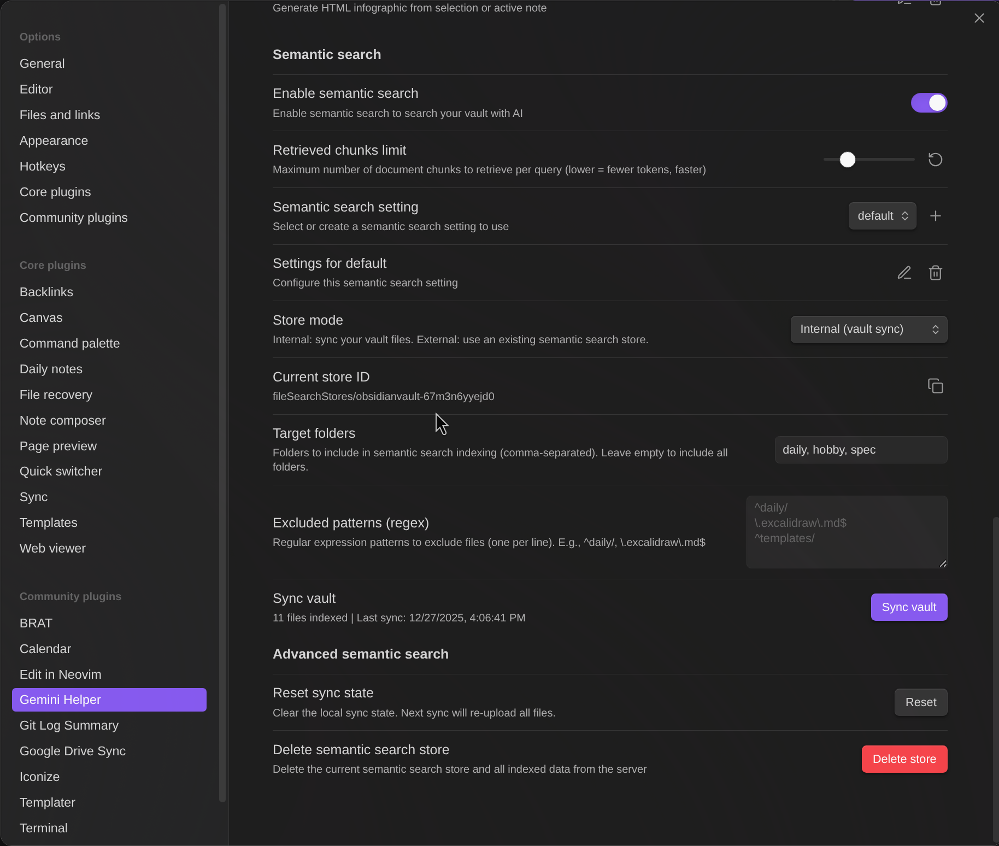
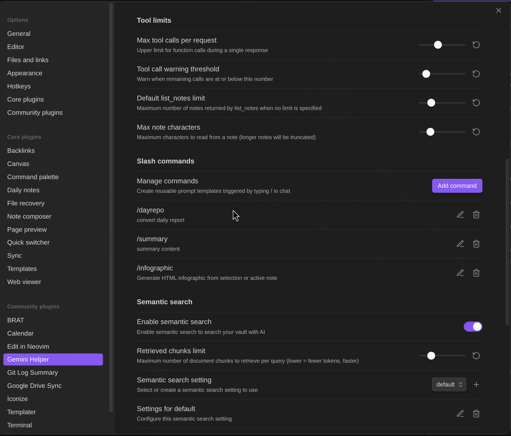

# Gemini Helper for Obsidian

**無料・オープンソース**の Obsidian 向け AI アシスタント。Google Gemini を活用した**チャット**、**ワークフロー自動化**、**セマンティック検索**を搭載。

> **このプラグインは完全に無料です。** Google Gemini API キー（無料または有料）、または [Gemini CLI](https://github.com/google-gemini/gemini-cli) 経由で Google アカウントが必要です。

## 主な機能

- **AI チャット** - ストリーミング応答、ファイル添付、Vault 操作、スラッシュコマンド
- **ワークフロービルダー** - ビジュアルノードエディタと 17 種類のノードでマルチステップタスクを自動化
- **セマンティック検索** - RAG による Vault 全体の知的検索
- **Web 検索** - Google 検索で最新情報を取得
- **画像生成** - Gemini 画像モデルで画像を作成

## Google API キーの選択肢

このプラグインには Google Gemini API キーまたは Google アカウント（Gemini CLI 経由）が必要です。以下から選択できます：

| 機能 | 無料 API キー | 有料 API キー | Gemini CLI |
|------|---------------|---------------|------------|
| 基本チャット | ✅ | ✅ | ✅ |
| Vault 操作 | ✅ | ✅ | 読み取り/検索のみ |
| Web 検索 | ✅ | ✅ | ❌ |
| セマンティック検索 | ✅（制限あり） | ✅ | ❌ |
| ワークフロー | ✅ | ✅ | ✅ |
| 画像生成 | ❌ | ✅ | ❌ |
| モデル | Flash, Gemma | Flash, Pro, Image | **Gemini 2.5 Pro** |
| 料金 | **無料** | 従量課金 | **無料** |

> [!TIP]
> **Gemini CLI** を使えば、Google アカウントだけで **Gemini 2.5 Pro**（フラッグシップモデル）が使えます！[Gemini CLI](https://github.com/google-gemini/gemini-cli) をインストールし、`gemini` を実行して `/auth` で認証。

### 無料 API キーのヒント

- **レート制限**はモデルごとで毎日リセット。別モデルに切り替えて作業を継続。
- **セマンティック検索同期**は制限あり。毎日「Sync Vault」を実行（アップロード済みファイルはスキップ）。
- **Gemma モデル**や **Gemini CLI** はチャットでの Vault 操作に非対応ですが、**ワークフローでは `note`、`note-read` などのノードでノートの読み書きが可能**です。`{content}` と `{selection}` 変数も使用可能。

---

# AI チャット

AI チャット機能は、Obsidian Vault と統合された Google Gemini との対話型インターフェースを提供します。


## スラッシュコマンド

`/` で呼び出せる再利用可能なプロンプトテンプレート：

- `{selection}`（選択テキスト）と `{content}`（アクティブノート）を含むテンプレート定義
- コマンドごとにモデルと検索設定を指定可能
- `/` を入力すると利用可能なコマンドを表示

**デフォルト:** `/infographic` - コンテンツを HTML インフォグラフィックに変換


## @ メンション

`@` を入力してファイルや変数を参照：

- `{selection}` - 選択テキスト
- `{content}` - アクティブノートの内容
- 任意の Vault ファイル - 参照して挿入（パスのみ挿入、内容は AI がツール経由で読み込み）

> [!NOTE]
> Vault ファイルの@メンションは、ファイルパスのみが挿入され、AI がツール経由でファイル内容を読み込みます。Gemma モデルは Vault 操作ツールに非対応のため機能しません。Gemini CLI はシェル経由で読み込み可能ですが、応答形式が異なる場合があります。

## ファイル添付

ファイルを直接添付：画像（PNG, JPEG, GIF, WebP）、PDF、テキストファイル

## Function Calling（Vault 操作）

AI が Vault を直接操作するツール：

| ツール | 説明 |
|--------|------|
| `read_note` | ノート内容を読み取り |
| `create_note` | 新規ノート作成 |
| `propose_edit` | 確認ダイアログ付き編集 |
| `propose_delete` | 確認ダイアログ付き削除 |
| `bulk_propose_edit` | 複数ファイルの一括編集（選択ダイアログ付き） |
| `bulk_propose_delete` | 複数ファイルの一括削除（選択ダイアログ付き） |
| `search_notes` | 名前またはコンテンツで Vault を検索 |
| `list_notes` | フォルダ内ノート一覧 |
| `rename_note` | リネーム/移動 |
| `create_folder` | 新規フォルダ作成 |
| `list_folders` | Vault 内フォルダ一覧 |
| `get_active_note_info` | アクティブノートの情報取得 |
| `get_rag_sync_status` | RAG 同期状態を確認 |

## 安全な編集

AI が `propose_edit` を使用時：
1. 確認ダイアログで変更内容をプレビュー
2. **適用** をクリックでファイルに書き込み
3. **破棄** をクリックでファイルを変更せずキャンセル

> 確認するまでファイルは変更されません。

## セマンティック検索

RAG による Vault の知的検索：

- **Internal モード** - Vault ファイルを Google File Search に同期
- **External モード** - 既存のストア ID を使用
- **差分同期** - 変更ファイルのみアップロード
- **対象フォルダ** - インデックスするフォルダを指定
- **除外パターン** - 正規表現でファイルを除外



---

# ワークフロービルダー

Markdown ファイル内でワークフローを作成・実行。LLM 呼び出し、ファイル操作、API リクエスト、制御フローを組み合わせ可能。


## クイックスタート

任意の Markdown ファイルにワークフローコードブロックを追加：

````markdown
```workflow
name: クイック要約
nodes:
  - id: input
    type: dialog
    title: トピックを入力
    inputTitle: トピック
    saveTo: topic
  - id: generate
    type: command
    prompt: "{{topic.input}}について簡潔に要約して"
    saveTo: result
  - id: save
    type: note
    path: "summaries/{{topic.input}}.md"
    content: "{{result}}"
    mode: create
```
````

Gemini サイドバーの **Workflow** タブを開いて実行。

## ノードタイプ

| カテゴリ | ノード | 説明 |
|----------|--------|------|
| 変数 | `variable`, `set` | 変数の宣言と更新 |
| 制御 | `if`, `while` | 条件分岐とループ |
| LLM | `command` | モデル/検索設定付きプロンプト実行 |
| データ | `http`, `json` | HTTP リクエストと JSON パース |
| ノート | `note`, `note-read`, `note-search`, `note-list`, `folder-list`, `open` | Vault 操作 |
| プロンプト | `prompt-file`, `prompt-selection`, `dialog` | ユーザー入力ダイアログ |
| 合成 | `workflow` | 別のワークフローをサブワークフローとして実行 |

## ノードリファレンス

### command

モデルと検索設定を指定して LLM プロンプトを実行。

```yaml
- id: search
  type: command
  model: gemini-3-flash-preview  # 任意: 特定のモデル
  ragSetting: __websearch__      # 任意: __websearch__, __none__, または設定名
  prompt: "{{topic}}を検索"
  saveTo: result
```

| プロパティ | 説明 |
|------------|------|
| `prompt` | LLM に送るプロンプト（必須） |
| `model` | モデルを指定（例：`gemini-3-flash-preview`） |
| `ragSetting` | `__websearch__`（Web 検索）、`__none__`（検索なし）、設定名、または省略で現在の設定 |
| `saveTo` | 応答を保存する変数名 |

### note

ノートファイルにコンテンツを書き込み。

```yaml
- id: save
  type: note
  path: "output/{{filename}}.md"
  content: "{{result}}"
  mode: overwrite
  confirm: true
```

| プロパティ | 説明 |
|------------|------|
| `path` | ファイルパス（必須） |
| `content` | 書き込む内容 |
| `mode` | `overwrite`（デフォルト）、`append`、または `create`（存在時スキップ） |
| `confirm` | `true`（デフォルト）で確認ダイアログ、`false` で即座に書き込み |

### note-list

フィルタリングとソート付きでノートを一覧表示。

```yaml
- id: list
  type: note-list
  folder: "Projects"
  recursive: true
  tags: "todo, project"
  tagMatch: all
  createdWithin: "7d"
  modifiedWithin: "24h"
  sortBy: modified
  sortOrder: desc
  limit: 20
  saveTo: noteList
```

| プロパティ | 説明 |
|------------|------|
| `folder` | フォルダパス（空で Vault 全体） |
| `recursive` | `true` でサブフォルダ含む、`false`（デフォルト）で直下のみ |
| `tags` | フィルタするタグ（カンマ区切り、`#` 有無どちらも可） |
| `tagMatch` | `any`（デフォルト）または `all` でタグマッチ |
| `createdWithin` | 作成日時でフィルタ: `30m`、`24h`、`7d` |
| `modifiedWithin` | 更新日時でフィルタ |
| `sortBy` | `created`、`modified`、または `name` |
| `sortOrder` | `asc` または `desc`（デフォルト） |
| `limit` | 最大件数（デフォルト: 50） |
| `saveTo` | 結果を保存する変数 |

**出力形式:**
```json
{
  "count": 5,
  "totalCount": 12,
  "hasMore": true,
  "notes": [
    {"name": "Note1", "path": "folder/Note1.md", "created": 1234567890, "modified": 1234567900, "tags": ["#todo"]}
  ]
}
```

### http

HTTP リクエストを実行。

```yaml
- id: fetch
  type: http
  url: "https://api.example.com/data"
  method: POST
  headers: '{"Authorization": "Bearer {{token}}"}'
  body: '{"query": "{{searchTerm}}"}'
  saveTo: response
  saveStatus: statusCode
  throwOnError: "true"
```

| プロパティ | 説明 |
|------------|------|
| `url` | リクエスト URL（必須） |
| `method` | `GET`（デフォルト）、`POST`、`PUT`、`PATCH`、`DELETE` |
| `headers` | JSON オブジェクトまたは `Key: Value` 形式（1行1つ） |
| `body` | リクエストボディ（POST/PUT/PATCH 用） |
| `saveTo` | レスポンスボディを保存する変数 |
| `saveStatus` | HTTP ステータスコードを保存する変数 |
| `throwOnError` | `true` で 4xx/5xx 応答時にエラーをスロー |

### dialog

オプション、ボタン、テキスト入力付きのダイアログを表示。

```yaml
- id: ask
  type: dialog
  title: オプションを選択
  message: 処理する項目を選んでください
  markdown: true
  options: "オプション A, オプション B, オプション C"
  multiSelect: true
  inputTitle: "追加メモ"
  multiline: true
  defaults: '{"input": "デフォルトテキスト", "selected": ["オプション A"]}'
  button1: 確認
  button2: キャンセル
  saveTo: dialogResult
```

| プロパティ | 説明 |
|------------|------|
| `title` | ダイアログタイトル |
| `message` | メッセージ内容（`{{変数}}` をサポート） |
| `markdown` | `true` でメッセージを Markdown としてレンダリング |
| `options` | カンマ区切りの選択肢リスト（任意） |
| `multiSelect` | `true` でチェックボックス、`false` でラジオボタン |
| `inputTitle` | テキスト入力フィールドのラベル（設定時に入力欄を表示） |
| `multiline` | `true` で複数行テキストエリア |
| `defaults` | 初期値の JSON（`input` と `selected`） |
| `button1` | プライマリボタンラベル（デフォルト: "OK"） |
| `button2` | セカンダリボタンラベル（任意） |
| `saveTo` | 結果を保存する変数: `{"button": "確認", "selected": [...], "input": "..."}` |

**シンプルなテキスト入力（prompt-value の代替）:**
```yaml
- id: input
  type: dialog
  title: 値を入力
  inputTitle: 入力
  multiline: true
  saveTo: userInput
```

### workflow

別のワークフローをサブワークフローとして実行。

```yaml
- id: runSub
  type: workflow
  path: "workflows/summarize.md"
  name: "Summarizer"
  input: '{"text": "{{content}}"}'
  output: '{"result": "summary"}'
  prefix: "sub_"
```

| プロパティ | 説明 |
|------------|------|
| `path` | ワークフローファイルのパス（必須） |
| `name` | ワークフロー名（ファイルに複数ある場合） |
| `input` | サブワークフロー変数へのマッピング JSON |
| `output` | 親変数へのマッピング JSON |
| `prefix` | 出力変数の接頭辞（`output` 未指定時） |

### prompt-file

ファイル選択ダイアログを表示、またはホットキーモードでアクティブファイルを使用。

```yaml
- id: selectFile
  type: prompt-file
  title: ノートを選択
  default: "notes/"
  forcePrompt: "true"
  saveTo: content
  saveFileTo: fileInfo
```

| プロパティ | 説明 |
|------------|------|
| `title` | ダイアログタイトル |
| `default` | デフォルトパス |
| `forcePrompt` | `true` でホットキーモードでも常にダイアログ表示 |
| `saveTo` | ファイル内容を保存する変数 |
| `saveFileTo` | ファイル情報 JSON を保存する変数 |

**ファイル情報形式:** `{"path": "folder/note.md", "basename": "note.md", "name": "note", "extension": "md"}`

### prompt-selection

選択テキストを取得、または選択ダイアログを表示。

```yaml
- id: getSelection
  type: prompt-selection
  saveTo: text
  saveSelectionTo: selectionInfo
```

| プロパティ | 説明 |
|------------|------|
| `saveTo` | 選択テキストを保存する変数 |
| `saveSelectionTo` | 選択メタデータ JSON を保存する変数 |

**選択情報形式:** `{"filePath": "...", "startLine": 1, "endLine": 1, "start": 0, "end": 10}`

### if / while

条件分岐とループ。

```yaml
- id: branch
  type: if
  condition: "{{count}} > 10"
  trueNext: handleMany
  falseNext: handleFew

- id: loop
  type: while
  condition: "{{counter}} < {{total}}"
  trueNext: processItem
  falseNext: done
```

| プロパティ | 説明 |
|------------|------|
| `condition` | 演算子付き式: `==`、`!=`、`<`、`>`、`<=`、`>=`、`contains` |
| `trueNext` | 条件が true のときのノード ID |
| `falseNext` | 条件が false のときのノード ID |

### variable / set

変数の宣言と更新。

```yaml
- id: init
  type: variable
  name: counter
  value: 0

- id: increment
  type: set
  name: counter
  value: "{{counter}} + 1"
```

### その他のノード

| ノード | プロパティ |
|--------|------------|
| `note-read` | `path`, `saveTo` |
| `note-search` | `query`, `searchContent`, `limit`, `saveTo` |
| `folder-list` | `folder`, `saveTo` |
| `open` | `path` |
| `json` | `source`, `saveTo` |

## ワークフロー終了

`next: end` でワークフローを明示的に終了：

```yaml
- id: save
  type: note
  path: "output.md"
  content: "{{result}}"
  next: end    # ここでワークフロー終了

- id: branch
  type: if
  condition: "{{cancel}}"
  trueNext: end      # true 分岐でワークフロー終了
  falseNext: continue
```

## 変数展開

`{{variable}}` 構文で変数を参照：

```yaml
# 基本
path: "{{folder}}/{{filename}}.md"

# オブジェクト/配列アクセス
url: "https://api.example.com?lat={{geo.latitude}}"
content: "{{items[0].name}}"

# ネストされた変数（ループ用）
path: "{{parsed.notes[{{counter}}].path}}"
```

## スマート入力ノード

`prompt-selection` と `prompt-file` ノードはホットキーコンテキストを自動検出：

| ノード | ホットキー経由 | パネルから実行 |
|--------|----------------|----------------|
| `prompt-selection` | 現在の選択を直接使用 | 選択ダイアログを表示 |
| `prompt-file` | アクティブファイルを直接使用 | ファイル選択ダイアログを表示 |

## 実用例

### 1. ノート要約

````markdown
```workflow
name: ノート要約
nodes:
  - id: select
    type: prompt-file
    title: ノートを選択
    saveTo: content
    saveFileTo: fileInfo
  - id: parseFile
    type: json
    source: fileInfo
    saveTo: file
  - id: summarize
    type: command
    prompt: "このノートを要約して:\n\n{{content}}"
    saveTo: summary
  - id: save
    type: note
    path: "summaries/{{file.name}}"
    content: "# 要約\n\n{{summary}}\n\n---\n*元ノート: {{file.path}}*"
    mode: create
```
````

### 2. Web リサーチ

````markdown
```workflow
name: Web リサーチ
nodes:
  - id: topic
    type: dialog
    title: リサーチトピック
    inputTitle: トピック
    saveTo: input
  - id: search
    type: command
    model: gemini-3-flash-preview
    ragSetting: __websearch__
    prompt: |
      以下のトピックについて Web 検索して: {{input.input}}

      重要な事実、最近の動向、情報源を含めて。
    saveTo: research
  - id: save
    type: note
    path: "research/{{input.input}}.md"
    content: "# {{input.input}}\n\n{{research}}"
    mode: overwrite
```
````

### 3. 条件分岐処理

````markdown
```workflow
name: スマート要約
nodes:
  - id: input
    type: dialog
    title: 処理するテキストを入力
    inputTitle: テキスト
    multiline: true
    saveTo: userInput
  - id: branch
    type: if
    condition: "{{userInput.input.length}} > 500"
    trueNext: summarize
    falseNext: enhance
  - id: summarize
    type: command
    prompt: "この長いテキストを要約して:\n\n{{userInput.input}}"
    saveTo: result
    next: save
  - id: enhance
    type: command
    prompt: "この短いテキストを拡張・強化して:\n\n{{userInput.input}}"
    saveTo: result
    next: save
  - id: save
    type: note
    path: "processed/output.md"
    content: "{{result}}"
    mode: overwrite
```
````

### 4. 複数ノートの一括処理

````markdown
```workflow
name: タグ分析
nodes:
  - id: init
    type: variable
    name: counter
    value: 0
  - id: initReport
    type: variable
    name: report
    value: "# タグ提案\n\n"
  - id: list
    type: note-list
    folder: Clippings
    limit: 5
    saveTo: notes
  - id: json
    type: json
    source: notes
    saveTo: parsed
  - id: loop
    type: while
    condition: "{{counter}} < {{parsed.count}}"
    trueNext: read
    falseNext: finish
  - id: read
    type: note-read
    path: "{{parsed.notes[{{counter}}].path}}"
    saveTo: content
  - id: analyze
    type: command
    prompt: "3つのタグを提案して:\n\n{{content}}"
    saveTo: tags
  - id: append
    type: set
    name: report
    value: "{{report}}## {{parsed.notes[{{counter}}].name}}\n{{tags}}\n\n"
  - id: increment
    type: set
    name: counter
    value: "{{counter}} + 1"
    next: loop
  - id: finish
    type: note
    path: "reports/tag-suggestions.md"
    content: "{{report}}"
    mode: overwrite
```
````

### 5. API 連携

````markdown
```workflow
name: 天気レポート
nodes:
  - id: city
    type: dialog
    title: 都市名
    inputTitle: 都市
    saveTo: cityInput
  - id: geocode
    type: http
    url: "https://geocoding-api.open-meteo.com/v1/search?name={{cityInput.input}}&count=1"
    method: GET
    saveTo: geoResponse
  - id: parseGeo
    type: json
    source: geoResponse
    saveTo: geo
  - id: weather
    type: http
    url: "https://api.open-meteo.com/v1/forecast?latitude={{geo.results[0].latitude}}&longitude={{geo.results[0].longitude}}&current=temperature_2m,weather_code&daily=temperature_2m_max,temperature_2m_min&timezone=auto"
    method: GET
    saveTo: weatherData
  - id: parse
    type: json
    source: weatherData
    saveTo: data
  - id: report
    type: command
    prompt: "天気レポートを作成:\n{{data}}"
    saveTo: summary
  - id: save
    type: note
    path: "weather/{{cityInput.input}}.md"
    content: "# {{cityInput.input}}の天気\n\n{{summary}}"
    mode: overwrite
```
````

### 6. 選択テキストの翻訳（ホットキー対応）

````markdown
```workflow
name: 選択テキストを翻訳
nodes:
  - id: getSelection
    type: prompt-selection
    saveTo: text
  - id: translate
    type: command
    prompt: "次のテキストを英語に翻訳してください:\n\n{{text}}"
    saveTo: translated
  - id: output
    type: note
    path: "translations/translated.md"
    content: "## 原文\n{{text}}\n\n## 翻訳\n{{translated}}\n\n---\n"
    mode: append
  - id: show
    type: open
    path: "translations/translated.md"
```
````

**ホットキー設定:**
1. ワークフローに `name:` フィールドを追加
2. ワークフローファイルを開き、ドロップダウンから対象ワークフローを選択
3. Workflow パネルフッターのキーボードアイコンをクリック
4. 設定 → ホットキー → "Workflow: 選択テキストを翻訳" を検索
5. ホットキーを割り当て（例：`Ctrl+Shift+T`）

### 7. サブワークフロー合成

**ファイル: `workflows/translate.md`**
````markdown
```workflow
name: Translator
nodes:
  - id: translate
    type: command
    prompt: "{{targetLang}}に翻訳:\n\n{{text}}"
    saveTo: translated
```
````

**ファイル: `workflows/main.md`**
````markdown
```workflow
name: 多言語エクスポート
nodes:
  - id: input
    type: dialog
    title: 翻訳するテキストを入力
    inputTitle: テキスト
    multiline: true
    saveTo: userInput
  - id: toJapanese
    type: workflow
    path: "workflows/translate.md"
    name: "Translator"
    input: '{"text": "{{userInput.input}}", "targetLang": "日本語"}'
    output: '{"japaneseText": "translated"}'
  - id: toSpanish
    type: workflow
    path: "workflows/translate.md"
    name: "Translator"
    input: '{"text": "{{userInput.input}}", "targetLang": "スペイン語"}'
    output: '{"spanishText": "translated"}'
  - id: save
    type: note
    path: "translations/output.md"
    content: |
      # 原文
      {{userInput.input}}

      ## 日本語
      {{japaneseText}}

      ## スペイン語
      {{spanishText}}
    mode: overwrite
```
````

### 8. インタラクティブなタスク選択

````markdown
```workflow
name: タスク処理
nodes:
  - id: selectTasks
    type: dialog
    title: タスクを選択
    message: 現在のノートに対して実行するタスクを選んでください
    options: "要約, 要点抽出, 英語に翻訳, 文法修正"
    multiSelect: true
    button1: 処理開始
    button2: キャンセル
    saveTo: selection
  - id: checkCancel
    type: if
    condition: "{{selection.button}} == 'キャンセル'"
    trueNext: cancelled
    falseNext: getFile
  - id: getFile
    type: prompt-file
    saveTo: content
  - id: process
    type: command
    prompt: |
      以下のタスクをこのテキストに対して実行してください：
      タスク: {{selection.selected}}

      テキスト:
      {{content}}
    saveTo: result
  - id: save
    type: note
    path: "processed/result.md"
    content: "{{result}}"
    mode: create
    next: end
  - id: cancelled
    type: dialog
    title: キャンセル
    message: 操作がキャンセルされました。
    button1: OK
    next: end
```
````

---

# 共通

## 対応モデル

### 有料プラン
| モデル | 説明 |
|--------|------|
| Gemini 3 Flash Preview | 高速モデル、1M コンテキスト（デフォルト） |
| Gemini 3 Pro Preview | フラッグシップモデル、1M コンテキスト |
| Gemini 2.5 Flash Lite | 軽量フラッシュモデル |
| Gemini 2.5 Flash (Image) | 画像生成、1024px |
| Gemini 3 Pro (Image) | プロ画像生成、4K |

### 無料プラン
| モデル | Vault 操作 |
|--------|------------|
| Gemini 2.5 Flash | ✅ |
| Gemini 2.5 Flash Lite | ✅ |
| Gemini 3 Flash Preview | ✅ |
| Gemma 3 (27B/12B/4B/1B) | ❌ |

## インストール

### 手動インストール
1. リリースから `main.js`, `manifest.json`, `styles.css` をダウンロード
2. `.obsidian/plugins/` に `gemini-helper` フォルダを作成
3. ファイルをコピーして Obsidian 設定で有効化

### ソースからビルド
```bash
git clone https://github.com/takeshy/obsidian-gemini-helper
cd obsidian-gemini-helper
npm install
npm run build
```

## 設定

### API 設定
1. [ai.google.dev](https://ai.google.dev) で API キーを取得
2. プラグイン設定で入力
3. API プラン（無料/有料）を選択


### Gemini CLI
1. [Gemini CLI](https://github.com/google-gemini/gemini-cli) をインストール
2. `gemini` → `/auth` で認証
3. 設定で「Command line mode」を有効化
4. 「Verify」で確認

**制限:** Vault 読み取り専用、セマンティック/Web 検索なし

### ワークスペース設定
- **Workspace Folder** - チャット履歴と設定の保存先
- **System Prompt** - AI への追加指示
- **Tool Limits** - 関数呼び出し制限の設定
- **Slash Commands** - カスタムプロンプトテンプレートの定義



## 使い方

### チャットを開く
- リボンの Gemini アイコンをクリック
- コマンド: "Gemini Helper: Open chat"
- トグル: "Gemini Helper: Toggle chat / editor"

### チャット操作
- **Enter** - メッセージ送信
- **Shift+Enter** - 改行
- **停止ボタン** - 生成を停止
- **+ ボタン** - 新規チャット
- **履歴ボタン** - 過去のチャットを読み込み

### ワークフローの使い方
1. サイドバーで **Workflow** タブを開く
2. `workflow` コードブロックを含むファイルを開く
3. ドロップダウンからワークフローを選択
4. **Run** で実行
5. **History** で過去の実行を確認


**Canvas へエクスポート:** 実行履歴を Obsidian Canvas としてビジュアル化。


### AI ワークフロー生成

**AI で新規ワークフローを作成：**
1. ワークフロードロップダウンから **+ New (AI)** を選択
2. ワークフロー名と出力先パス（`{{name}}` 変数対応）を入力
3. ワークフローの動作を自然言語で記述
4. モデルを選択して **Generate** をクリック
5. ワークフローが自動的に作成・保存される

**AI で既存ワークフローを修正：**
1. 既存のワークフローを読み込み
2. **AI Modify** ボタン（スパークルアイコン）をクリック
3. 変更したい内容を記述
4. 変更前後の比較を確認
5. **Apply Changes** で更新を適用


**手動ワークフロー編集：**

ビジュアルノードエディタでドラッグ＆ドロップ操作でワークフローを直接編集。


**ファイルから再読み込み：**
- ドロップダウンから **Reload from file** を選択して、Markdown ファイルからワークフローを再インポート

## 動作要件

- Obsidian v0.15.0 以上
- Google AI API キー（または Gemini CLI）
- デスクトップ版・モバイル版対応

## プライバシー

**ローカルに保存されるデータ：**
- API キー（Obsidian 設定に保存）
- チャット履歴（Markdown ファイルとして）
- ワークフロー実行履歴

**Google に送信されるデータ：**
- すべてのチャットメッセージと添付ファイルは Google Gemini API に送信されます
- セマンティック検索を有効にすると、Vault ファイルが Google File Search にアップロードされます
- Web 検索を有効にすると、検索クエリが Google Search に送信されます

**サードパーティサービスへの送信：**
- ワークフローの `http` ノードは、ワークフローで指定された任意の URL にデータを送信できます

**セキュリティに関する注意：**
- 実行前にワークフローを確認してください。`http` ノードは Vault データを外部エンドポイントに送信できます
- ワークフローの `note` ノードはデフォルトで書き込み前に確認ダイアログを表示します
- `confirmEdits: false` を設定したスラッシュコマンドは、Apply/Discard ボタンを表示せずにファイル編集を自動適用します

データ保持ポリシーについては [Google AI 利用規約](https://ai.google.dev/terms) を参照してください。

## ライセンス

MIT

## リンク

- [Gemini API ドキュメント](https://ai.google.dev/docs)
- [Obsidian プラグインドキュメント](https://docs.obsidian.md/Plugins/Getting+started/Build+a+plugin)

## サポート

このプラグインが役に立ったら、コーヒーをおごってください！

[](https://buymeacoffee.com/takeshy)
