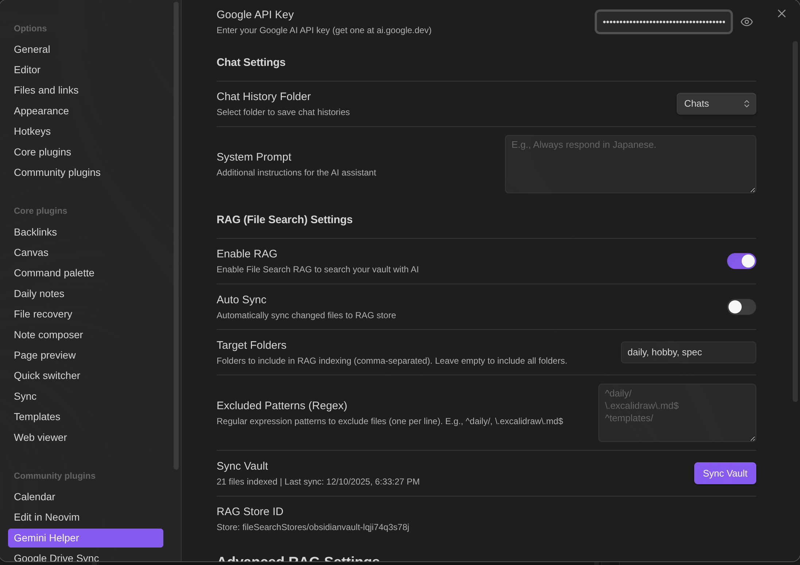

# Gemini Helper for Obsidian

Google Gemini を活用した Obsidian 向け AI アシスタントプラグインです。File Search RAG によるセマンティック検索機能を搭載しています。

## スクリーンショット

### AI チャット画面


### 設定画面


## 機能

### AI チャットインターフェース
- **ストリーミング応答** - リアルタイムで応答が表示され、自然な会話フローを実現
- **モデル選択** - チャット画面から直接 Gemini モデルを切り替え可能
- **Web検索** - Google検索を使用して最新情報を取得
- **セマンティック検索設定選択** - チャット画面からセマンティック検索設定を切り替え可能
- **スラッシュコマンド** - `/` を入力して呼び出せる再利用可能なプロンプトテンプレート
- **チャット履歴** - Markdown 形式で自動保存（閲覧・編集可能）
- **会話スレッド** - 同じチャット内でコンテキストを維持
- **生成停止** - 停止ボタンで AI の応答を途中で停止可能
- **メッセージコピー** - ワンクリックでメッセージをクリップボードにコピー

### スラッシュコマンド
チャット入力欄で `/` を入力して呼び出せるカスタムプロンプトテンプレート：
- **カスタムプロンプト** - 変数を含む再利用可能なプロンプトテンプレートを定義
- **モデル指定** - コマンドごとに使用するモデルを指定可能
- **検索指定** - コマンドごとに Web 検索やセマンティック検索を指定可能
- **変数** - `{content}` でアクティブノートの内容、`{selection}` で選択テキストを挿入
- **オートコンプリート** - `/` を入力すると候補が表示され、入力で絞り込み可能

### @ メンション
`@` を入力してファイルや変数をメッセージに直接参照：
- **変数** - `{selection}`（テキスト選択時のみ表示）、`{content}`（アクティブノート）
- **Vault ファイル** - Vault 内の任意の Markdown ファイルを参照
- **オートコンプリート** - `@` を入力すると候補が表示され、入力で絞り込み可能
- **ナビゲーション** - Tab/Shift+Tab または矢印キーで移動、Enter で選択
- 変数とファイルパスはメッセージ送信時に自動的に展開されます

### ファイル添付
メッセージにファイルを直接添付できます：
- **画像** - PNG, JPEG, GIF, WebP
- **ドキュメント** - PDF ファイル
- **テキストファイル** - プレーンテキスト, Markdown, CSV, JSON

### Function Calling（Vault 操作）
AI が以下のツールを使って直接 Vault を操作できます：

| ツール | 説明 |
|--------|------|
| `read_note` | ノート名またはアクティブノートの内容を読み取り |
| `create_note` | 新規ノートを作成（内容・タグ指定可） |
| `propose_edit` | ノートを編集（適用/破棄ボタンで確認） |
| `search_notes` | ファイル名またはコンテンツで検索 |
| `list_notes` | フォルダ内または Vault 全体のノート一覧 |
| `create_folder` | 新規フォルダを作成 |
| `list_folders` | Vault 内の全フォルダ一覧 |
| `get_active_note_info` | アクティブノートのメタ情報を取得 |
| `rename_note` | ノートのリネーム・移動 |
| `delete_note` | ノートを削除（デフォルト無効） |
| `get_rag_sync_status` | ファイルのセマンティック検索同期状態を確認 |

### 安全な編集機能
AI が `propose_edit` でノートを編集する際：
1. 変更がファイルに直接適用されます
2. 元の内容はメモリにバックアップされます
3. 変更を確認し、**適用** で確定、**破棄** で元に戻せます

### セマンティック検索統合
セマンティック検索は RAG（Retrieval-Augmented Generation）を使用して Vault を知的に検索します。

- **複数設定** - 複数のセマンティック検索設定を作成・管理可能
- **セマンティック検索** - AI を活用した意味ベースの Vault 全体検索
- **セマンティック検索インジケーター** - セマンティック検索が使用された際に表示
- **Internal モード** - Vault のファイルを新しいセマンティック検索ストアに同期
- **External モード** - 既存のセマンティック検索ストアを使用（複数ストア ID 対応）
- **差分同期** - 変更されたファイルのみアップロード（チェックサムベース）
- **対象フォルダ指定** - インデックスに含めるフォルダを指定可能
- **除外パターン** - 正規表現で特定ファイルを除外
- **同期進捗表示** - リアルタイムの進捗表示とキャンセル機能
- **ストア管理** - 設定からセマンティック検索ストアを削除可能

## 対応モデル

| モデル | 説明 |
|--------|------|
| Gemini 3 Flash Preview | 最新の高速モデル（1M コンテキスト、デフォルト、推奨） |
| Gemini 3 Pro Preview | 最新のフラッグシップモデル（1M コンテキスト） |
| Gemini 2.5 Flash Lite | 軽量版 Flash モデル |

## インストール

### 手動インストール
1. 最新リリース（`main.js`、`manifest.json`、`styles.css`）をダウンロード
2. Vault の `.obsidian/plugins/` ディレクトリに `gemini-helper` フォルダを作成
3. ダウンロードしたファイルをコピー
4. Obsidian 設定 > コミュニティプラグイン でプラグインを有効化

### ソースからビルド
```bash
git clone https://github.com/your-repo/obsidian-gemini-helper
cd obsidian-gemini-helper
npm install
npm run build
```

`main.js`、`manifest.json`、`styles.css` を Vault のプラグインフォルダにコピーしてください。

## 設定

### API 設定
1. [ai.google.dev](https://ai.google.dev) で Google AI API キーを取得
2. プラグイン設定で API キーを入力
3. デフォルトモデルを選択

### ワークスペース設定
- **Workspace Folder** - チャット履歴とセマンティック検索設定の保存先
- **Save Chat History** - チャットセッションの保存 ON/OFF
- **System Prompt** - AI への追加指示（例：「常に日本語で回答してください」）

### スラッシュコマンド設定
1. 設定の **Slash commands** セクションを開く
2. **Add command** をクリックして新しいコマンドを作成
3. 以下を設定：
   - **Command name** - トリガー名（例：`translate` で `/translate`）
   - **Description** - オートコンプリートに表示される説明
   - **Prompt template** - プロンプトテキスト（変数使用可）：
     - `{content}` - アクティブノートの内容に置換
     - `{selection}` - 選択中のテキストに置換
   - **Model**（任意）- このコマンドで使用するモデルを指定
   - **Search**（任意）- 検索設定を指定（なし、Web検索、セマンティック検索）
4. 鉛筆アイコンで編集、ゴミ箱アイコンで削除

### セマンティック検索設定
1. **Enable semantic search** - セマンティック検索機能の ON/OFF
2. **Semantic search setting** - セマンティック検索設定を選択または作成
3. **+** ボタンで新しいセマンティック検索設定を作成
4. 鉛筆アイコンでリネーム、ゴミ箱アイコンで削除

#### ストアモード
- **Internal（Vault Sync）** - Vault のファイルを Google の File Search に同期
  - **Target Folders** - インデックスに含めるフォルダ（カンマ区切り、空欄で全体）
  - **Excluded Patterns** - ファイルを除外する正規表現パターン（1行に1つ）
    - 例: `^daily/` は daily フォルダ内のファイルを除外
    - 例: `\.excalidraw\.md$` は Excalidraw ファイルを除外
  - **Sync Vault** - ファイルをセマンティック検索ストアにアップロード
  - **Reset Sync State** - ローカルの同期状態をクリア（次回同期で全ファイル再アップロード）
  - **Delete semantic search store** - Google サーバーからストアを完全に削除

- **External（Existing Store）** - 既存のセマンティック検索ストアを使用
  - **Semantic search store IDs** - ストア ID を入力（1行に1つ、複数可）
  - 複数の Vault 間でストアを共有したり、事前に作成したストアを使用する場合に便利

## 使い方

### チャットを開く
- 左リボンの Gemini アイコンをクリック
- またはコマンドパレット: "Gemini Helper: Open chat"
- または "Gemini Helper: Toggle chat / editor" でチャットと最後にアクティブだったノートを素早く切り替え（Obsidian 設定でホットキーを割り当てると便利）

### チャット操作
- **Enter** - メッセージ送信
- **Shift+Enter** - 改行
- **クリップアイコン** - ファイルを添付
- **停止ボタン** - 生成を停止（生成中に表示）
- **+ ボタン** - 新規チャット開始
- **履歴ボタン** - 過去のチャットを表示・読み込み

### モデル & 検索選択
入力欄の下にあるドロップダウンから選択：
- **モデルドロップダウン** - 会話中でもモデルを切り替え可能
- **検索ドロップダウン** - Web検索またはセマンティック検索設定を選択

### スラッシュコマンドの使い方
1. チャット入力欄で `/` を入力すると利用可能なコマンドが表示
2. 続けて入力すると絞り込み（例：`/tr` で "tr" から始まるコマンドを表示）
3. 矢印キーで移動、Tab または Enter で選択
4. 変数が解決されたプロンプトテンプレートが入力欄に挿入
5. 必要に応じて編集し、Enter または送信ボタンで送信

作成例：
- `/translate` - 「以下を英語に翻訳して: {selection}」
- `/summarize` - 「このノートを要約して: {content}」
- `/explain` - 「この概念を説明して: {selection}」

### セマンティック検索同期
1. 設定でセマンティック検索を有効化
2. 新しいセマンティック検索設定を作成するか、既存のものを選択
3. 対象フォルダと除外パターンを設定（Internal モードの場合）
4. 「Sync Vault」をクリックしてインデックス作成
5. チャット画面でセマンティック検索設定を選択
6. AI が質問に回答する際にセマンティック検索を使用するようになります
7. セマンティック検索インジケーターで使用されたか確認できます

## 動作要件

- Obsidian v0.15.0 以上
- Google AI API キー
- デスクトップ版・モバイル版両対応

## プライバシー

- API キーは Vault の設定ファイルにローカル保存されます
- セマンティック検索有効時、ファイルは Google の File Search API にアップロードされます
- チャット履歴は Vault 内に Markdown ファイルとしてローカル保存されます
- セマンティック検索設定はワークスペースフォルダ内の `gemini-workspace.json` に保存されます

## 開発

```bash
# 依存パッケージのインストール
npm install

# 開発ビルド（ウォッチモード）
npm run dev

# プロダクションビルド
npm run build
```

## ライセンス

MIT

## クレジット

使用ライブラリ:
- [@google/genai](https://www.npmjs.com/package/@google/genai) - Google Gemini SDK
- [React](https://react.dev/) - UI フレームワーク
- [Lucide React](https://lucide.dev/) - アイコン
