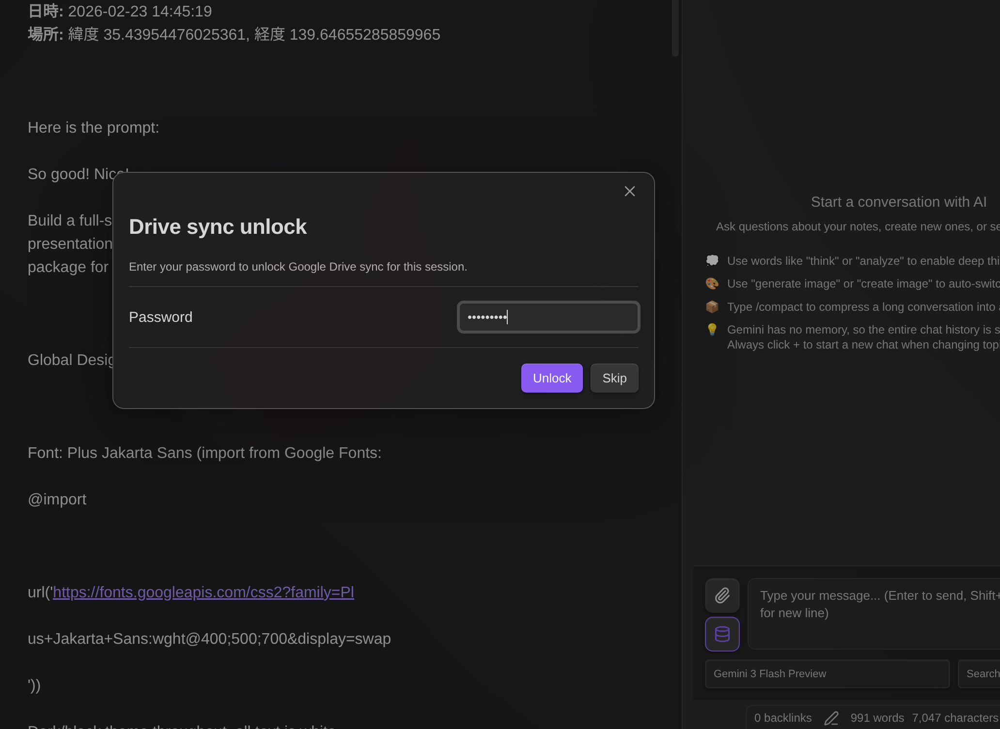

# Gemini Helper for Obsidian

[](https://deepwiki.com/takeshy/obsidian-gemini-helper)

**無料・オープンソース**の Obsidian 向け AI アシスタント。Google Gemini を活用した**チャット**、**ワークフロー自動化**、**RAG**を搭載。

> **このプラグインは完全に無料です。** Google Gemini API キー（無料または有料）、または CLI ツール（[Gemini CLI](https://github.com/google-gemini/gemini-cli)、[Claude Code](https://github.com/anthropics/claude-code)、[Codex CLI](https://github.com/openai/codex)）が必要です。

## 主な機能

- **AI チャット** - ストリーミング応答、ファイル添付、Vault 操作、スラッシュコマンド
- **ワークフロービルダー** - ビジュアルノードエディタと 23 種類のノードでマルチステップタスクを自動化
- **編集履歴** - AI による変更を差分表示で追跡・復元
- **RAG** - Vault 全体の知的検索（Retrieval-Augmented Generation）
- **Web 検索** - Google 検索で最新情報を取得
- **画像生成** - Gemini 画像モデルで画像を作成
- **暗号化** - チャット履歴とワークフロー実行ログをパスワード保護


## API キー / CLI の選択肢

このプラグインには Google Gemini API キーまたは CLI ツールが必要です。以下から選択できます：

| 機能         | 無料 API キー  | 有料 API キー     | CLI                            |
| ------------ | -------------- | ----------------- | ------------------------------ |
| 基本チャット | ✅             | ✅                | ✅                             |
| Vault 操作   | ✅             | ✅                | 読み取り/検索のみ              |
| Web 検索     | ✅             | ✅                | ❌                             |
| RAG          | ✅（制限あり） | ✅                | ❌                             |
| ワークフロー | ✅             | ✅                | ✅                             |
| 画像生成     | ❌             | ✅                | ❌                             |
| モデル       | Flash, Gemma   | Flash, Pro, Image | Gemini CLI, Claude Code, Codex |
| 料金         | **無料**       | 従量課金          | **無料**                       |

> [!TIP]
> **CLI オプション**を使えば、アカウントだけでフラッグシップモデルが使えます（API キー不要）！
>
> - **Gemini CLI**: [Gemini CLI](https://github.com/google-gemini/gemini-cli) をインストールし、`gemini` を実行して `/auth` で認証
> - **Claude CLI**: [Claude Code](https://github.com/anthropics/claude-code) をインストール（`npm install -g @anthropic-ai/claude-code`）し、`claude` で認証
> - **Codex CLI**: [Codex CLI](https://github.com/openai/codex) をインストール（`npm install -g @openai/codex`）し、`codex` で認証

### 無料 API キーのヒント

- **レート制限**はモデルごとで毎日リセット。別モデルに切り替えて作業を継続。
- **RAG同期**は制限あり。毎日「Sync Vault」を実行（アップロード済みファイルはスキップ）。
- **Gemma モデル**や **Gemini CLI** はチャットでの Vault 操作に非対応ですが、**ワークフローでは `note`、`note-read` などのノードでノートの読み書きが可能**です。`{content}` と `{selection}` 変数も使用可能。

---

# AI チャット

AI チャット機能は、Obsidian Vault と統合された Google Gemini との対話型インターフェースを提供します。


## スラッシュコマンド

`/` で呼び出せる再利用可能なプロンプトテンプレート：

- `{selection}`（選択テキスト）と `{content}`（アクティブノート）を含むテンプレート定義
- コマンドごとにモデルと検索設定を指定可能
- `/` を入力すると利用可能なコマンドを表示

**デフォルト:** `/infographic` - コンテンツを HTML インフォグラフィックに変換


## @ メンション

`@` を入力してファイルや変数を参照：

- `{selection}` - 選択テキスト
- `{content}` - アクティブノートの内容
- 任意の Vault ファイル - 参照して挿入（パスのみ挿入、内容は AI がツール経由で読み込み）

> [!NOTE]
> **`{selection}` と `{content}` の動作について：** Markdown View から Chat View にフォーカスが移動すると、通常は選択が解除されます。これを防ぐため、ビュー切替時に選択内容を変数に保持し、Markdown View 上の選択箇所を背景色でハイライト表示します。`{selection}` は選択テキストがある場合のみ @ の候補に表示されます。
>
> `{selection}` と `{content}` はどちらも入力エリアでは**意図的に展開されません**。チャット入力欄は狭いため、長いテキストを展開すると入力が困難になるためです。実際にメッセージを送信する際に展開され、送信済みメッセージを確認すると展開後の内容が表示されます。

> [!NOTE]
> Vault ファイルの@メンションは、ファイルパスのみが挿入され、AI がツール経由でファイル内容を読み込みます。Gemma モデルは Vault 操作ツールに非対応のため機能しません。Gemini CLI はシェル経由で読み込み可能ですが、応答形式が異なる場合があります。

## ファイル添付

ファイルを直接添付：画像（PNG, JPEG, GIF, WebP）、PDF、テキストファイル

## Function Calling（Vault 操作）

AI が Vault を直接操作するツール：

| ツール                 | 説明                                         |
| ---------------------- | -------------------------------------------- |
| `read_note`            | ノート内容を読み取り                         |
| `create_note`          | 新規ノート作成                               |
| `propose_edit`         | 確認ダイアログ付き編集                       |
| `propose_delete`       | 確認ダイアログ付き削除                       |
| `bulk_propose_edit`    | 複数ファイルの一括編集（選択ダイアログ付き） |
| `bulk_propose_delete`  | 複数ファイルの一括削除（選択ダイアログ付き） |
| `search_notes`         | 名前またはコンテンツで Vault を検索          |
| `list_notes`           | フォルダ内ノート一覧                         |
| `rename_note`          | リネーム/移動                                |
| `create_folder`        | 新規フォルダ作成                             |
| `list_folders`         | Vault 内フォルダ一覧                         |
| `get_active_note_info` | アクティブノートの情報取得                   |
| `get_rag_sync_status`  | RAG 同期状態を確認                           |

### Vault ツールモード

AI が Chat でノートを扱う際は Vault ツールを経由します。添付ボタンの下にあるデータベースアイコン（📦）から、AI が使用できる Vault ツールを制御できます：

| モード              | 説明                   | 使用可能なツール                  |
| ------------------- | ---------------------- | --------------------------------- |
| **Vault: 全て**     | Vault への完全アクセス | すべてのツール                    |
| **Vault: 検索なし** | 検索ツールを除外       | `search_notes`、`list_notes` 以外 |
| **Vault: オフ**     | Vault アクセスなし     | なし                              |

**各モードの使い分け：**

- **Vault: 全て** - 通常使用のデフォルトモード。AI は Vault の読み書き・検索が可能です。
- **Vault: 検索なし** - RAG のみで検索したい場合や、対象ファイルが事前にわかっている場合に使用。Vault 検索を省略することでトークンを節約し、レスポンスも速くなります。
- **Vault: オフ** - Vault へのアクセスが不要な場合に使用。

**自動モード選択：**

| 条件                                  | デフォルトモード | 変更可能 |
| ------------------------------------- | ---------------- | -------- |
| CLI モデル（Gemini/Claude/Codex CLI） | Vault: オフ      | 不可     |
| Gemma モデル                          | Vault: オフ      | 不可     |
| Web Search 有効                       | Vault: オフ      | 不可     |
| RAG 有効                              | Vault: オフ      | 不可     |
| RAG なし                              | Vault: 全て      | 可       |

**一部モードが強制される理由：**

- **CLI/Gemma モデル**: これらのモデルは関数呼び出し（Function Calling）をサポートしていないため、Vault ツールは使用できません。
- **Web Search**: 仕様上、Web Search 有効時は Vault ツールが無効になります。
- **RAG 有効**: Gemini API は File Search（RAG）と関数呼び出しの併用をサポートしていません。RAG 有効時は Vault ツールと MCP が自動的に無効になります。

## 安全な編集

AI が `propose_edit` を使用時：

1. 確認ダイアログで変更内容をプレビュー
2. **適用** をクリックでファイルに書き込み
3. **破棄** をクリックでファイルを変更せずキャンセル

> 確認するまでファイルは変更されません。

## 編集履歴

ノートへの変更を追跡・復元：

- **自動追跡** - すべての AI 編集（チャット、ワークフロー）と手動変更を記録
- **ファイルメニューからアクセス** - Markdown ファイルを右クリック：
  - **スナップショット** - 現在の状態をスナップショットとして保存
  - **履歴** - 編集履歴モーダルを開く


- **コマンドパレット** - "Show edit history" コマンドからもアクセス可能
- **差分表示** - 追加・削除を色分けして変更箇所を正確に表示
- **復元** - ワンクリックで以前のバージョンに戻す
- **コピー** - 履歴バージョンを新しいファイルとして保存（デフォルト名: `{filename}_{datetime}.md`）
- **リサイズ可能なモーダル** - ドラッグで移動、角からリサイズ

**差分の表示形式：**

- `+` 行は古いバージョンに存在していた内容
- `-` 行は新しいバージョンで追加された内容

**仕組み：**

編集履歴はスナップショットベースのアプローチを使用：

1. **スナップショット作成** - ファイルが初めて開かれるか AI によって変更されると、その内容のスナップショットが保存される
2. **差分記録** - ファイルが変更されると、新しい内容とスナップショットの差分が履歴エントリとして記録される
3. **スナップショット更新** - 各変更後、スナップショットは新しい内容に更新される
4. **復元** - 以前のバージョンに復元するには、スナップショットから差分を逆順に適用

**履歴が記録されるタイミング：**

- AI チャット編集（`propose_edit` ツール）
- ワークフローのノート変更（`note` ノード）
- コマンドによる手動保存
- ファイルを開いた時にスナップショットと異なる場合の自動検出

**保存場所：** 編集履歴はメモリ上に保存され、Obsidian の再起動時にクリアされます。永続的なバージョン管理は Obsidian 組み込みのファイル復元機能でカバーされます。

**設定：**

- プラグイン設定で有効/無効を切り替え
- 差分のコンテキスト行数を設定


## RAG

Vault の知的検索（Retrieval-Augmented Generation）：

- **対応ファイル** - Markdown、PDF、画像（PNG、JPEG、GIF、WebP）
- **Internal モード** - Vault ファイルを Google File Search に同期
- **External モード** - 既存のストア ID を使用
- **差分同期** - 変更ファイルのみアップロード
- **対象フォルダ** - インデックスするフォルダを指定
- **除外パターン** - 正規表現でファイルを除外


## MCPサーバー

MCP（Model Context Protocol）サーバーは、Vault操作以外のAI機能を拡張する追加ツールを提供します。

**セットアップ：**

1. プラグイン設定 → **MCPサーバー**セクションを開く
2. **サーバーを追加**をクリック
3. サーバー名とURLを入力
4. 認証用のオプションヘッダー（JSON形式）を設定
5. **接続テスト**をクリックして接続を確認し、利用可能なツールを取得
6. サーバー設定を保存

> **注意：** 保存前に接続テストが必須です。これによりサーバーへの接続が確認され、利用可能なツールが表示されます。


**MCPツールの使用方法：**

- **チャットで：** データベースアイコン（📦）をクリックしてツール設定を開きます。会話ごとにMCPサーバーを有効/無効にできます。
- **ワークフローで：** `mcp`ノードを使用してMCPサーバーツールを呼び出します。

**ツールヒント：** 接続テスト成功後、利用可能なツール名が保存され、設定画面とチャットUIの両方に表示されます。

### MCP Apps（インタラクティブUI）

一部のMCPツールは、ツール結果を視覚的に操作できるインタラクティブUIを返します。この機能は[MCP Apps仕様](https://github.com/anthropics/anthropic-cookbook/tree/main/misc/mcp_apps)に基づいています。


**仕組み：**

- MCPツールがレスポンスメタデータで`ui://`リソースURIを返すと、プラグインはHTMLコンテンツを取得してレンダリングします
- UIはセキュリティのためサンドボックス化されたiframe内で表示されます（`sandbox="allow-scripts allow-forms"`）
- インタラクティブアプリはJSON-RPCブリッジを通じて追加のMCPツールを呼び出したり、コンテキストを更新できます

**チャットでの表示：**
- MCP Appsはアシスタントメッセージ内にインラインで表示され、展開/折りたたみボタンがあります
- ⊕をクリックでフルスクリーン展開、⊖で折りたたみ

**ワークフローでの表示：**
- MCP Appsはワークフロー実行中にモーダルダイアログで表示されます
- ワークフローはユーザー操作を待機し、モーダルが閉じられると続行します

> **セキュリティ：** すべてのMCP Appコンテンツは制限された権限でサンドボックス化されたiframe内で実行されます。iframeは親ページのDOM、Cookie、ローカルストレージにアクセスできません。`allow-scripts`と`allow-forms`のみが有効です。

---

# ワークフロービルダー

Markdown ファイル内で自動化ワークフローを構築。**プログラミング知識は不要**です。やりたいことを自然言語で説明するだけで、AI がワークフローを作成します。


## AI によるワークフロー作成

**YAML 構文やノードタイプを学ぶ必要はありません。** やりたいことを自然言語で説明するだけ：

1. Gemini サイドバーの **Workflow** タブを開く
2. ドロップダウンから **+ New (AI)** を選択
3. やりたいことを記述：_「選択したノートを要約して summaries フォルダに保存するワークフローを作成して」_
4. **Generate** をクリック - AI が完全なワークフローを作成


**既存ワークフローの修正も同様に：**

1. 任意のワークフローを読み込み
2. **AI Modify** ボタンをクリック
3. 変更内容を記述：_「要約を日本語に翻訳するステップを追加して」_
4. 確認して適用


## クイックスタート（手動）

手動でワークフローを記述することもできます。任意の Markdown ファイルにワークフローコードブロックを追加：

````markdown
```workflow
name: クイック要約
nodes:
  - id: input
    type: dialog
    title: トピックを入力
    inputTitle: トピック
    saveTo: topic
  - id: generate
    type: command
    prompt: "{{topic.input}}について簡潔に要約して"
    saveTo: result
  - id: save
    type: note
    path: "summaries/{{topic.input}}.md"
    content: "{{result}}"
    mode: create
```
````

Gemini サイドバーの **Workflow** タブを開いて実行。

## 利用可能なノードタイプ

23 種類のノードタイプでワークフローを構築できます：

| カテゴリ       | ノード                                                                 |
| -------------- | ---------------------------------------------------------------------- |
| 変数           | `variable`, `set`                                                      |
| 制御           | `if`, `while`                                                          |
| LLM            | `command`                                                              |
| データ         | `http`, `json`                                                         |
| ノート         | `note`, `note-read`, `note-search`, `note-list`, `folder-list`, `open` |
| ファイル       | `file-explorer`, `file-save`                                           |
| プロンプト     | `prompt-file`, `prompt-selection`, `dialog`                            |
| 合成           | `workflow`                                                             |
| RAG            | `rag-sync`                                                             |
| 外部連携       | `mcp`, `obsidian-command`                                              |
| ユーティリティ | `sleep`                                                                |

> **詳細なノード仕様と実例は [WORKFLOW_NODES_ja.md](docs/WORKFLOW_NODES_ja.md) を参照してください**

## ホットキーモード

キーボードショートカットでワークフローを即座に実行：

1. ワークフローに `name:` フィールドを追加
2. ワークフローファイルを開いてドロップダウンから選択
3. Workflow パネルフッターのキーボードアイコン（⌨️）をクリック
4. 設定 → ホットキー → "Workflow: [ワークフロー名]" を検索
5. ホットキーを割り当て（例：`Ctrl+Shift+T`）

ホットキー実行時：

- `prompt-file` はアクティブファイルを自動使用（ダイアログなし）
- `prompt-selection` は現在の選択を使用、選択がなければファイル全体を使用

## イベントトリガー

Obsidian のイベントでワークフローを自動実行：


| イベント       | 説明                                      |
| -------------- | ----------------------------------------- |
| ファイル作成   | 新規ファイル作成時にトリガー              |
| ファイル変更   | ファイル保存時にトリガー（5秒デバウンス） |
| ファイル削除   | ファイル削除時にトリガー                  |
| ファイル名変更 | ファイル名変更時にトリガー                |
| ファイルを開く | ファイルを開いた時にトリガー              |

**イベントトリガーの設定：**

1. ワークフローに `name:` フィールドを追加
2. ワークフローファイルを開いてドロップダウンから選択
3. Workflow パネルフッターの zap アイコン（⚡）をクリック
4. トリガーするイベントを選択
5. 必要に応じてファイルパターンフィルターを追加

**ファイルパターン例：**

- `**/*.md` - 全フォルダのすべての Markdown ファイル
- `journal/*.md` - journal フォルダ内の Markdown ファイルのみ
- `*.md` - ルートフォルダ内の Markdown ファイルのみ
- `**/{daily,weekly}/*.md` - daily または weekly フォルダ内のファイル
- `projects/[a-z]*.md` - 小文字で始まるファイル

**イベント変数：** イベント実行時、以下の変数が自動設定されます：

| 変数                   | 説明                                                              |
| ---------------------- | ----------------------------------------------------------------- |
| `__eventType__`        | イベント種別：`create`, `modify`, `delete`, `rename`, `file-open` |
| `__eventFilePath__`    | 対象ファイルのパス                                                |
| `__eventFile__`        | ファイル情報 JSON（path, basename, name, extension）              |
| `__eventFileContent__` | ファイル内容（create/modify/file-open イベント時）                |
| `__eventOldPath__`     | 変更前パス（rename イベント時のみ）                               |

> **Note:** `prompt-file` と `prompt-selection` ノードはイベント実行時に自動的にイベントファイルを使用します。`prompt-selection` はファイル全体を選択として扱います。

---

# 共通

## 対応モデル

### 有料プラン

| モデル                   | 説明                                      |
| ------------------------ | ----------------------------------------- |
| Gemini 3.1 Pro Preview | 最新フラッグシップモデル、1M コンテキスト（推奨） |
| Gemini 3.1 Pro Preview (Custom Tools) | カスタムツールと bash を活用したエージェントワークフローに最適化 |
| Gemini 3 Flash Preview | 高速モデル、1M コンテキスト、コストパフォーマンス最高 |
| Gemini 3 Pro Preview | フラッグシップモデル、1M コンテキスト |
| Gemini 2.5 Flash | 高速モデル、1M コンテキスト |
| Gemini 2.5 Pro           | プロモデル、1M コンテキスト               |
| Gemini 2.5 Flash Lite    | 軽量フラッシュモデル                      |
| Gemini 2.5 Flash (Image) | 画像生成、1024px                          |
| Gemini 3 Pro (Image)     | プロ画像生成、4K                          |

> **Thinking モード:** チャットでは、メッセージに「考えて」「分析して」「検討して」などのキーワードが含まれると Thinking モードが有効になります。ただし、**Gemini 3 Pro** と **Gemini 3.1 Pro** はキーワードに関係なく常に Thinking モードで動作します。これらのモデルは Thinking の無効化をサポートしていません。

### 無料プラン

| モデル                  | Vault 操作 |
| ----------------------- | ---------- |
| Gemini 2.5 Flash        | ✅         |
| Gemini 2.5 Flash Lite   | ✅         |
| Gemini 3 Flash Preview  | ✅         |
| Gemma 3 (27B/12B/4B/1B) | ❌         |

## インストール

### BRAT（推奨）

1. [BRAT](https://github.com/TfTHacker/obsidian42-brat) プラグインをインストール
2. BRAT 設定 → 「Add Beta plugin」を開く
3. `https://github.com/takeshy/obsidian-gemini-helper` を入力
4. コミュニティプラグイン設定でプラグインを有効化

### 手動インストール

1. リリースから `main.js`, `manifest.json`, `styles.css` をダウンロード
2. `.obsidian/plugins/` に `gemini-helper` フォルダを作成
3. ファイルをコピーして Obsidian 設定で有効化

### ソースからビルド

```bash
git clone https://github.com/takeshy/obsidian-gemini-helper
cd obsidian-gemini-helper
npm install
npm run build
```

## 設定

### API 設定

1. [ai.google.dev](https://ai.google.dev) で API キーを取得
2. プラグイン設定で入力
3. API プラン（無料/有料）を選択


### CLI モード（Gemini / Claude / Codex）

**Gemini CLI:**

1. [Gemini CLI](https://github.com/google-gemini/gemini-cli) をインストール
2. `gemini` → `/auth` で認証
3. Gemini CLI セクションで「Verify」をクリック

**Claude CLI:**

1. [Claude Code](https://github.com/anthropics/claude-code) をインストール: `npm install -g @anthropic-ai/claude-code`
2. `claude` で認証
3. Claude CLI セクションで「Verify」をクリック

**Codex CLI:**

1. [Codex CLI](https://github.com/openai/codex) をインストール: `npm install -g @openai/codex`
2. `codex` で認証
3. Codex CLI セクションで「Verify」をクリック

**CLI の制限:** Vault 読み取り専用、セマンティック/Web 検索なし

**カスタム CLI パス:** CLI の自動検出に失敗した場合は、Verify ボタンの横にある歯車アイコン（⚙️）をクリックして、CLI パスを手動で指定できます。

<details>
<summary><b>Windows: CLI パスの確認方法</b></summary>

1. PowerShell を開いて以下を実行：
   ```powershell
   Get-Command gemini
   ```
2. スクリプトのパスが表示されます（例: `C:\Users\YourName\AppData\Roaming\npm\gemini.ps1`）
3. `npm` フォルダから実際の `index.js` へのパスに変換：
   ```
   C:\Users\YourName\AppData\Roaming\npm\node_modules\@google\gemini-cli\dist\index.js
   ```
4. このフルパスを CLI パス設定に入力

Claude CLI の場合は `Get-Command claude` を実行し、`node_modules\@anthropic-ai\claude-code\dist\index.js` に移動してください。
</details>

> [!TIP]
> **Claude CLI ヒント:** Gemini Helper のチャットセッションはローカルに保存されます。Obsidian の外で会話を続けるには、Vault ディレクトリで `claude --resume` を実行して過去のセッションを表示・再開できます。

### ワークスペース設定

- **Workspace Folder** - チャット履歴と設定の保存先
- **System Prompt** - AI への追加指示
- **Tool Limits** - 関数呼び出し制限の設定
- **Edit History** - AI による変更を追跡・復元


### 暗号化

チャット履歴とワークフロー実行ログを個別にパスワード保護。

**設定手順:**

1. プラグイン設定でパスワードを設定（公開鍵暗号方式で安全に保存）


2. 設定後、各ログタイプの暗号化を切り替え:
   - **AIチャット履歴を暗号化** - チャット会話ファイルを暗号化
   - **ワークフロー実行ログを暗号化** - ワークフロー履歴ファイルを暗号化


各設定は独立して有効/無効を切り替えできます。

**機能:**

- **個別制御** - どのログを暗号化するか選択可能（チャット、ワークフロー、または両方）
- **自動暗号化** - 設定に基づいて新規ファイルは保存時に暗号化
- **パスワードキャッシュ** - セッション中は一度入力すればOK
- **専用ビューア** - 暗号化ファイルはプレビュー付きの専用エディタで開く
- **復号オプション** - 必要に応じて個別ファイルの暗号化を解除

**仕組み:**

```
【セットアップ - パスワード設定時に1回だけ】
パスワード → 鍵ペア生成（RSA） → 秘密鍵を暗号化 → 設定に保存

【暗号化 - ファイルごと】
ファイル内容 → 新しいAES鍵で暗号化 → AES鍵を公開鍵で暗号化
→ ファイルに保存: 暗号化データ + 暗号化秘密鍵（設定からコピー） + salt

【復号】
パスワード + salt → 秘密鍵を復元 → AES鍵を復号 → ファイル内容を復号
```

- 鍵ペアは1回だけ生成（RSA生成は重い）、AES鍵はファイルごとに生成
- 各ファイルに保存: 暗号化コンテンツ + 暗号化秘密鍵（設定からコピー） + salt
- ファイルは自己完結型 — パスワードだけで復号可能、プラグイン依存なし

<details>
<summary>Python復号スクリプト（クリックで展開）</summary>

```python
#!/usr/bin/env python3
"""プラグインなしでGemini Helper暗号化ファイルを復号"""
import base64, sys, re, getpass
from cryptography.hazmat.primitives import hashes, serialization
from cryptography.hazmat.primitives.kdf.pbkdf2 import PBKDF2HMAC
from cryptography.hazmat.primitives.ciphers.aead import AESGCM
from cryptography.hazmat.primitives.asymmetric import padding

def decrypt_file(filepath: str, password: str) -> str:
    with open(filepath, 'r') as f:
        content = f.read()

    # YAMLフロントマターを解析
    match = re.match(r'^---\n([\s\S]*?)\n---\n([\s\S]*)$', content)
    if not match:
        raise ValueError("無効な暗号化ファイル形式")

    frontmatter, encrypted_data = match.groups()
    key_match = re.search(r'key:\s*(.+)', frontmatter)
    salt_match = re.search(r'salt:\s*(.+)', frontmatter)
    if not key_match or not salt_match:
        raise ValueError("フロントマターにkeyまたはsaltがありません")

    enc_private_key = base64.b64decode(key_match.group(1).strip())
    salt = base64.b64decode(salt_match.group(1).strip())
    data = base64.b64decode(encrypted_data.strip())

    # パスワードから鍵を導出
    kdf = PBKDF2HMAC(algorithm=hashes.SHA256(), length=32, salt=salt, iterations=100000)
    derived_key = kdf.derive(password.encode())

    # 秘密鍵を復号
    iv, enc_priv = enc_private_key[:12], enc_private_key[12:]
    private_key_pem = AESGCM(derived_key).decrypt(iv, enc_priv, None)
    private_key = serialization.load_der_private_key(base64.b64decode(private_key_pem), None)

    # 暗号化データを解析: key_length(2) + enc_aes_key + iv(12) + enc_content
    key_len = (data[0] << 8) | data[1]
    enc_aes_key = data[2:2+key_len]
    content_iv = data[2+key_len:2+key_len+12]
    enc_content = data[2+key_len+12:]

    # RSA秘密鍵でAES鍵を復号
    aes_key = private_key.decrypt(enc_aes_key, padding.OAEP(
        mgf=padding.MGF1(algorithm=hashes.SHA256()), algorithm=hashes.SHA256(), label=None))

    # コンテンツを復号
    return AESGCM(aes_key).decrypt(content_iv, enc_content, None).decode('utf-8')

if __name__ == "__main__":
    if len(sys.argv) != 2:
        print(f"使用法: {sys.argv[0]} <暗号化ファイル>")
        sys.exit(1)
    password = getpass.getpass("パスワード: ")
    print(decrypt_file(sys.argv[1], password))
```

必要: `pip install cryptography`

</details>

> **警告:** パスワードを忘れると、暗号化ファイルは復元できません。パスワードは安全に保管してください。

> **ヒント:** ディレクトリ内のすべてのファイルを一括暗号化するには、ワークフローを使用します。[WORKFLOW_NODES_ja.md](docs/WORKFLOW_NODES_ja.md#obsidian-command) の「ディレクトリ内の全ファイルを暗号化」の例を参照してください。


**セキュリティ上のメリット:**

- **AIチャットからの保護** - 暗号化ファイルはAIのVault操作（`read_note`ツール）で読み取ることができません。これにより、APIキーなどの機密データがチャット中に誤って漏洩することを防ぎます。
- **ワークフローからのアクセス** - ワークフローでは`note-read`ノードを使用して暗号化ファイルを読み取れます。アクセス時にパスワードダイアログが表示され、入力後はセッション中キャッシュされます。
- **シークレットの安全な保管** - APIキーをワークフローに直接記述する代わりに、暗号化ファイルに保存できます。ワークフローはパスワード認証後に実行時にキーを読み取ります。

### スラッシュコマンド

- `/` で呼び出すカスタムプロンプトテンプレートを定義
- コマンドごとにモデルと検索設定を指定可能


## 使い方

### チャットを開く

- リボンの Gemini アイコンをクリック
- コマンド: "Gemini Helper: Open chat"
- トグル: "Gemini Helper: Toggle chat / editor"

### チャット操作

- **Enter** - メッセージ送信
- **Shift+Enter** - 改行
- **停止ボタン** - 生成を停止
- **+ ボタン** - 新規チャット
- **履歴ボタン** - 過去のチャットを読み込み

### ワークフローの使い方

**サイドバーから:**

1. サイドバーで **Workflow** タブを開く
2. `workflow` コードブロックを含むファイルを開く
3. ドロップダウンからワークフローを選択（または **Browse all workflows** で vault 内の全ワークフローを検索）
4. **Run** で実行
5. **History** で過去の実行を確認

**コマンドパレットから (Run Workflow):**

「Gemini Helper: Run Workflow」コマンドを使用すると、どこからでもワークフローを閲覧・実行できます：

1. コマンドパレットを開いて "Run Workflow" を検索
2. ワークフローコードブロックを含むすべての Vault ファイルを閲覧（`workflows/` フォルダ内のファイルが優先表示）
3. ワークフローの内容と AI 生成履歴をプレビュー
4. ワークフローを選択して **Run** で実行


ワークフローファイルに移動せずに素早くワークフローを実行できるので便利です。


**フローチャートとして可視化:** Workflow パネルの **Canvas** ボタン（グリッドアイコン）をクリックすると、ワークフローを Obsidian Canvas にエクスポートできます。以下の特徴があります：

- ループや分岐が適切なルーティングで明確に表示
- 条件分岐ノード（`if`/`while`）は Yes/No パスを表示
- ループバック矢印はノードを迂回して配置され見やすい
- 各ノードの設定内容をすべて表示
- 元のワークフローファイルへのリンクを含み、すぐにナビゲート可能


複数の分岐やループを含む複雑なワークフローを理解するのに特に便利です。

**実行履歴をエクスポート:** 実行履歴を Obsidian Canvas としてビジュアル化。History モーダルで **Open Canvas view** をクリックして Canvas ファイルを作成。

> **Note:** Canvas ファイルはワークスペースフォルダに動的に作成されます。確認後、不要になったら手動で削除してください。


### AI ワークフロー生成

**AI で新規ワークフローを作成：**

1. ワークフロードロップダウンから **+ New (AI)** を選択
2. ワークフロー名と出力先パス（`{{name}}` 変数対応）を入力
3. ワークフローの動作を自然言語で記述
4. モデルを選択して **Generate** をクリック
5. ワークフローが自動的に作成・保存される

> **ヒント：** 既にワークフローがあるファイルでドロップダウンから **+ New (AI)** を使用すると、出力先パスがカレントファイルにデフォルト設定されます。生成されたワークフローはそのファイルに追記されます。

**任意のファイルからワークフローを作成：**

ワークフローコードブロックがないファイルで Workflow タブを開くと、**「Create workflow with AI」** ボタンが表示されます。クリックして新規ワークフローを生成（デフォルト出力先：`workflows/{{name}}.md`）。

**@ ファイル参照：**

説明フィールドで `@` を入力するとファイルを参照できます：

- `@{selection}` - 現在のエディタ選択範囲
- `@{content}` - アクティブなノートの内容
- `@path/to/file.md` - Vault 内の任意のファイル

Generate をクリックすると、ファイルの内容が AI リクエストに直接埋め込まれます。YAML フロントマターは自動的に除去されます。

> **ヒント：** Vault 内の既存のワークフロー例やテンプレートを基にワークフローを作成する際に便利です。

**ファイル添付：**

添付ボタンをクリックして、ワークフロー生成リクエストにファイル（画像、PDF、テキストファイル）を添付できます。AI に視覚的なコンテキストや例を提供する際に便利です。

**モーダル操作：**

AI ワークフローモーダルはドラッグ＆ドロップでの位置調整と角からのリサイズをサポートし、快適な編集体験を提供します。

**リクエスト履歴：**

AI で生成したワークフローは、コードブロックの上に履歴エントリが保存されます：

- タイムスタンプとアクション（作成/修正）
- リクエストの内容
- 参照したファイルの内容（折りたたみセクション内）


**AI で既存ワークフローを修正：**

1. 既存のワークフローを読み込み
2. **AI Modify** ボタン（スパークルアイコン）をクリック
3. 変更したい内容を記述
4. 変更前後の比較を確認
5. **Apply Changes** で更新を適用


**実行履歴の参照：**

AI でワークフローを修正する際、過去の実行結果を参照して AI に問題点を伝えることができます：

1. **実行履歴を参照** ボタンをクリック
2. リストから実行記録を選択（エラーがある実行はハイライト表示）
3. 含めたいステップを選択（エラーステップはデフォルトで選択済み）
4. AI がステップの入出力データを受け取り、何が問題だったかを理解

ワークフローのデバッグに特に有効です。「ステップ 2 のエラーを修正して」と伝えるだけで、AI はどの入力が失敗の原因だったかを正確に把握できます。

**リクエスト履歴：**

ワークフローを再生成する（プレビューで「No」をクリック）と、セッション中の全ての過去のリクエストが AI に渡されます。これにより、複数回の修正にわたる完全なコンテキストを AI が理解できます。

**手動ワークフロー編集：**

ビジュアルノードエディタでドラッグ＆ドロップ操作でワークフローを直接編集。


**ファイルから再読み込み：**

- ドロップダウンから **Reload from file** を選択して、Markdown ファイルからワークフローを再インポート

## 動作要件

- Obsidian v0.15.0 以上
- Google AI API キー、または CLI ツール（Gemini CLI / Claude CLI / Codex CLI）
- デスクトップ版・モバイル版対応（CLI モードはデスクトップ版のみ）

## プライバシー

**ローカルに保存されるデータ：**

- API キー（Obsidian 設定に保存）
- チャット履歴（Markdown ファイル、暗号化オプションあり）
- ワークフロー実行履歴（暗号化オプションあり）
- 暗号化キー（秘密鍵はパスワードで暗号化）

**Google に送信されるデータ：**

- すべてのチャットメッセージと添付ファイルは Google Gemini API に送信されます
- RAGを有効にすると、Vault ファイルが Google File Search にアップロードされます
- Web 検索を有効にすると、検索クエリが Google Search に送信されます

**サードパーティサービスへの送信：**

- ワークフローの `http` ノードは、ワークフローで指定された任意の URL にデータを送信できます

**CLI プロバイダー（オプション）：**

- CLI モードを有効にすると、外部 CLI ツール（gemini, claude, codex）が child_process 経由で実行されます
- これはユーザーが明示的に設定・検証した場合のみ発生します
- CLI モードはデスクトップ版のみで利用可能です（モバイル版では使用不可）

**MCP サーバー（オプション）：**

- MCP（Model Context Protocol）サーバーは、ワークフローの `mcp` ノード用にプラグイン設定で構成できます
- MCP サーバーは追加のツールと機能を提供する外部サービスです

**GemiHub 経由の Google Drive 同期（オプション）：**
- Google Drive 同期が有効な場合、Vault ファイルはご自身の Google Drive アカウントにアップロードされます
- 使用するネットワークエンドポイント：
  - `https://www.googleapis.com/drive/v3` — ファイルメタデータと同期操作
  - `https://www.googleapis.com/upload/drive/v3` — ファイルアップロード
  - `https://gemihub.online/api/obsidian/token` — OAuth トークンリフレッシュ（下記参照）
- **トークンリフレッシュの仕組み：** 暗号化されたリフレッシュトークンが GemiHub プロキシに送信され、プロキシが OAuth クライアントシークレットを付加して Google のトークンエンドポイントに転送します。クライアント側のコードに OAuth クライアントシークレットを安全に埋め込むことができないため、プロキシが必要です。プロキシはトークンを保存・記録しません。[GemiHub プライバシーポリシー](https://gemihub.online/privacy)を参照してください。
- 暗号化された認証データ（RSA + AES-256-GCM）はプラグイン設定に保存されます。復号パスワードが送信されることはありません
- Vault のコンテンツは GemiHub に送信されません — ファイルは Obsidian と Google Drive API 間で直接同期されます

**セキュリティに関する注意：**

- 実行前にワークフローを確認してください。`http` ノードは Vault データを外部エンドポイントに送信できます
- ワークフローの `note` ノードはデフォルトで書き込み前に確認ダイアログを表示します
- `confirmEdits: false` を設定したスラッシュコマンドは、Apply/Discard ボタンを表示せずにファイル編集を自動適用します
- 機密情報の管理：API キーやトークンをワークフロー YAML（`http` ヘッダー、`mcp` 設定など）に直接記載しないでください。代わりに暗号化ファイルに保存し、`note-read` ノードで実行時に読み込んでください。ワークフローはパスワード入力で暗号化ファイルを読み取れます。

データ保持ポリシーについては [Google AI 利用規約](https://ai.google.dev/terms) を参照してください。

## ライセンス

MIT

## 実験的機能

### Google Drive 同期 (GemiHub 連携)

[GemiHub](https://gemihub.online) 経由で Obsidian Vault を Google Drive と同期します。Obsidian でノートを編集し、GemiHub の Web インターフェースからアクセスすることも、その逆も可能です。



**GemiHub 限定機能**（Obsidian プラグインでは利用不可）：

- **自動 RAG** - GemiHub に同期されたファイルは、同期のたびに自動的にセマンティック検索用にインデックスされます。手動セットアップは不要です
- **OAuth2 対応 MCP** - OAuth2 認証が必要な MCP サーバーを使用可能（例：Google Calendar、Gmail、Google Docs）
- **Markdown から PDF/HTML への変換** - Markdown ノートをフォーマット済みの PDF または HTML ドキュメントに変換
- **公開パブリッシュ** - 変換した HTML/PDF ドキュメントを共有可能な公開 URL で公開

**接続により Obsidian に追加される機能：**

- **Diff プレビュー付き双方向同期** - 変更をコミットする前に、詳細なファイル一覧と Unified Diff ビューで Push・Pull を実行
- **Diff 付きコンフリクト解決** - 同じファイルが両方で編集された場合、カラーコード付き Unified Diff でコンフリクトを解決
- **Drive 編集履歴** - Obsidian と GemiHub の両方での変更を追跡、ファイルごとの履歴に変更元（ローカル/リモート）を表示
- **コンフリクトバックアップ管理** - Drive に保存されたコンフリクトバックアップの閲覧、プレビュー、復元

> **セットアップ：** 設定手順は [GemiHub 連携ガイド](docs/GEMIHUB_CONNECTION.md) を参照してください。

## リンク

- [Gemini API ドキュメント](https://ai.google.dev/docs)
- [Obsidian プラグインドキュメント](https://docs.obsidian.md/Plugins/Getting+started/Build+a+plugin)

## サポート

このプラグインが役に立ったら、コーヒーをおごってください！

[](https://buymeacoffee.com/takeshy)
