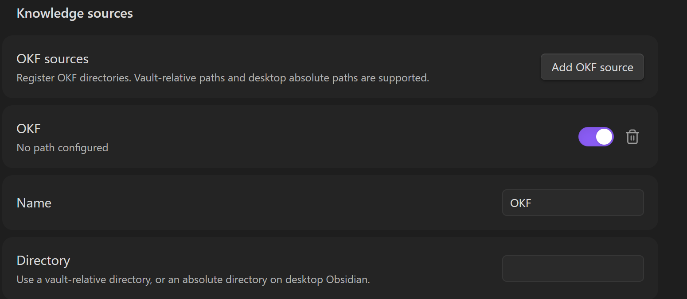
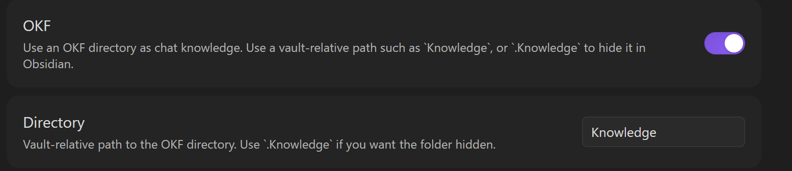
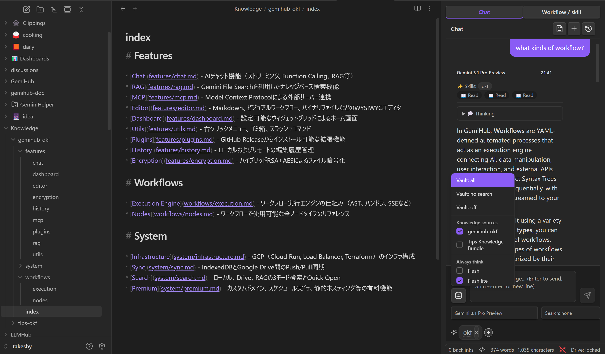
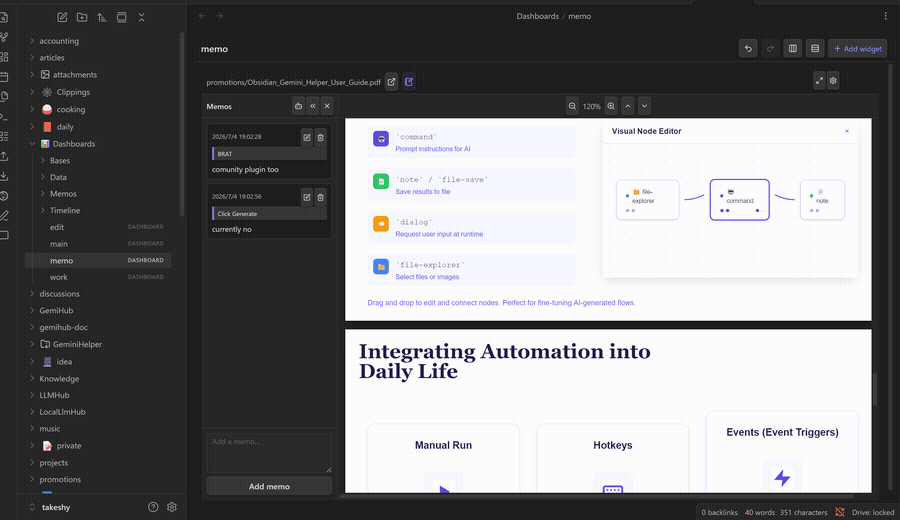
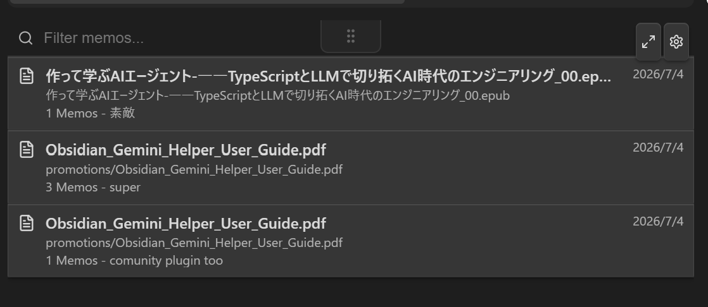

# Gemini Helper for Obsidian

[](https://deepwiki.com/takeshy/obsidian-gemini-helper)

**無料・オープンソース**の Obsidian 向け AI アシスタント。Google Gemini を活用した**チャット**、**ワークフロー自動化**、**RAG**を搭載。

> **このプラグインは完全に無料です。** [ai.google.dev](https://ai.google.dev) から Google Gemini API キー（無料または有料）が必要です。

## 主な機能

- **AI チャット** - ストリーミング応答、ファイル添付、Vault 操作、スラッシュコマンド
- **使用量の可視化** - チャットやワークフロー実行ごとの API トークン数と概算コストを表示
- **エージェントスキル** - チャットをスキルで拡張可能。Obsidian 用 Markdown、Canvas、Bases、Dashboard の各スキルが組み込み済み
- **外部スキル** - 公式 `takeshy/llm-hub-skills` リポジトリからバージョン管理されたスキルをインストール
- **ワークフロービルダー** - ビジュアルノードエディタと 24 種類のノードでマルチステップタスクを自動化
- **MCP 対応** - ワークフローで MCP ツールを利用し、MCP UI リソースを Obsidian 内で表示
- **RAG** - Vault 全体の知的検索（Retrieval-Augmented Generation）
- **OKF 知識ソース** - Open Knowledge Format バンドルをコンパクトなチャット知識として追加
- **AI フォルダアクセス** - AI に Vault 全体を自動で読ませたくない場合に、AI が自動で読めるフォルダを制限
- **暗号化と Secret Manager** - チャット履歴とワークフローログを暗号化し、ダッシュボードから暗号化シークレットを管理
- **編集履歴** - AI による変更を差分表示で追跡・復元
- **ダッシュボード** - Bases ビュー、ファイル、読書メモ、Web ページ、タイムライン、カンバンボード、ワークフロー出力をレスポンシブなウィジェットグリッドに配置


## API キー

このプラグインには Google Gemini API キーが必要です。以下から選択できます：

| 機能         | 無料 API キー  | 有料 API キー     |
| ------------ | -------------- | ----------------- |
| 基本チャット | ✅             | ✅                |
| Vault 操作   | ✅             | ✅                |
| Web 検索     | ✅             | ✅                |
| RAG          | ✅（制限あり） | ✅                |
| ワークフロー | ✅             | ✅                |
| 画像生成     | ❌             | ✅                |
| モデル       | Flash, Gemma   | Flash, Pro, Image |
| 料金         | **無料**       | 従量課金          |

### 無料 API キーのヒント

- **レート制限**はモデルごとで毎日リセット。別モデルに切り替えて作業を継続。
- **RAG同期**は制限あり。毎日「Sync Vault」を実行（アップロード済みファイルはスキップ）。

---

# AI チャット

AI チャット機能は、Obsidian Vault と統合された Google Gemini との対話型インターフェースを提供します。


## チャットを開く
- リボンの Gemini アイコンをクリック
- コマンド: "Gemini Helper: Open chat"
- トグル: "Gemini Helper: Toggle chat / editor"

## チャット操作
- **Enter** - メッセージ送信
- **Shift+Enter** - 改行
- **停止ボタン** - 生成を停止
- **+ ボタン** - 新規チャット
- **履歴ボタン** - 過去のチャットを読み込み

## スラッシュコマンド

`/` で呼び出せる再利用可能なプロンプトテンプレート：

- `{selection}`（選択テキスト）と `{content}`（アクティブノート）を含むテンプレート定義
- コマンドごとにモデルと検索設定を指定可能
- `/` を入力すると利用可能なコマンドを表示

**デフォルト:** `/infographic` - コンテンツを HTML インフォグラフィックに変換


## @ メンション

`@` を入力してファイルや変数を参照：

- `{selection}` - 選択テキスト
- `{content}` - アクティブノートの内容
- 任意の Vault ファイル - 参照して挿入（パスのみ挿入、内容は AI がツール経由で読み込み）

> [!NOTE]
> **`{selection}` と `{content}` の動作について：** Markdown View から Chat View にフォーカスが移動すると、通常は選択が解除されます。これを防ぐため、ビュー切替時に選択内容を変数に保持し、Markdown View 上の選択箇所を背景色でハイライト表示します。`{selection}` は選択テキストがある場合のみ @ の候補に表示されます。
>
> `{selection}` と `{content}` はどちらも入力エリアでは**意図的に展開されません**。チャット入力欄は狭いため、長いテキストを展開すると入力が困難になるためです。実際にメッセージを送信する際に展開され、送信済みメッセージを確認すると展開後の内容が表示されます。

> [!NOTE]
> Vault ファイルの @メンションはファイルパスのみを挿入します。AI がツールでコンテンツを読み取ります。

## ファイル添付

ファイルを直接添付：画像（PNG, JPEG, GIF, WebP）、PDF、テキストファイル、音声（MP3, WAV, FLAC, AAC, Opus, OGG）、動画（MP4, WebM, MOV, AVI, MKV）

## Function Calling（Vault 操作）

AI が Vault を直接操作するツール：

| ツール                 | 説明                                         |
| ---------------------- | -------------------------------------------- |
| `read_note`            | ノート内容を読み取り                         |
| `create_note`          | 新規ノート作成                               |
| `propose_edit`         | 確認ダイアログ付き編集                       |
| `propose_delete`       | 確認ダイアログ付き削除                       |
| `bulk_propose_edit`    | 複数ファイルの一括編集（選択ダイアログ付き） |
| `bulk_propose_delete`  | 複数ファイルの一括削除（選択ダイアログ付き） |
| `search_notes`         | 名前またはコンテンツで Vault を検索          |
| `list_notes`           | フォルダ内ノート一覧                         |
| `rename_note`          | リネーム/移動                                |
| `create_folder`        | 新規フォルダ作成                             |
| `list_folders`         | Vault 内フォルダ一覧                         |
| `get_active_note_info` | アクティブノートの情報取得                   |
| `get_rag_sync_status`  | RAG 同期状態を確認                           |
| `bulk_propose_rename`  | 選択ダイアログ付き一括リネーム               |

### Vault ツールモード

AI が Chat でノートを扱う際は Vault ツールを経由します。添付ボタンの下にあるデータベースアイコン（📦）から、AI が使用できる Vault ツールを制御できます：

| モード              | 説明                   | 使用可能なツール                  |
| ------------------- | ---------------------- | --------------------------------- |
| **Vault: 全て**     | Vault への完全アクセス | すべてのツール                    |
| **Vault: 検索なし** | 検索ツールを除外       | `search_notes`、`list_notes` 以外 |
| **Vault: オフ**     | Vault アクセスなし     | なし                              |

**各モードの使い分け：**

- **Vault: 全て** - 通常使用のデフォルトモード。AI は Vault の読み書き・検索が可能です。
- **Vault: 検索なし** - RAG のみで検索したい場合や、対象ファイルが事前にわかっている場合に使用。Vault 検索を省略することでトークンを節約し、レスポンスも速くなります。
- **Vault: オフ** - Vault へのアクセスが不要な場合に使用。

> **Note:** RAG、Web Search、Vault ツール、MCP は Interactions API により同時使用可能です。

### AI フォルダアクセス

**設定 → ワークスペース → AI が自動アクセスできるフォルダ** で、AI が自動で読めるフォルダを任意に選択できます。明示的にファイルを添付または参照しない限り AI に読ませたくないディレクトリがある場合に使用します。

- 空欄のままにすると、自動 Vault 操作で Vault 全体へのアクセスを許可します
- `Public` や `Shared/Docs` のような Vault 相対フォルダをカンマ区切りで入力します
- ルートフォルダアクセスは `/`、`.`、空パスでは指定しません。空欄はフォルダ制限なしを意味し、Vault 全体を許可します
- `.` と `..` のパスセグメントは拒否されます
- この設定は Chat と AI コマンドワークフローの自動 Vault 操作を制限します。RAG 検索、手動ファイル添付、MCP ツール、スクリプト、直接のワークフロー note ノードは制限しません
- AI に絶対に読ませたくないファイルには、フォルダ範囲だけに頼らず暗号化を使用してください

## 安全な編集

AI が `propose_edit` を使用時：

1. 確認ダイアログで変更内容をプレビュー
2. **適用** をクリックでファイルに書き込み
3. **破棄** をクリックでファイルを変更せずキャンセル

> 確認するまでファイルは変更されません。

## 編集履歴

ノートへの変更を追跡・復元：

- **自動追跡** - すべての AI 編集（チャット、ワークフロー）と手動変更を記録
- **ファイルメニューからアクセス** - Markdown ファイルを右クリック：
  - **スナップショット** - 現在の状態をスナップショットとして保存
  - **履歴** - 編集履歴モーダルを開く

- **コマンドパレット** - "Show edit history" コマンドからもアクセス可能
- **差分表示** - 追加・削除を色分けして変更箇所を正確に表示
- **復元** - ワンクリックで以前のバージョンに戻す
- **コピー** - 履歴バージョンを新しいファイルとして保存（デフォルト名: `{filename}_{datetime}.md`）
- **リサイズ可能なモーダル** - ドラッグで移動、角からリサイズ

**差分の表示形式：**

- `+` 行は古いバージョンに存在していた内容
- `-` 行は新しいバージョンで追加された内容

**仕組み：**

編集履歴はスナップショットベースのアプローチを使用：

1. **スナップショット作成** - ファイルが初めて開かれるか AI によって変更されると、その内容のスナップショットが保存される
2. **差分記録** - ファイルが変更されると、新しい内容とスナップショットの差分が履歴エントリとして記録される
3. **スナップショット更新** - 各変更後、スナップショットは新しい内容に更新される
4. **復元** - 以前のバージョンに復元するには、スナップショットから差分を逆順に適用

**履歴が記録されるタイミング：**

- AI チャット編集（`propose_edit` ツール）
- ワークフローのノート変更（`note` ノード）
- コマンドによる手動保存
- ファイルを開いた時にスナップショットと異なる場合の自動検出

**保存場所：** 編集履歴はメモリ上に保存され、Obsidian の再起動時にクリアされます。永続的なバージョン管理は Obsidian 組み込みのファイル復元機能でカバーされます。


## RAG

Vault の知的検索（Retrieval-Augmented Generation）：

- **対応ファイル** - Markdown、PDF、Office文書（Doc、Docx、XLS、XLSX、PPTX）
- **Internal モード** - Vault ファイルを Google File Search に同期
- **External モード** - 既存のストア ID を使用
- **差分同期** - 変更ファイルのみアップロード
- **対象フォルダ** - インデックスするフォルダを指定
- **除外パターン** - 正規表現でファイルを除外


## MCPサーバー

MCP（Model Context Protocol）サーバーは、Vault操作以外のAI機能を拡張する追加ツールを提供します。

**セットアップ：**

1. プラグイン設定 → **MCPサーバー**セクションを開く
2. **サーバーを追加**をクリック
3. サーバー名とURLを入力
4. 認証用のオプションヘッダー（JSON形式）を設定
5. **接続テスト**をクリックして接続を確認し、利用可能なツールを取得
6. サーバー設定を保存

> **注意：** 保存前に接続テストが必須です。これによりサーバーへの接続が確認され、利用可能なツールが表示されます。


**MCPツールの使用方法：**

- **チャットで：** データベースアイコン（📦）をクリックしてツール設定を開きます。会話ごとにMCPサーバーを有効/無効にできます。
- **ワークフローで：** `mcp`ノードを使用してMCPサーバーツールを呼び出します。

**ツールヒント：** 接続テスト成功後、利用可能なツール名が保存され、設定画面とチャットUIの両方に表示されます。

### MCP Apps（インタラクティブUI）

一部のMCPツールは、ツール結果を視覚的に操作できるインタラクティブUIを返します。この機能は[MCP Apps仕様](https://github.com/anthropics/anthropic-cookbook/tree/main/misc/mcp_apps)に基づいています。

**仕組み：**

- MCPツールがレスポンスメタデータで`ui://`リソースURIを返すと、プラグインはHTMLコンテンツを取得してレンダリングします
- UIはセキュリティのためサンドボックス化されたiframe内で表示されます（`sandbox="allow-scripts allow-forms"`）
- インタラクティブアプリはJSON-RPCブリッジを通じて追加のMCPツールを呼び出したり、コンテキストを更新できます

**チャットでの表示：**
- MCP Appsはアシスタントメッセージ内にインラインで表示され、展開/折りたたみボタンがあります
- ⊕をクリックでフルスクリーン展開、⊖で折りたたみ

**ワークフローでの表示：**
- MCP Appsはワークフロー実行中にモーダルダイアログで表示されます
- ワークフローはユーザー操作を待機し、モーダルが閉じられると続行します

> **セキュリティ：** すべてのMCP Appコンテンツは制限された権限でサンドボックス化されたiframe内で実行されます。iframeは親ページのDOM、Cookie、ローカルストレージにアクセスできません。`allow-scripts`と`allow-forms`のみが有効です。

## エージェントスキル

カスタム指示、参考資料、実行可能なワークフローでAIの機能を拡張します。スキルは[OpenAI Codex](https://github.com/openai/codex)の`.codex/skills/`など、業界標準のエージェントスキルパターンに従います。

- **ビルトインスキル** - Obsidian固有の知識（Markdown、Canvas、Bases）が最初から組み込み済み。[kepano/obsidian-skills](https://github.com/kepano/obsidian-skills)に基づく
- **カスタム指示** - `SKILL.md`ファイルでドメイン固有の動作を定義
- **参考資料** - `references/`にスタイルガイド、テンプレート、チェックリストを含める
- **ワークフロー統合** - スキルがワークフローをFunction Callingツールとして公開可能
- **外部スキル** - 公式 `takeshy/llm-hub-skills` リポジトリから互換性のあるスキルをインストール
- **スラッシュコマンド** - `/folder-name` と入力してスキルを即座に実行・送信
- **選択的有効化** - 会話ごとにアクティブなスキルを選択
- **コンテキストに応じた組み込みスキル** - Dashboard、Canvas、Base のいずれかのファイルが開いているとき、チャットは汎用の Markdown スキルの代わりに対応する組み込みスキルを自動的に使用します
- **スキルチップをクリックで開く** - 入力エリアやアシスタントメッセージに表示されるアクティブなスキルチップをクリックすると、対応する `SKILL.md` が開きます（ビルトインスキルは静的ラベル表示）
- **ワークフローエラーからの復旧** - チャット中にスキルワークフローが失敗した場合、失敗したツール呼び出しに **ワークフローを開く** ボタンが表示されます。クリックするとファイルが開き、Gemini ビューが Workflow / skill タブに切り替わるので、そのまま編集・再実行できます

スキルの作成もワークフローと同じ方法で — **+ New (AI)** を選択し、**「エージェントスキルとして作成」** にチェックを入れて説明を記述するだけ。AI が `SKILL.md` の指示とワークフローの両方を生成します。既存のスキルを編集するには、`SKILL.md` を開いて Workflow / skill タブの **AIでスキルを変更** をクリック。AI が指示本文と参照先ワークフローを一括で更新します。



外部スキルは公式リポジトリからインポートされ、Vault の `skills/` フォルダにコピーされます。設定パネルにはインストール可能なスキル、インストール済みバージョン、スキルごとの更新チェックが表示されます。インポートされたスキルは、Vault で作成したスキルと同じセレクタ、スラッシュコマンド、参照、ワークフロー実行を使用します。

> **セットアップ手順と例については、Gemini Helper のチャットに尋ねてください。組み込みの OKF ナレッジソースに最新のエージェントスキルリファレンスが含まれています。**

## OKF 知識ソース

Gemini Helper は Open Knowledge Format (OKF) バンドルをチャット知識として読み込めます。**設定 → 知識ソース** で **OKF** を有効にし、`Knowledge` や `.Knowledge` などの Vault 相対ディレクトリを指定します。



OKF は厳選されたドメインコンテキスト（概念、指標、データセット、用語集、プレイブックなど）に最適です。コンパクトなプロンプトコンテキストとして注入されます。一方、スキルは再利用可能な動作、参照、実行可能なワークフローのための場所です。

Gemini Helper には、自身の機能に関する組み込みの OKF バンドルも同梱されています。チャットはこの組み込み知識を使って、プラグインのセットアップ、チャットツール、スキル、ワークフロー、RAG、OKF、MCP、ダッシュボード、セキュリティ、トラブルシューティングに関する質問に、別途 OKF ディレクトリを用意しなくても答えられます。



> **OKF の構造と制限については、Gemini Helper のチャットに尋ねるか、英語版の OKF バンドル（[`docs/okf/gemini-helper-help/`](docs/okf/gemini-helper-help/index.md)）を参照してください。**

---

# ワークフロービルダー

Markdown ファイル内で自動化ワークフローを構築。**プログラミング知識は不要**です。やりたいことを自然言語で説明するだけで、AI がワークフローを作成します。


## ワークフローの実行

**サイドバーから：**
1. サイドバーで **Workflow / skill** タブを開く
2. `workflow` コードブロックを含むファイルを開く
3. ドロップダウンからワークフローを選択（または **Browse all workflows** で Vault 内の全ワークフローを検索）
4. **Run** をクリックして実行
5. **History** をクリックして過去の実行を確認

**コマンドパレットから（Run Workflow）：**

「Gemini Helper: Run Workflow」コマンドを使用すると、どこからでもワークフローを閲覧・実行できます：

1. コマンドパレットを開いて "Run Workflow" を検索
2. ワークフローコードブロックを含むすべての Vault ファイルを閲覧（`workflows/` フォルダ内のファイルが優先表示）
3. ワークフローの内容と AI 生成履歴をプレビュー
4. ワークフローを選択して **Run** をクリックして実行


ワークフローファイルに移動せずに素早くワークフローを実行できるので便利です。


**実行履歴をエクスポート：** 実行履歴を Obsidian Canvas としてビジュアル分析。History モーダルで **Open Canvas view** をクリックして Canvas ファイルを作成。

> **Note:** Canvas ファイルはワークスペースフォルダに動的に作成されます。確認後、不要になったら手動で削除してください。


## AI によるワークフロー & スキル作成

**YAML 構文やノードタイプを学ぶ必要はありません。** やりたいことを自然言語で説明するだけ：

1. Gemini サイドバーの **Workflow / skill** タブを開く
2. ドロップダウンから **+ New (AI)** を選択
3. やりたいことを記述：_「選択したノートを要約して summaries フォルダに保存するワークフローを作成して」_
4. ワークフローではなくエージェントスキルを作成したい場合は **「エージェントスキルとして作成」** にチェック
5. モデルを選択して **Generate** をクリック
6. AI がまず平易な言葉の **プラン** を出力します。確認して **OK** で続行、**再計画** でフィードバックを与えてやり直し、**Cancel** で中止
7. 生成後、AI が結果を **レビュー** します。問題が見つかった場合は **OK**（確認ダイアログ付き）、**再修正**（レビューフィードバックで再生成）、**Cancel** から選択。問題なしの場合は自動で続行
8. 最終プレビューを承認するとワークフローが保存されます

> **ヒント：** 既にワークフローがあるファイルでドロップダウンから **+ New (AI)** を使用すると、出力先パスがカレントファイルにデフォルト設定されます。生成されたワークフローはそのファイルに追記されます。

**任意のファイルからワークフローを作成：**

ワークフローコードブロックがないファイルで Workflow / skill タブを開くと、**「Create workflow with AI」** ボタンが表示されます。クリックして新規ワークフローを生成（デフォルト出力先：`workflows/{{name}}.md`）。

**@ ファイル参照：**

説明フィールドで `@` を入力するとファイルを参照できます：
- `@{selection}` - 現在のエディタ選択範囲
- `@{content}` - アクティブなノートの内容
- `@path/to/file.md` - Vault 内の任意のファイル

Generate をクリックすると、ファイルの内容が AI リクエストに直接埋め込まれます。YAML フロントマターは自動的に除去されます。

> **ヒント：** Vault 内の既存のワークフロー例やテンプレートを基にワークフローを作成する際に便利です。

**ファイル添付：**

添付ボタンをクリックして、ワークフロー生成リクエストにファイル（画像、PDF、テキストファイル）を添付できます。AI に視覚的なコンテキストや例を提供する際に便利です。

**外部 LLM の利用（プロンプトコピー / レスポンス貼り付け）：**

任意の外部 LLM（Claude、GPT など）を使用してワークフローを生成できます：

1. 通常通りワークフロー名と説明を入力
2. **Copy Prompt** をクリック - プロンプト全体がクリップボードにコピーされます
3. お好みの LLM にプロンプトを貼り付け
4. LLM のレスポンスをコピー
5. 表示された **Paste Response** テキストエリアに貼り付け
6. **Apply** をクリックしてワークフローを作成

貼り付けるレスポンスは、生の YAML でも `` ```workflow `` コードブロックを含む完全な Markdown ドキュメントでも構いません。Markdown レスポンスはそのまま保存され、LLM が含めたドキュメントも保持されます。


**モーダル操作：**

AI ワークフローモーダルはドラッグ＆ドロップでの位置調整と角からのリサイズをサポートし、快適な編集体験を提供します。

**リクエスト履歴：**

AI で生成したワークフローは、コードブロックの上に履歴エントリが保存されます：
- タイムスタンプとアクション（作成/修正）
- リクエストの内容
- 参照したファイルの内容（折りたたみセクション内）
**既存ワークフローの修正も同様に：**
1. 任意のワークフローを読み込み
2. **AI Modify** ボタン（スパークルアイコン）をクリック
3. 変更内容を記述：_「要約を日本語に翻訳するステップを追加して」_
4. 作成時と同じ plan → generate → review フローが実行されます。レビュー結果に対して **再修正** を何度でも押せ、押すたびに新しい生成パスと新しいレビューが走るので、最終的に表示されるレビューは常に確定する YAML と一致します
5. 変更前後の diff を確認
6. **Apply Changes** をクリックして更新

**AI でスキルを変更：**

アクティブファイルが `SKILL.md` の場合、Workflow / skill タブには通常のワークフロー修正ボタンの代わりに（または並べて）**「AIでスキルを変更」** ボタンが表示されます。スキル全体 — SKILL.md の指示本文と参照先ワークフローファイル — を 1 回の操作で更新し、スキルの frontmatter（name、description、workflows エントリ）を保持します。

**実行履歴の参照：**

AI でワークフローを修正する際、過去の実行結果を参照して AI に問題点を伝えることができます：

1. **実行履歴を参照** ボタンをクリック
2. リストから実行記録を選択（エラーがある実行はハイライト表示）
3. 含めたいステップを選択（エラーステップはデフォルトで選択済み）
4. AI がステップの入出力データを受け取り、何が問題だったかを理解

ワークフローのデバッグに特に有効です。「ステップ 2 のエラーを修正して」と伝えるだけで、AI はどの入力が失敗の原因だったかを正確に把握できます。

**リクエスト履歴：**

ワークフローを再生成する（プレビューで「No」をクリック）と、セッション中の全ての過去のリクエストが AI に渡されます。これにより、複数回の修正にわたる完全なコンテキストを AI が理解できます。

**手動ワークフロー編集：**

ビジュアルノードエディタでドラッグ＆ドロップ操作でワークフローを直接編集。


**ファイルから再読み込み：**
- ドロップダウンから **Reload from file** を選択して、Markdown ファイルからワークフローを再インポート

## 利用可能なノードタイプ

24 種類のノードタイプでワークフローを構築できます：

| カテゴリ       | ノード                                                                 |
| -------------- | ---------------------------------------------------------------------- |
| 変数           | `variable`, `set`                                                      |
| 制御           | `if`, `while`                                                          |
| LLM            | `command`                                                              |
| データ         | `http`, `json`, `script`                                               |
| ノート         | `note`, `note-read`, `note-search`, `note-list`, `folder-list`, `open` |
| ファイル       | `file-explorer`, `file-save`                                           |
| プロンプト     | `prompt-file`, `prompt-selection`, `dialog`                            |
| 合成           | `workflow`                                                             |
| RAG            | `rag-sync`                                                             |
| 外部連携       | `mcp`, `obsidian-command`                                              |
| ユーティリティ | `sleep`                                                                |

> **詳細なノード仕様と実例については、Gemini Helper のチャットに尋ねてください。組み込みの OKF ナレッジソースに最新のワークフローリファレンスが含まれています。**

## ホットキーモード

キーボードショートカットでワークフローを即座に実行：

1. ワークフローに `name:` フィールドを追加
2. ワークフローファイルを開いてドロップダウンから選択
3. Workflow パネルフッターのキーボードアイコン（⌨️）をクリック
4. 設定 → ホットキー → "Workflow: [ワークフロー名]" を検索
5. ホットキーを割り当て（例：`Ctrl+Shift+T`）

ホットキー実行時：

- `prompt-file` はアクティブファイルを自動使用（ダイアログなし）
- `prompt-selection` は現在の選択を使用、選択がなければファイル全体を使用

## イベントトリガー

Obsidian のイベントでワークフローを自動実行：


| イベント       | 説明                                      |
| -------------- | ----------------------------------------- |
| ファイル作成   | 新規ファイル作成時にトリガー              |
| ファイル変更   | ファイル保存時にトリガー（5秒デバウンス） |
| ファイル削除   | ファイル削除時にトリガー                  |
| ファイル名変更 | ファイル名変更時にトリガー                |
| ファイルを開く | ファイルを開いた時にトリガー              |

**イベントトリガーの設定：**

1. ワークフローに `name:` フィールドを追加
2. ワークフローファイルを開いてドロップダウンから選択
3. Workflow パネルフッターの zap アイコン（⚡）をクリック
4. トリガーするイベントを選択
5. 必要に応じてファイルパターンフィルターを追加

**ファイルパターン例：**

- `**/*.md` - 全フォルダのすべての Markdown ファイル
- `journal/*.md` - journal フォルダ内の Markdown ファイルのみ
- `*.md` - ルートフォルダ内の Markdown ファイルのみ
- `**/{daily,weekly}/*.md` - daily または weekly フォルダ内のファイル
- `projects/[a-z]*.md` - 小文字で始まるファイル

**イベント変数：** イベント実行時、以下の変数が自動設定されます：

| 変数                   | 説明                                                              |
| ---------------------- | ----------------------------------------------------------------- |
| `_eventType`        | イベント種別：`create`, `modify`, `delete`, `rename`, `file-open` |
| `_eventFilePath`    | 対象ファイルのパス                                                |
| `_eventFile`        | ファイル情報 JSON（path, basename, name, extension）              |
| `_eventFileContent` | ファイル内容（create/modify/file-open イベント時）                |
| `_eventOldPath`     | 変更前パス（rename イベント時のみ）                               |

> **Note:** `prompt-file` と `prompt-selection` ノードはイベント実行時に自動的にイベントファイルを使用します。`prompt-selection` はファイル全体を選択として扱います。

---

# ダッシュボード

ウィジェットのレスポンシブグリッドから、自分専用の**ホーム/概要ページ**を構築できます。ダッシュボードは `.dashboard` ファイルで、**Bases ビュー**・**ファイル**・**読書メモ**・**Web ページ**・**タイムライン**・**ワークフロー出力**・**カンバンボード**・**暗号化シークレット**をドラッグ＆リサイズ可能なグリッドに配置します。通常のノートと同じように開くだけで、ライブで編集可能なボードが表示されます。


**ダッシュボードを作成する:**
- コマンド: **「Gemini Helper: ダッシュボードを作成」** — `Dashboards/` 配下に新しいボードを作成して開きます
- またはチャットで AI に依頼（組み込みの **dashboard** エージェントスキルが `.dashboard` ファイルと、その元になる `.base` ファイルを作成します）

**編集について:** ダッシュボードには、もはや専用の編集モードは不要です。ウィジェットをドラッグして移動し、右下のハンドルをドラッグしてリサイズし、各ウィジェットの歯車アイコンから設定を行い、ツールバーの **+ ウィジェットを追加** でさらに追加できます。各ウィジェットには最大化ボタンもあり、クリックするとそのウィジェットだけが表示され、復元アイコンで通常のグリッド表示に戻ります。すべての編集は自動保存されます。


## ウィジェットの種類

**+ ウィジェットを追加** をクリックして種類を選びます:


| ウィジェット | 表示内容 | 主な設定 |
|--------|-------|------------|
| **Base** | Obsidian ネイティブの Bases UI（テーブル / カード / リスト）による `.base` ファイルの名前付きビュー | `base` パス、`view` 名 |
| **File** | Vault ファイルをインライン表示：Markdown/テキスト/HTML、画像、PDF、EPUB、その他のファイルは開くボタン付きで表示 | `path`, `showHeader` |
| **Web Embed** | iframe 内の Web ページ。任意のヘッダーとブラウザで開くボタンを表示できます | `url`, `showHeader` |
| **Workflow** | ワークフローをヘッドレス実行した出力を Markdown または HTML で表示 | `workflow` パス、`output`、`refreshInterval` |
| **Kanban** | ノートをドラッグ可能なカードとして、ステータス列にグループ化して表示 | 任意の `.kanban` ファイル、`tag`/`folder` フィルター、`statusProperty`、`columns`、`displayFields` |
| **Secret Manager** | Vault の暗号化シークレットを作成・検索・表示・編集・コピー | `.encrypted` ファイルを格納する任意のフォルダ |
| **Timeline** | タグ、画像添付、ピン留め、フィルター、長文折り畳み、AI による下書きリライト付きの日付ベースの短い投稿 | `name`, `latestCount`, 折り畳み上限 |
| **MemoList** | `Dashboards/Memos/` 配下にある File ウィジェットの読書メモファイルの一覧 | なし |

**File** ウィジェットは、ノートやドキュメントを読むための画面です。Markdown/テキスト/HTML ファイルはインライン表示され、画像はそのまま表示され、PDF/EPUB は連続スクロールの読書ビューを使用します。テキストを選択して右クリックすると、**コピー**、**AI に質問**、**メモに追加** ができます。メモはダッシュボードのデータと同じ場所、`Dashboards/Memos/` 配下に保存され、可能な場合は引用元テキストへのリンクを保持し、メモパネルから編集・削除できます。メモの引用をクリックすると元の場所にジャンプし、メモパネルを開いている間はメモの範囲がドキュメント内でハイライト表示されます。



**MemoList** ウィジェットは、ダッシュボード全体のメモファイルを一覧表示します。行をクリックしても他の画面には移動せず、そのウィジェットを最大化して、対応するファイルをメモパネル付きで開きます。ウィジェットを復元すると MemoList に戻ります。



**Base** と **Workflow** ウィジェットには、設定パネルを離れずに元になる `.base` ファイルやワークフローを作成できる **AI で作成** ボタンがあります。Base ウィジェットでは `.base` ファイルの新規作成/選択に加え、選択したビューの表示タイプ、順序、並び替え、上限、フィルター、カード画像、リストのインデント、Raw YAML をダッシュボード設定パネルから直接編集できます。AI 編集では、適用前に提案された `.base` の差分が表示されます。

Timeline の入力欄には、画像添付ボタンの横に **AI で編集** ボタンがあります。現在の下書き本文と指示だけを AI に渡し、結果はモーダル内の差分で確認してから textarea に適用できます。

## タイムライン

日付付きの短い投稿をダッシュボード上で記録できます。Timeline ウィジェットは、素早いテキスト入力、画像添付、フィルター、ピン留め、インライン編集、長文の折り畳み、AI によるリライトに対応しています。


composer やインライン編集欄の **AI で編集** から、ダッシュボードを離れずに下書きをリライトできます。


## カンバンボード

ノートをドラッグ＆ドロップのボードに変えます。カードは **タグ** および/または **フォルダ** フィルターに一致するノートで、フロントマターの **ステータスプロパティ** によって列にグループ化されます。カードを別の列にドラッグすると、そのノートのステータスが更新され、ノートのフロントマターに直接書き込まれます。ボードはダッシュボード上で直接、完全に操作できます。


ボード定義は `Dashboards/Kanbans/` 配下の再利用可能な `.kanban` YAML ファイルとして保存できます。ウィジェット設定で既存ファイルを選択するか、インラインでボードを設定して **現在の設定から .kanban ファイルを作成** をクリックします。複数のダッシュボードから同じ定義を参照でき、1つのウィジェット設定で行った変更は共有ファイルに反映されます。カードの並び順はダッシュボードウィジェットごとに保持されます。ボードヘッダーには一時的なタグフィルターもあります。

表示項目は検出された frontmatter プロパティから選択でき、任意の表示名や項目名の非表示を指定できます。`file.path`、`file.name`、`file.content`、`file.mtime`、`file.ctime` の計算フィールドは明示的に選択した場合だけ表示され、`file.content` には最大文字数も指定できます。

- **タイトルと新規** — ヘッダーには任意のボードタイトル（1つのダッシュボードに複数のボードを置くときに便利）と **新規** ボタンが表示されます。新規ボタンはタイトル入力と列選択のダイアログを開き、ボードのフィルター（フォルダ・タグ・ステータス）に既に一致するノートを作成します。
- **プレビューと遷移** — カードをクリックするとダイアログでノートをプレビューでき、ダイアログの遷移アイコンで新しいタブにノートを開きます。
- **列** — 色分けされ、完全に設定可能です。任意の「未指定」列が、どの列にも一致しないステータスのカードを集めます。
- **手動順序** — カードを列内で上下にドラッグして、そのボード専用の並び順を保存できます。
- **表示フィールド** — 各カードのタイトル下に表示する追加の frontmatter プロパティ（例: `priority`, `due`）を指定できます。

すべてはウィジェット設定から構成できます:


## Secret Manager

Secret Manager ウィジェットは、プラグインの既存の暗号化鍵を使い、各値を個別の `.encrypted` Vault ファイルとして保存します。先に **設定 → 暗号化** で暗号化パスワードを設定してください。チャット履歴とワークフローログの暗号化トグルを有効にする必要はありません。

- **作成と整理** — 任意のルートフォルダ（既定は `Secrets`）を指定でき、ウィジェット内では入れ子のフォルダ構造が維持されます。
- **検索** — シークレット値を復号せずに、ファイル名・説明・カスタム公開メタデータで絞り込めます。
- **ロック解除とコピー** — 暗号化パスワードを入力すると、値の表示・編集・コピーができます。パスワードは現在のセッション中キャッシュされます。
- **保存時の暗号化** — 平文値はロック解除中にメモリ上でのみ使用され、暗号化されていない状態で Vault に保存されることはありません。

> [!WARNING]
> シークレット名、説明、カスタム公開メタデータ、Vault パスは、一覧表示と検索を可能にするため暗号文の外側に保存されます。これらの項目にパスワード、トークン、その他の機密値を入力しないでください。機密データはシークレット値にだけ入力してください。

> [!NOTE]
> **ワークフローウィジェットはライブ実行ではなくキャッシュから読み込みます。** ワークフローウィジェットが実行されるのは、**実行**ボタン、設定エディタのテスト実行、または**自動更新間隔**（分。`0` は手動のみ）より古いキャッシュ結果がある状態で開いたときの一度だけです。結果は `Dashboards/Data/<encoded dashboard path>.json` 配下の通常の Vault ファイルとして保存されるため、他のファイルと同様に同期/バージョン管理され、push/pull の対象になります。ワークフローは Markdown/HTML 出力を変数（既定 `result`）に格納する必要があります。

> **`.dashboard` ファイル形式、YAML スキーマ、AI 生成のヒントについては、Gemini Helper のチャットに尋ねてください。組み込みの OKF ナレッジソースに最新のダッシュボードリファレンスが含まれています。**

---

# 共通

## 対応モデル

### 有料プラン

| モデル                   | 説明                                      |
| ------------------------ | ----------------------------------------- |
| Gemini 3.1 Pro Preview | 最新のフラッグシップモデル、1Mコンテキスト（推奨） |
| Gemini 3.1 Pro Preview (Custom Tools) | カスタムツールとbash向けに最適化されたエージェントワークフロー |
| Gemini 3 Flash Preview | 高速モデル、1Mコンテキスト、最高のコストパフォーマンス |
| Gemini 3.1 Flash Lite | Stable の低レイテンシ・低コストモデル、1Mコンテキスト |
| Gemini 2.5 Flash | 高速モデル、1Mコンテキスト |
| Gemini 2.5 Pro           | Proモデル、1Mコンテキスト               |
| Gemini 3 Pro (Image)     | Pro品質の画像生成、4K                          |
| Gemini 3.1 Flash (Image) | 高速・低コストの画像生成 |

> **Thinking モード:** チャットでは、メッセージに「考えて」「分析して」「検討して」などのキーワードが含まれると Thinking モードが有効になります。ただし、**Gemini 3.1 Pro** はキーワードに関係なく常に Thinking モードで動作します。このモデルは Thinking の無効化をサポートしていません。

**Always Think トグル:**

キーワードなしで Flash モデルの Thinking モードを強制的に ON にできます。Database icon（📦）をクリックしてツールメニューを開き、**Always Think** のトグルを確認してください：

- **Flash** — デフォルトは OFF。チェックすると Flash モデルで常に Thinking を有効にします。
- **Flash Lite** — デフォルトは ON。Flash Lite は Thinking を有効にしてもコストと速度の差がほとんどないため、ON のままにすることを推奨します。

トグルが ON の場合、メッセージの内容に関わらずそのモデルファミリーで常に Thinking が有効になります。OFF の場合は、既存のキーワードベースの検出が使用されます。


### 無料プラン

| モデル                  | Vault 操作 |
| ----------------------- | ---------- |
| Gemini 2.5 Flash        | ✅         |
| Gemini 2.5 Flash Lite   | ✅         |
| Gemini 3 Flash Preview  | ✅         |
| Gemini 3.1 Flash Lite   | ✅         |
| Gemma 4 (31B, 26B A4B MoE) | ✅      |

## インストール

### コミュニティプラグイン（推奨）

1. Obsidian の **設定 → コミュニティプラグイン** を開く
2. **閲覧** を選択
3. `Gemini Helper` で検索
4. プラグインをインストールして有効化

### BRAT

このリポジトリからベータ版を直接試したい場合は BRAT を使用してください。

1. [BRAT](https://github.com/TfTHacker/obsidian42-brat) プラグインをインストール
2. BRAT 設定 → 「Add Beta plugin」を開く
3. `https://github.com/takeshy/obsidian-gemini-helper` を入力
4. コミュニティプラグイン設定でプラグインを有効化

### 手動インストール

1. リリースから `main.js`, `manifest.json`, `styles.css` をダウンロード
2. `.obsidian/plugins/` に `gemini-helper` フォルダを作成
3. ファイルをコピーして Obsidian 設定で有効化

### ソースからビルド

```bash
git clone https://github.com/takeshy/obsidian-gemini-helper
cd obsidian-gemini-helper
npm install
npm run build
```

## 設定

### API 設定

1. [ai.google.dev](https://ai.google.dev) で API キーを取得
2. プラグイン設定で入力
3. API プラン（無料/有料）を選択


### ワークスペース設定

- **System Prompt** - AI への追加指示
- **Tool Limits** - 関数呼び出し制限の設定
- **AI が自動アクセスできるフォルダ** - AI の自動 Vault アクセス用の任意のフォルダ許可リスト。空欄なら Vault 全体を許可します。AI に絶対に読ませたくないファイルには暗号化を使用してください


### 暗号化

チャット履歴、ワークフロー実行ログ、個別の暗号化ファイル、Dashboard Secret Manager を保護する暗号鍵を設定します。

**設定手順:**

1. プラグイン設定でパスワードを設定（公開鍵暗号方式で安全に保存）


2. 設定後、必要に応じて各ログタイプの自動暗号化を切り替え:
   - **AIチャット履歴を暗号化** - チャット会話ファイルを暗号化
   - **ワークフロー実行ログを暗号化** - ワークフロー履歴ファイルを暗号化


各ログ設定は独立して有効/無効を切り替えできます。暗号化ファイルエディタと Secret Manager に必要なのは最初のパスワード/鍵設定だけで、どちらのログ暗号化トグルも有効にする必要はありません。

**機能:**

- **個別制御** - どのログを暗号化するか選択可能（チャット、ワークフロー、または両方）
- **自動暗号化** - 設定に基づいて新規ファイルは保存時に暗号化
- **パスワードキャッシュ** - セッション中は一度入力すればOK
- **専用ビューア** - 暗号化ファイルはプレビュー付きの専用エディタで開く
- **検索可能なメタデータ** - ファイルを復号せずに、任意の説明と明示的に公開するキー/値メタデータを追加
- **復号オプション** - 必要に応じて個別ファイルの暗号化を解除

**仕組み:**

```
【セットアップ - パスワード設定時に1回だけ】
パスワード → 鍵ペア生成（RSA） → 秘密鍵を暗号化 → 設定に保存

【暗号化 - ファイルごと】
ファイル内容 → 新しいAES鍵で暗号化 → AES鍵を公開鍵で暗号化
→ ファイルに保存: 暗号化データ + 暗号化秘密鍵（設定からコピー） + salt

【復号】
パスワード + salt → 秘密鍵を復元 → AES鍵を復号 → ファイル内容を復号
```

- 鍵ペアは1回だけ生成（RSA生成は重い）、AES鍵はファイルごとに生成
- 各ファイルに保存: 暗号化コンテンツ + 暗号化秘密鍵（設定からコピー） + salt
- ファイルは自己完結型 — パスワードだけで復号可能、プラグイン依存なし

<details>
<summary>Python復号スクリプト（クリックで展開）</summary>

```python
#!/usr/bin/env python3
"""プラグインなしでGemini Helper暗号化ファイルを復号"""
import base64, sys, re, getpass
from cryptography.hazmat.primitives import hashes, serialization
from cryptography.hazmat.primitives.kdf.pbkdf2 import PBKDF2HMAC
from cryptography.hazmat.primitives.ciphers.aead import AESGCM
from cryptography.hazmat.primitives.asymmetric import padding

def decrypt_file(filepath: str, password: str) -> str:
    with open(filepath, 'r') as f:
        content = f.read()

    # YAMLフロントマターを解析
    match = re.match(r'^---\n([\s\S]*?)\n---\n([\s\S]*)$', content)
    if not match:
        raise ValueError("無効な暗号化ファイル形式")

    frontmatter, encrypted_data = match.groups()
    key_match = re.search(r'^key:\s*(.+)$', frontmatter, re.MULTILINE)
    salt_match = re.search(r'^salt:\s*(.+)$', frontmatter, re.MULTILINE)
    if not key_match or not salt_match:
        raise ValueError("フロントマターにkeyまたはsaltがありません")

    enc_private_key = base64.b64decode(key_match.group(1).strip())
    salt = base64.b64decode(salt_match.group(1).strip())
    data = base64.b64decode(encrypted_data.strip())

    # パスワードから鍵を導出
    kdf = PBKDF2HMAC(algorithm=hashes.SHA256(), length=32, salt=salt, iterations=100000)
    derived_key = kdf.derive(password.encode())

    # 秘密鍵を復号
    iv, enc_priv = enc_private_key[:12], enc_private_key[12:]
    private_key_pem = AESGCM(derived_key).decrypt(iv, enc_priv, None)
    private_key = serialization.load_der_private_key(base64.b64decode(private_key_pem), None)

    # 暗号化データを解析: key_length(2) + enc_aes_key + iv(12) + enc_content
    key_len = (data[0] << 8) | data[1]
    enc_aes_key = data[2:2+key_len]
    content_iv = data[2+key_len:2+key_len+12]
    enc_content = data[2+key_len+12:]

    # RSA秘密鍵でAES鍵を復号
    aes_key = private_key.decrypt(enc_aes_key, padding.OAEP(
        mgf=padding.MGF1(algorithm=hashes.SHA256()), algorithm=hashes.SHA256(), label=None))

    # コンテンツを復号
    return AESGCM(aes_key).decrypt(content_iv, enc_content, None).decode('utf-8')

if __name__ == "__main__":
    if len(sys.argv) != 2:
        print(f"使用法: {sys.argv[0]} <暗号化ファイル>")
        sys.exit(1)
    password = getpass.getpass("パスワード: ")
    print(decrypt_file(sys.argv[1], password))
```

必要: `pip install cryptography`

</details>

> **警告:** パスワードを忘れると、暗号化ファイルは復元できません。パスワードは安全に保管してください。

> **ヒント:** ディレクトリ内のすべてのファイルを一括暗号化するには、ワークフローを使用します。最新の `obsidian-command` ワークフロー例については、Gemini Helper のチャットに尋ねてください。


**セキュリティ上のメリット:**

- **AIチャットからの保護** - 暗号化ファイルはAIのVault操作（`read_note`ツール）で読み取ることができません。これにより、APIキーなどの機密データがチャット中に誤って漏洩することを防ぎます。
- **ワークフローからのアクセス** - ワークフローでは`note-read`ノードを使用して暗号化ファイルを読み取れます。アクセス時にパスワードダイアログが表示され、入力後はセッション中キャッシュされます。
- **シークレットの安全な保管** - APIキーをワークフローに直接記述する代わりに、暗号化ファイルに保存できます。ワークフローはパスワード認証後に実行時にキーを読み取ります。

### スラッシュコマンド

- `/` で呼び出すカスタムプロンプトテンプレートを定義
- コマンドごとにモデルと検索設定を指定可能


## 動作要件

- Obsidian v0.15.0 以上
- Google AI API キー
- デスクトップとモバイル対応

## プライバシー

**ローカルに保存されるデータ：**

- API キー（Obsidian 設定に保存）
- チャット履歴（Markdown ファイル、暗号化オプションあり）
- ワークフロー実行履歴（暗号化オプションあり）
- 暗号化キー（秘密鍵はパスワードで暗号化）

**Google に送信されるデータ：**

- すべてのチャットメッセージと添付ファイルは Google Gemini API に送信されます
- RAGを有効にすると、Vault ファイルが Google File Search にアップロードされます
- Web 検索を有効にすると、検索クエリが Google Search に送信されます

**サードパーティサービスへの送信：**

- ワークフローの `http` ノードは、ワークフローで指定された任意の URL にデータを送信できます

**MCP サーバー（オプション）：**

- MCP（Model Context Protocol）サーバーは、ワークフローの `mcp` ノード用にプラグイン設定で構成できます
- MCP サーバーは追加のツールと機能を提供する外部サービスです

**セキュリティに関する注意：**

- 実行前にワークフローを確認してください。`http` ノードは Vault データを外部エンドポイントに送信できます
- ワークフローの `note` ノードはデフォルトで書き込み前に確認ダイアログを表示します
- `confirmEdits: false` を設定したスラッシュコマンドは、Apply/Discard ボタンを表示せずにファイル編集を自動適用します
- 機密情報の管理：API キーやトークンをワークフロー YAML（`http` ヘッダー、`mcp` 設定など）に直接記載しないでください。代わりに暗号化ファイルに保存し、`note-read` ノードで実行時に読み込んでください。ワークフローはパスワード入力で暗号化ファイルを読み取れます。

データ保持ポリシーについては [Google AI 利用規約](https://ai.google.dev/terms) を参照してください。

## ライセンス

MIT

## リンク

- [Gemini API ドキュメント](https://ai.google.dev/docs)
- [Obsidian プラグインドキュメント](https://docs.obsidian.md/Plugins/Getting+started/Build+a+plugin)

## 関連プラグイン

> **v1.11.0以降、このプラグインはGemini関連の機能に特化しました。**
> CLI サポートは削除されました。CLI および複数の LLM プロバイダー（OpenAI、Claude、OpenRouter、Local LLM）をサポートする新しいプラグイン [obsidian-llm-hub](https://github.com/takeshy/obsidian-llm-hub) を作成しました。
> また、GemiHub（Google Drive）との連携は [obsidian-gemihub](https://github.com/takeshy/obsidian-gemihub) に分離しました。

| プラグイン | 説明 |
|-----------|------|
| obsidian-gemini-helper | Gemini に特化（RAG は File Search API） |
| obsidian-llm-hub | LLM 全般に対応、Desktop Only（RAG は Embedding、gemini-embedding-2-preview にも対応） |
| obsidian-local-llm-hub | Local LLM 専門（RAG はローカル Embedding のみ） |
| obsidian-gemihub | Web 版 gemini-helper である GemiHub と Google Drive 経由でファイル連携 |

## サポート

このプラグインが役に立ったら、コーヒーをおごってください！

[](https://buymeacoffee.com/takeshy)
