# Gemini Helper para Obsidian

[](https://deepwiki.com/takeshy/obsidian-gemini-helper)

Assistente de IA **gratuito e open-source** para Obsidian com **Chat**, **Automação de Workflows** e **RAG** alimentado pelo Google Gemini.

> **Este plugin é completamente gratuito.** Você só precisa de uma chave de API do Google Gemini (gratuita ou paga) de [ai.google.dev](https://ai.google.dev), ou usar ferramentas CLI: [Gemini CLI](https://github.com/google-gemini/gemini-cli), [Claude Code](https://github.com/anthropics/claude-code) ou [Codex CLI](https://github.com/openai/codex).

## Destaques

- **Chat com IA** - Respostas em streaming, anexos de arquivos, operações no vault, comandos de barra
- **Construtor de Workflows** - Automatize tarefas de múltiplas etapas com editor visual de nós e 23 tipos de nós
- **Histórico de Edições** - Rastreie e restaure alterações feitas pela IA com visualização de diff
- **RAG** - Geração Aumentada por Recuperação para busca inteligente em seu vault
- **Busca na Web** - Acesse informações atualizadas via Google Search
- **Geração de Imagens** - Crie imagens com modelos de imagem do Gemini
- **Criptografia** - Proteja com senha o histórico de chat e logs de execução de workflows

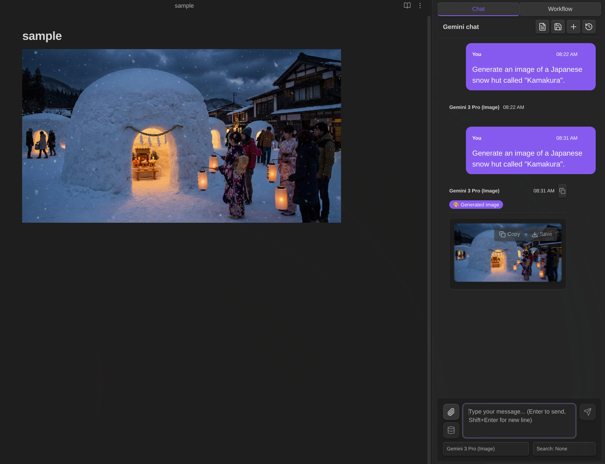

## Chave de API / Opções de CLI

Este plugin requer uma chave de API do Google Gemini ou uma ferramenta CLI. Você pode escolher entre:

| Recurso | Chave API Gratuita | Chave API Paga | CLI |
|---------|---------------------|-----------------|-----|
| Chat básico | ✅ | ✅ | ✅ |
| Operações no vault | ✅ | ✅ | Somente Leitura/Busca |
| Busca na Web | ✅ | ✅ | ❌ |
| RAG | ✅ (limitado) | ✅ | ❌ |
| Workflow | ✅ | ✅ | ✅ |
| Geração de Imagens | ❌ | ✅ | ❌ |
| Modelos | Flash, Gemma | Flash, Pro, Image | Gemini CLI, Claude Code, Codex |
| Custo | **Gratuito** | Pague por uso | **Gratuito** |

> [!TIP]
> **Opções de CLI** permitem usar modelos principais apenas com uma conta - sem necessidade de chave de API!
> - **Gemini CLI**: Instale o [Gemini CLI](https://github.com/google-gemini/gemini-cli), execute `gemini` e autentique com `/auth`
> - **Claude CLI**: Instale o [Claude Code](https://github.com/anthropics/claude-code) (`npm install -g @anthropic-ai/claude-code`), execute `claude` e autentique
> - **Codex CLI**: Instale o [Codex CLI](https://github.com/openai/codex) (`npm install -g @openai/codex`), execute `codex` e autentique

### Dicas para Chave de API Gratuita

- **Limites de taxa** são por modelo e reiniciam diariamente. Troque de modelo para continuar trabalhando.
- **Sincronização RAG** é limitada. Execute "Sync Vault" diariamente - arquivos já enviados são ignorados.
- **Modelos Gemma** e **Gemini CLI** não suportam operações no vault no Chat, mas **Workflows ainda podem ler/escrever notas** usando os tipos de nó `note`, `note-read` e outros. As variáveis `{content}` e `{selection}` também funcionam.

---

# Chat com IA

O recurso de Chat com IA fornece uma interface de conversação interativa com o Google Gemini, integrada ao seu vault do Obsidian.

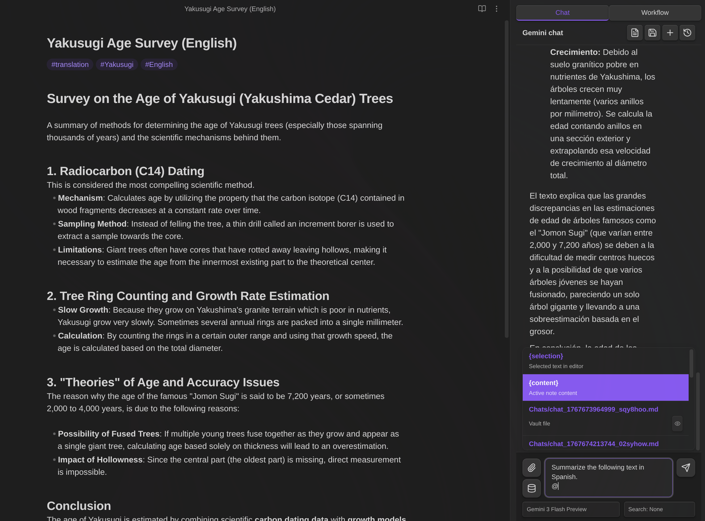

## Comandos de Barra

Crie templates de prompts reutilizáveis acionados por `/`:

- Defina templates com `{selection}` (texto selecionado) e `{content}` (nota ativa)
- Modelo opcional e substituição de busca por comando
- Digite `/` para ver os comandos disponíveis

**Padrão:** `/infographic` - Converte conteúdo em infográfico HTML


## Menções com @

Referencie arquivos e variáveis digitando `@`:

- `{selection}` - Texto selecionado
- `{content}` - Conteúdo da nota ativa
- Qualquer arquivo do vault - Navegue e insira (somente caminho; a IA lê o conteúdo via ferramentas)

> [!NOTE]
> **Como `{selection}` e `{content}` funcionam:** Quando você muda da Visualização Markdown para a Visualização de Chat, a seleção normalmente seria apagada devido à mudança de foco. Para preservar sua seleção, o plugin a captura ao mudar de visualização e destaca a área selecionada com uma cor de fundo na Visualização Markdown. A opção `{selection}` só aparece nas sugestões @ quando há texto selecionado.
>
> Tanto `{selection}` quanto `{content}` **não são expandidos** intencionalmente na área de entrada—como a entrada do chat é compacta, expandir texto longo dificultaria a digitação. O conteúdo é expandido quando você envia a mensagem, o que pode ser verificado conferindo sua mensagem enviada no chat.

> [!NOTE]
> Menções de arquivos do vault com @ inserem apenas o caminho do arquivo - a IA lê o conteúdo via ferramentas. Isso não funciona com modelos Gemma (sem suporte a ferramentas do vault). O Gemini CLI pode ler arquivos via shell, mas o formato da resposta pode diferir.

## Anexos de Arquivos

Anexe arquivos diretamente: Imagens (PNG, JPEG, GIF, WebP), PDFs, Arquivos de texto

## Chamada de Funções (Operações no Vault)

A IA pode interagir com seu vault usando estas ferramentas:

| Ferramenta | Descrição |
|------------|-----------|
| `read_note` | Ler conteúdo de nota |
| `create_note` | Criar novas notas |
| `propose_edit` | Editar com diálogo de confirmação |
| `propose_delete` | Excluir com diálogo de confirmação |
| `bulk_propose_edit` | Editar múltiplos arquivos em massa com diálogo de seleção |
| `bulk_propose_delete` | Excluir múltiplos arquivos em massa com diálogo de seleção |
| `search_notes` | Buscar no vault por nome ou conteúdo |
| `list_notes` | Listar notas em pasta |
| `rename_note` | Renomear/mover notas |
| `create_folder` | Criar novas pastas |
| `list_folders` | Listar pastas no vault |
| `get_active_note_info` | Obter informações sobre nota ativa |
| `get_rag_sync_status` | Verificar status de sincronização RAG |

### Modo de Ferramentas do Vault

Quando a IA manipula notas no Chat, ela usa ferramentas do Vault. Controle quais ferramentas do vault a IA pode usar através do ícone de banco de dados (📦) abaixo do botão de anexo:

| Modo | Descrição | Ferramentas Disponíveis |
|------|-----------|------------------------|
| **Vault: Tudo** | Acesso completo ao vault | Todas as ferramentas |
| **Vault: Sem pesquisa** | Excluir ferramentas de pesquisa | Todas exceto `search_notes`, `list_notes` |
| **Vault: Desligado** | Sem acesso ao vault | Nenhuma |

**Quando usar cada modo:**

- **Vault: Tudo** - Modo padrão para uso geral. A IA pode ler, escrever e pesquisar em seu vault.
- **Vault: Sem pesquisa** - Use quando quiser pesquisar apenas com RAG, ou quando já souber o arquivo alvo. Isso evita pesquisas redundantes no vault, economizando tokens e melhorando o tempo de resposta.
- **Vault: Desligado** - Use quando não precisar de acesso ao vault.

**Seleção automática de modo:**

| Condição | Modo Padrão | Alterável |
|----------|-------------|-----------|
| Modelos CLI (Gemini/Claude/Codex CLI) | Vault: Desligado | Não |
| Modelos Gemma | Vault: Desligado | Não |
| Web Search habilitado | Vault: Desligado | Não |
| RAG habilitado | Vault: Desligado | Não |
| Sem RAG | Vault: Tudo | Sim |

**Por que alguns modos são forçados:**

- **Modelos CLI/Gemma**: Esses modelos não suportam chamadas de função, então as ferramentas do Vault não podem ser usadas.
- **Web Search**: Por design, as ferramentas do Vault são desabilitadas quando Web Search está habilitado.
- **RAG habilitado**: A API Gemini não suporta combinar File Search (RAG) com chamadas de função. Quando RAG está habilitado, as ferramentas do Vault e MCP são automaticamente desabilitadas.

## Edição Segura

Quando a IA usa `propose_edit`:
1. Um diálogo de confirmação mostra as alterações propostas
2. Clique em **Apply** para gravar as alterações no arquivo
3. Clique em **Discard** para cancelar sem modificar o arquivo

> As alterações NÃO são gravadas até você confirmar.

## Histórico de Edições

Rastreie e restaure alterações feitas em suas notas:

- **Rastreamento automático** - Todas as edições de IA (chat, workflow) e alterações manuais são registradas
- **Acesso pelo menu de arquivo** - Clique com o botão direito em um arquivo markdown para acessar:
  - **Snapshot** - Salvar o estado atual como snapshot
  - **History** - Abrir modal de histórico de edições


- **Paleta de comandos** - Também disponível via comando "Show edit history"
- **Visualização de diff** - Veja exatamente o que mudou com adições/exclusões coloridas
- **Restaurar** - Reverta para qualquer versão anterior com um clique
- **Copiar** - Salva uma versão histórica como um novo arquivo (nome padrão: `{filename}_{datetime}.md`)
- **Modal redimensionável** - Arraste para mover, redimensione pelos cantos

**Exibição de diff:**
- Linhas `+` existiam na versão anterior
- Linhas `-` foram adicionadas na versão mais nova

**Como funciona:**

O histórico de edições usa uma abordagem baseada em snapshots:

1. **Criação do snapshot** - Quando um arquivo é aberto pela primeira vez ou modificado pela IA, um snapshot de seu conteúdo é salvo
2. **Registro de diff** - Quando o arquivo é modificado, a diferença entre o novo conteúdo e o snapshot é registrada como uma entrada de histórico
3. **Atualização do snapshot** - O snapshot é atualizado para o novo conteúdo após cada modificação
4. **Restaurar** - Para restaurar para uma versão anterior, os diffs são aplicados em reverso a partir do snapshot

**Quando o histórico é registrado:**
- Edições de chat da IA (ferramenta `propose_edit`)
- Modificações de notas de workflow (nó `note`)
- Salvamentos manuais via comando
- Auto-detecção quando o arquivo difere do snapshot ao abrir

**Armazenamento:** O histórico de edição é armazenado em memória e limpo ao reiniciar o Obsidian. O rastreamento persistente de versões é coberto pela recuperação de arquivos integrada do Obsidian.

**Configurações:**
- Habilitar/desabilitar nas configurações do plugin
- Configurar linhas de contexto para diffs

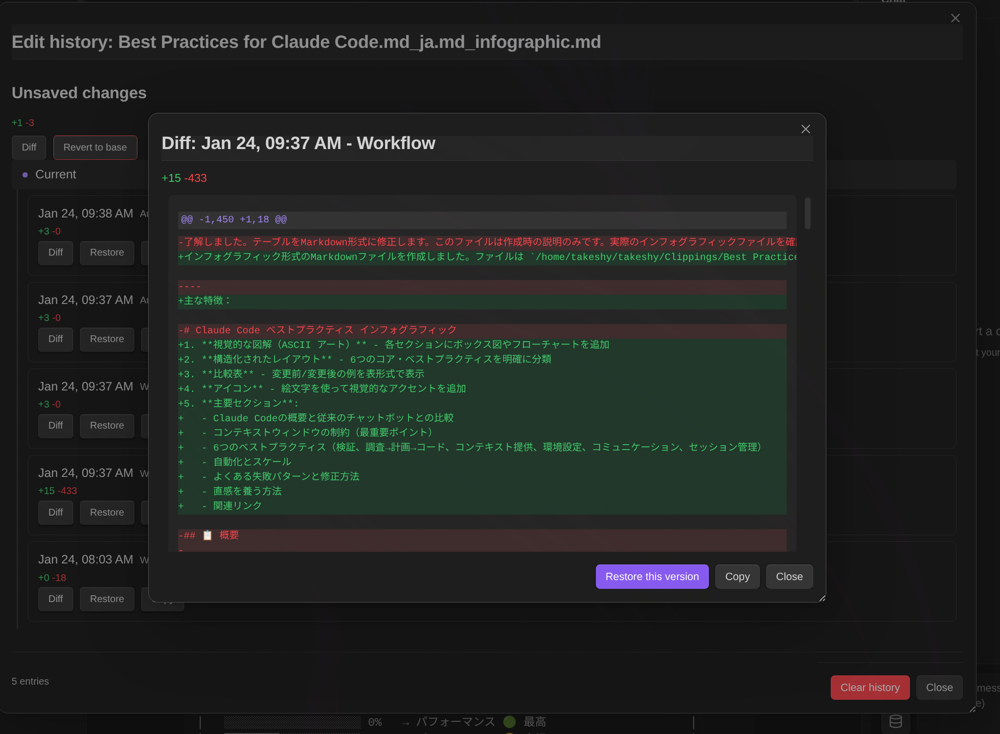

## RAG

Geração Aumentada por Recuperação para busca inteligente no vault:

- **Arquivos suportados** - Markdown, PDF, Imagens (PNG, JPEG, GIF, WebP)
- **Modo interno** - Sincronizar arquivos do vault com o Google File Search
- **Modo externo** - Usar IDs de stores existentes
- **Sincronização incremental** - Enviar apenas arquivos alterados
- **Pastas de destino** - Especificar pastas a incluir
- **Padrões de exclusão** - Padrões regex para excluir arquivos

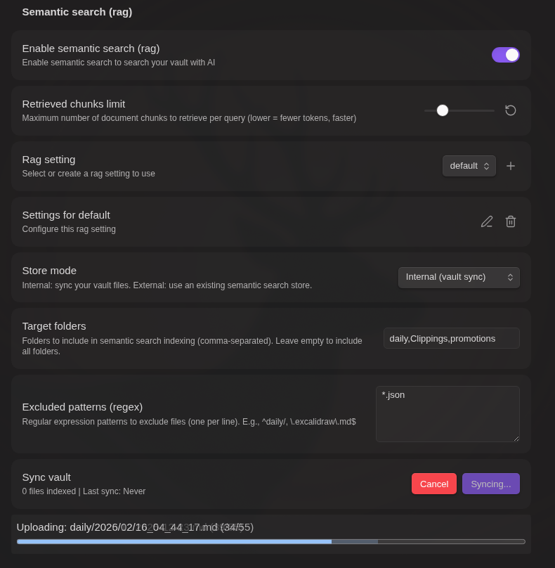

## Servidores MCP

Os servidores MCP (Model Context Protocol) fornecem ferramentas adicionais que estendem as capacidades da IA além das operações do vault.

**Configuração:**

1. Abra as configurações do plugin → seção **Servidores MCP**
2. Clique em **Adicionar servidor**
3. Digite o nome e URL do servidor
4. Configure cabeçalhos opcionais (formato JSON) para autenticação
5. Clique em **Testar conexão** para verificar e obter as ferramentas disponíveis
6. Salve a configuração do servidor

> **Nota:** O teste de conexão é obrigatório antes de salvar. Isso garante que o servidor está acessível e exibe as ferramentas disponíveis.

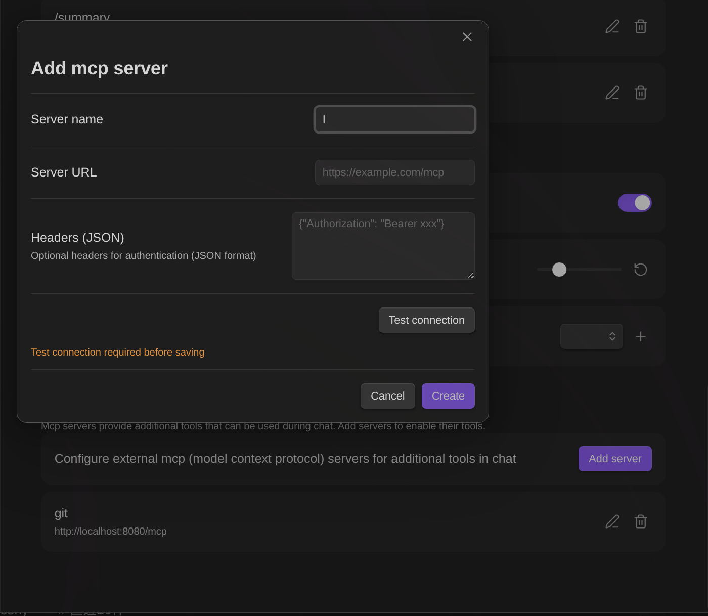

**Usando ferramentas MCP:**

- **No chat:** Clique no ícone de banco de dados (📦) para abrir as configurações de ferramentas. Ative/desative servidores MCP por conversa.
- **Em workflows:** Use o nó `mcp` para chamar ferramentas do servidor MCP.

**Dicas de ferramentas:** Após um teste de conexão bem-sucedido, os nomes das ferramentas disponíveis são salvos e exibidos tanto nas configurações quanto na interface do chat.

### MCP Apps (UI Interativa)

Algumas ferramentas MCP retornam UI interativa que permite interagir visualmente com os resultados da ferramenta. Este recurso é baseado na [especificação MCP Apps](https://github.com/anthropics/anthropic-cookbook/tree/main/misc/mcp_apps).

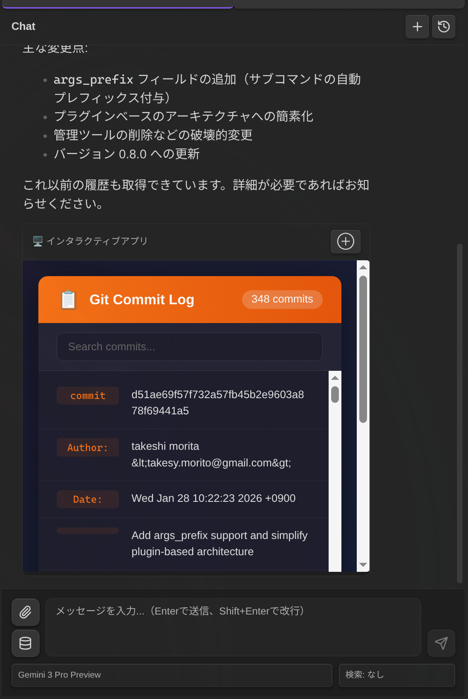

**Como funciona:**

- Quando uma ferramenta MCP retorna um URI de recurso `ui://` nos metadados de resposta, o plugin busca e renderiza o conteúdo HTML
- A UI é exibida em um iframe sandboxed por segurança (`sandbox="allow-scripts allow-forms"`)
- Aplicativos interativos podem chamar ferramentas MCP adicionais e atualizar o contexto através de uma ponte JSON-RPC

**No Chat:**
- MCP Apps aparece inline nas mensagens do assistente com um botão expandir/recolher
- Clique em ⊕ para expandir para tela cheia, ⊖ para recolher

**Em Workflows:**
- MCP Apps é exibido em um diálogo modal durante a execução do workflow
- O workflow pausa para permitir a interação do usuário, depois continua quando o modal é fechado

> **Segurança:** Todo o conteúdo MCP App é executado em um iframe sandboxed com permissões restritas. O iframe não pode acessar o DOM da página pai, cookies ou armazenamento local. Apenas `allow-scripts` e `allow-forms` estão habilitados.

---

# Construtor de Workflows

Construa workflows automatizados de múltiplas etapas diretamente em arquivos Markdown. **Não é necessário conhecimento de programação** - apenas descreva o que você quer em linguagem natural, e a IA criará o workflow para você.

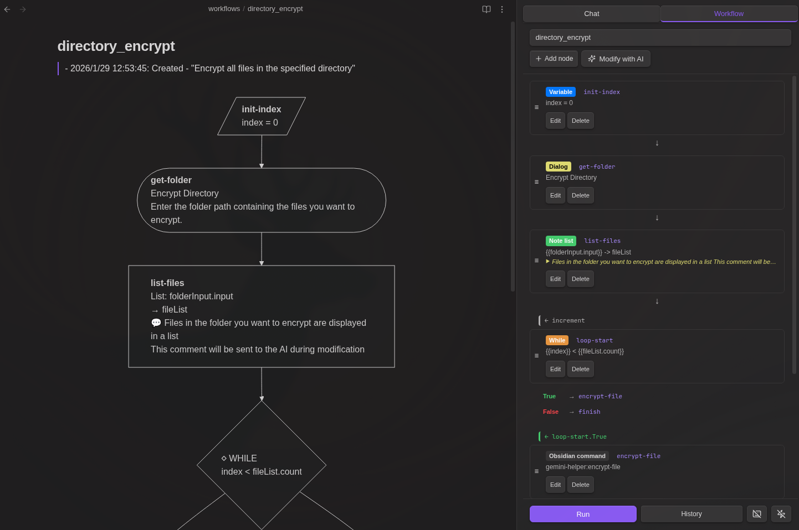

## Criação de Workflows com IA

**Você não precisa aprender sintaxe YAML ou tipos de nós.** Simplesmente descreva seu workflow em linguagem simples:

1. Abra a aba **Workflow** na barra lateral do Gemini
2. Selecione **+ New (AI)** no menu dropdown
3. Descreva o que você quer: *"Crie um workflow que resuma a nota selecionada e salve em uma pasta de resumos"*
4. Clique em **Generate** - a IA cria o workflow completo

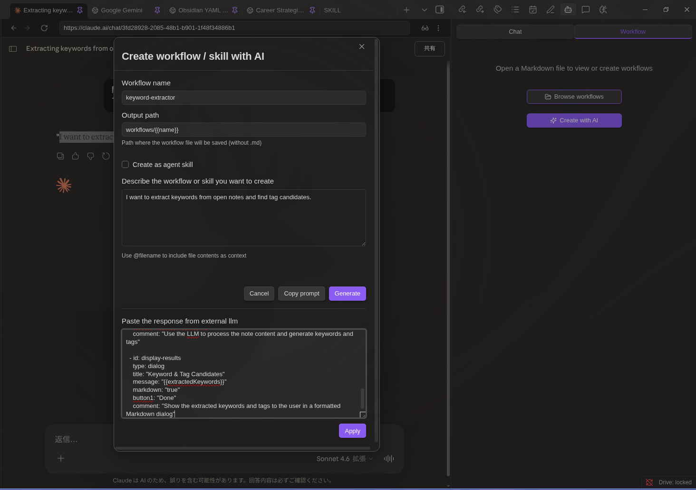

**Modifique workflows existentes da mesma forma:**
1. Carregue qualquer workflow
2. Clique no botão **AI Modify**
3. Descreva as alterações: *"Adicione uma etapa para traduzir o resumo para japonês"*
4. Revise e aplique


## Início Rápido (Manual)

Você também pode escrever workflows manualmente. Adicione um bloco de código workflow a qualquer arquivo Markdown:

````markdown
```workflow
name: Quick Summary
nodes:
  - id: input
    type: dialog
    title: Enter topic
    inputTitle: Topic
    saveTo: topic
  - id: generate
    type: command
    prompt: "Write a brief summary about {{topic.input}}"
    saveTo: result
  - id: save
    type: note
    path: "summaries/{{topic.input}}.md"
    content: "{{result}}"
    mode: create
```
````

Abra a aba **Workflow** na barra lateral do Gemini para executá-lo.

## Tipos de Nós Disponíveis

23 tipos de nós estão disponíveis para construção de workflows:

| Categoria | Nós |
|-----------|-----|
| Variáveis | `variable`, `set` |
| Controle | `if`, `while` |
| LLM | `command` |
| Dados | `http`, `json` |
| Notas | `note`, `note-read`, `note-search`, `note-list`, `folder-list`, `open` |
| Arquivos | `file-explorer`, `file-save` |
| Prompts | `prompt-file`, `prompt-selection`, `dialog` |
| Composição | `workflow` |
| RAG | `rag-sync` |
| Externo | `mcp`, `obsidian-command` |
| Utilitário | `sleep` |

> **Para especificações detalhadas de nós e exemplos, veja [WORKFLOW_NODES_pt.md](docs/WORKFLOW_NODES_pt.md)**

## Modo de Atalho

Atribua atalhos de teclado para executar workflows instantaneamente:

1. Adicione um campo `name:` ao seu workflow
2. Abra o arquivo de workflow e selecione o workflow no dropdown
3. Clique no ícone de teclado (⌨️) no rodapé do painel Workflow
4. Vá para Settings → Hotkeys → pesquise "Workflow: [Nome do Seu Workflow]"
5. Atribua um atalho (ex.: `Ctrl+Shift+T`)

Quando acionado por atalho:
- `prompt-file` usa o arquivo ativo automaticamente (sem diálogo)
- `prompt-selection` usa a seleção atual, ou o conteúdo completo do arquivo se não houver seleção

## Gatilhos de Eventos

Workflows podem ser acionados automaticamente por eventos do Obsidian:


| Evento | Descrição |
|--------|-----------|
| File Created | Acionado quando um novo arquivo é criado |
| File Modified | Acionado quando um arquivo é salvo (debounce de 5s) |
| File Deleted | Acionado quando um arquivo é excluído |
| File Renamed | Acionado quando um arquivo é renomeado |
| File Opened | Acionado quando um arquivo é aberto |

**Configuração de gatilho de evento:**
1. Adicione um campo `name:` ao seu workflow
2. Abra o arquivo de workflow e selecione o workflow no dropdown
3. Clique no ícone de raio (⚡) no rodapé do painel Workflow
4. Selecione quais eventos devem acionar o workflow
5. Opcionalmente adicione um filtro de padrão de arquivo

**Exemplos de padrão de arquivo:**
- `**/*.md` - Todos os arquivos Markdown em qualquer pasta
- `journal/*.md` - Arquivos Markdown somente na pasta journal
- `*.md` - Arquivos Markdown somente na pasta raiz
- `**/{daily,weekly}/*.md` - Arquivos nas pastas daily ou weekly
- `projects/[a-z]*.md` - Arquivos começando com letra minúscula

**Variáveis de evento:** Quando acionado por um evento, estas variáveis são definidas automaticamente:

| Variável | Descrição |
|----------|-----------|
| `__eventType__` | Tipo de evento: `create`, `modify`, `delete`, `rename`, `file-open` |
| `__eventFilePath__` | Caminho do arquivo afetado |
| `__eventFile__` | JSON com informações do arquivo (path, basename, name, extension) |
| `__eventFileContent__` | Conteúdo do arquivo (para eventos create/modify/file-open) |
| `__eventOldPath__` | Caminho anterior (somente para eventos rename) |

> **Nota:** Os nós `prompt-file` e `prompt-selection` usam automaticamente o arquivo do evento quando acionados por eventos. `prompt-selection` usa o conteúdo inteiro do arquivo como seleção.

---

# Comum

## Modelos Suportados

### Plano Pago
| Modelo | Descrição |
|--------|-----------|
| Gemini 3.1 Pro Preview | Último modelo principal, contexto de 1M (recomendado) |
| Gemini 3.1 Pro Preview (Custom Tools) | Otimizado para workflows agênticos com ferramentas personalizadas e bash |
| Gemini 3 Flash Preview | Modelo rápido, contexto de 1M, melhor custo-benefício |
| Gemini 3 Pro Preview | Modelo principal, contexto de 1M |
| Gemini 2.5 Flash | Modelo rápido, contexto de 1M |
| Gemini 2.5 Pro | Modelo Pro, contexto de 1M |
| Gemini 2.5 Flash Lite | Modelo flash leve |
| Gemini 2.5 Flash (Image) | Geração de imagens, 1024px |
| Gemini 3 Pro (Image) | Geração de imagens Pro, 4K |

### Plano Gratuito
| Modelo | Operações no Vault |
|--------|---------------------|
| Gemini 2.5 Flash | ✅ |
| Gemini 2.5 Flash Lite | ✅ |
| Gemini 3 Flash Preview | ✅ |
| Gemma 3 (27B/12B/4B/1B) | ❌ |

## Instalação

### BRAT (Recomendado)
1. Instale o plugin [BRAT](https://github.com/TfTHacker/obsidian42-brat)
2. Abra as configurações do BRAT → "Add Beta plugin"
3. Digite: `https://github.com/takeshy/obsidian-gemini-helper`
4. Ative o plugin nas configurações de Community plugins

### Manual
1. Baixe `main.js`, `manifest.json`, `styles.css` das releases
2. Crie a pasta `gemini-helper` em `.obsidian/plugins/`
3. Copie os arquivos e ative nas configurações do Obsidian

### A partir do Código-fonte
```bash
git clone https://github.com/takeshy/obsidian-gemini-helper
cd obsidian-gemini-helper
npm install
npm run build
```

## Configuração

### Configurações de API
1. Obtenha a chave de API em [ai.google.dev](https://ai.google.dev)
2. Digite nas configurações do plugin
3. Selecione o plano de API (Gratuito/Pago)

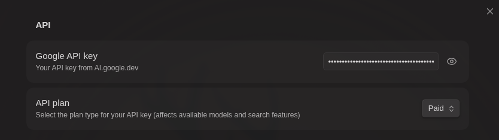

### Modo CLI (Gemini / Claude / Codex)

**Gemini CLI:**
1. Instale o [Gemini CLI](https://github.com/google-gemini/gemini-cli)
2. Autentique com `gemini` → `/auth`
3. Clique em "Verify" na seção Gemini CLI

**Claude CLI:**
1. Instale o [Claude Code](https://github.com/anthropics/claude-code): `npm install -g @anthropic-ai/claude-code`
2. Autentique com `claude`
3. Clique em "Verify" na seção Claude CLI

**Codex CLI:**
1. Instale o [Codex CLI](https://github.com/openai/codex): `npm install -g @openai/codex`
2. Autentique com `codex`
3. Clique em "Verify" na seção Codex CLI

**Limitações do CLI:** Operações no vault somente leitura, sem busca semântica/web

**Caminho CLI personalizado:** Se a detecção automática do CLI falhar, clique no ícone de engrenagem (⚙️) ao lado do botão Verify para especificar manualmente o caminho do CLI.

<details>
<summary><b>Windows: Como encontrar o caminho do CLI</b></summary>

1. Abra o PowerShell e execute:
   ```powershell
   Get-Command gemini
   ```
2. Isso mostra o caminho do script (ex: `C:\Users\YourName\AppData\Roaming\npm\gemini.ps1`)
3. Navegue da pasta `npm` até o `index.js` real:
   ```
   C:\Users\YourName\AppData\Roaming\npm\node_modules\@google\gemini-cli\dist\index.js
   ```
4. Insira este caminho completo nas configurações de caminho do CLI

Para Claude CLI, use `Get-Command claude` e navegue até `node_modules\@anthropic-ai\claude-code\dist\index.js`.
</details>

> [!TIP]
> **Dica do Claude CLI:** As sessões de chat do Gemini Helper são armazenadas localmente. Você pode continuar conversas fora do Obsidian executando `claude --resume` no diretório do seu vault para ver e retomar sessões anteriores.

### Configurações de Workspace
- **Workspace Folder** - Localização do histórico de chat e configurações
- **System Prompt** - Instruções adicionais para a IA
- **Tool Limits** - Controlar limites de chamadas de função
- **Edit History** - Rastrear e restaurar alterações feitas pela IA

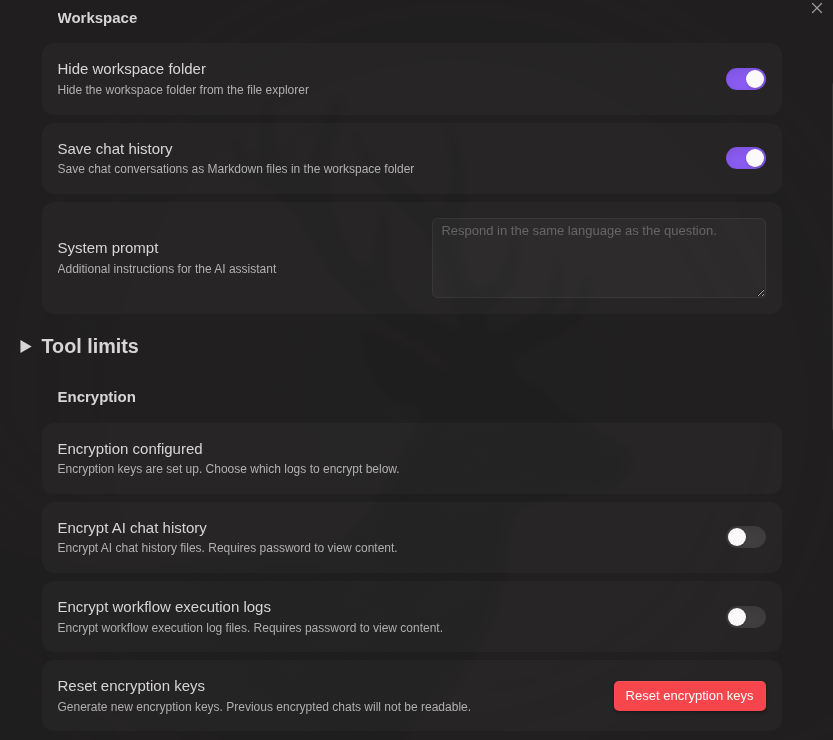

### Criptografia

Proteja seu histórico de chat e logs de execução de workflows com senha separadamente.

**Configuração:**

1. Defina uma senha nas configurações do plugin (armazenada com segurança usando criptografia de chave pública)

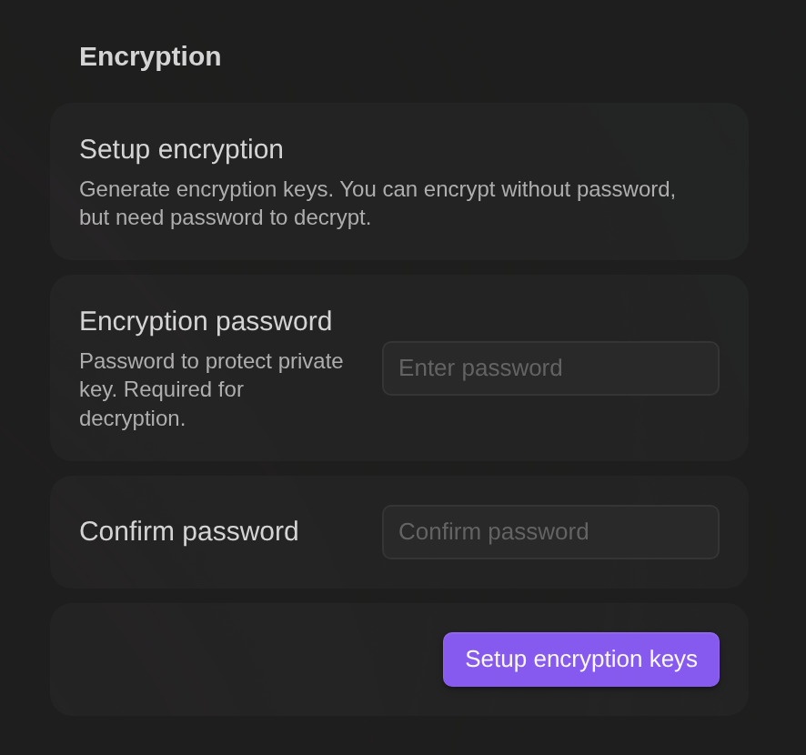

2. Após a configuração, ative a criptografia para cada tipo de log:
   - **Criptografar histórico de chat AI** - Criptografa arquivos de conversa de chat
   - **Criptografar logs de execução de workflows** - Criptografa arquivos de histórico de workflows

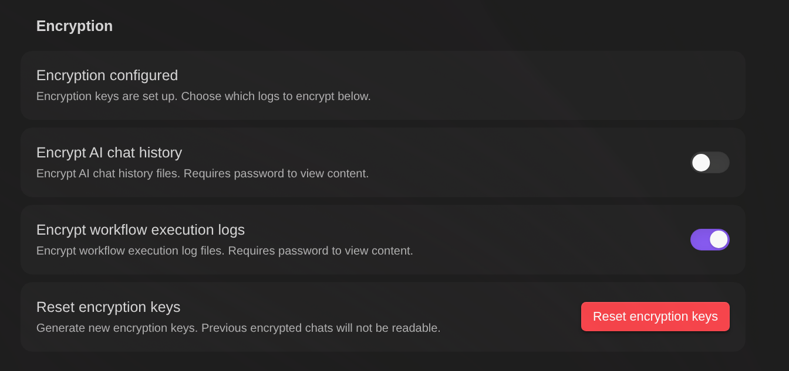

Cada configuração pode ser habilitada/desabilitada independentemente.

**Recursos:**
- **Controles separados** - Escolha quais logs criptografar (chat, workflow, ou ambos)
- **Criptografia automática** - Novos arquivos são criptografados ao salvar com base nas configurações
- **Cache de senha** - Digite a senha uma vez por sessão
- **Visualizador dedicado** - Arquivos criptografados abrem em um editor seguro com pré-visualização
- **Opção de descriptografia** - Remova a criptografia de arquivos individuais quando necessário

**Como funciona:**

```
[Configuração - uma vez ao definir a senha]
Senha → Gerar par de chaves (RSA) → Criptografar chave privada → Armazenar nas configurações

[Criptografia - para cada arquivo]
Conteúdo do arquivo → Criptografar com nova chave AES → Criptografar chave AES com chave pública
→ Salvar no arquivo: dados criptografados + chave privada criptografada (das configurações) + salt

[Descriptografia]
Senha + salt → Restaurar chave privada → Descriptografar chave AES → Descriptografar conteúdo
```

- Par de chaves é gerado uma vez (geração RSA é lenta), chave AES é gerada por arquivo
- Cada arquivo armazena: conteúdo criptografado + chave privada criptografada (copiada das configurações) + salt
- Os arquivos são autocontidos — descriptografáveis apenas com a senha, sem dependência do plugin

<details>
<summary>Script Python de descriptografia (clique para expandir)</summary>

```python
#!/usr/bin/env python3
"""Descriptografar arquivos Gemini Helper sem o plugin."""
import base64, sys, re, getpass
from cryptography.hazmat.primitives import hashes, serialization
from cryptography.hazmat.primitives.kdf.pbkdf2 import PBKDF2HMAC
from cryptography.hazmat.primitives.ciphers.aead import AESGCM
from cryptography.hazmat.primitives.asymmetric import padding

def decrypt_file(filepath: str, password: str) -> str:
    with open(filepath, 'r') as f:
        content = f.read()

    match = re.match(r'^---\n([\s\S]*?)\n---\n([\s\S]*)$', content)
    if not match:
        raise ValueError("Formato de arquivo criptografado inválido")

    frontmatter, encrypted_data = match.groups()
    key_match = re.search(r'key:\s*(.+)', frontmatter)
    salt_match = re.search(r'salt:\s*(.+)', frontmatter)
    if not key_match or not salt_match:
        raise ValueError("Falta key ou salt no frontmatter")

    enc_private_key = base64.b64decode(key_match.group(1).strip())
    salt = base64.b64decode(salt_match.group(1).strip())
    data = base64.b64decode(encrypted_data.strip())

    kdf = PBKDF2HMAC(algorithm=hashes.SHA256(), length=32, salt=salt, iterations=100000)
    derived_key = kdf.derive(password.encode())

    iv, enc_priv = enc_private_key[:12], enc_private_key[12:]
    private_key_pem = AESGCM(derived_key).decrypt(iv, enc_priv, None)
    private_key = serialization.load_der_private_key(base64.b64decode(private_key_pem), None)

    key_len = (data[0] << 8) | data[1]
    enc_aes_key = data[2:2+key_len]
    content_iv = data[2+key_len:2+key_len+12]
    enc_content = data[2+key_len+12:]

    aes_key = private_key.decrypt(enc_aes_key, padding.OAEP(
        mgf=padding.MGF1(algorithm=hashes.SHA256()), algorithm=hashes.SHA256(), label=None))

    return AESGCM(aes_key).decrypt(content_iv, enc_content, None).decode('utf-8')

if __name__ == "__main__":
    if len(sys.argv) != 2:
        print(f"Uso: {sys.argv[0]} <arquivo_criptografado>")
        sys.exit(1)
    password = getpass.getpass("Senha: ")
    print(decrypt_file(sys.argv[1], password))
```

Requer: `pip install cryptography`

</details>

> **Aviso:** Se você esquecer sua senha, arquivos criptografados não podem ser recuperados. Mantenha sua senha em segurança.

> **Dica:** Para criptografar todos os arquivos em um diretório de uma vez, use um workflow. Veja o exemplo "Criptografar todos os arquivos em um diretório" em [WORKFLOW_NODES_pt.md](docs/WORKFLOW_NODES_pt.md#obsidian-command).


**Benefícios de segurança:**
- **Protegido do chat com IA** - Arquivos criptografados não podem ser lidos pelas operações de IA no vault (ferramenta `read_note`). Isso mantém dados sensíveis como chaves de API seguros contra exposição acidental durante o chat.
- **Acesso via workflow com senha** - Workflows podem ler arquivos criptografados usando o nó `note-read`. Quando acessado, um diálogo de senha aparece, e a senha é armazenada em cache para a sessão.
- **Armazene segredos com segurança** - Em vez de escrever chaves de API diretamente nos workflows, armazene-as em arquivos criptografados. O workflow lê a chave em tempo de execução após a verificação da senha.

### Comandos de Barra
- Definir templates de prompt personalizados acionados por `/`
- Override opcional de modelo e busca por comando

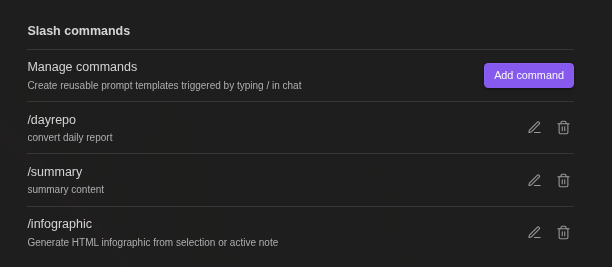

## Uso

### Abrindo o Chat
- Clique no ícone do Gemini na ribbon
- Comando: "Gemini Helper: Open chat"
- Alternar: "Gemini Helper: Toggle chat / editor"

### Controles do Chat
- **Enter** - Enviar mensagem
- **Shift+Enter** - Nova linha
- **Botão Stop** - Parar geração
- **Botão +** - Novo chat
- **Botão History** - Carregar chats anteriores

### Usando Workflows

**Da Barra Lateral:**
1. Abra a aba **Workflow** na barra lateral
2. Abra um arquivo com bloco de código `workflow`
3. Selecione o workflow no dropdown (ou escolha **Browse all workflows** para pesquisar todos os workflows do vault)
4. Clique em **Run** para executar
5. Clique em **History** para ver execuções anteriores

**Da Paleta de Comandos (Run Workflow):**

Use o comando "Gemini Helper: Run Workflow" para navegar e executar workflows de qualquer lugar:

1. Abra a paleta de comandos e pesquise "Run Workflow"
2. Navegue por todos os arquivos do vault com blocos de código workflow (arquivos na pasta `workflows/` são mostrados primeiro)
3. Visualize o conteúdo do workflow e o histórico de geração por AI
4. Selecione um workflow e clique em **Run** para executar


Isso é útil para executar rapidamente workflows sem precisar navegar primeiro até o arquivo do workflow.


**Visualizar como Fluxograma:** Clique no botão **Canvas** (ícone de grade) no painel Workflow para exportar seu workflow como um Canvas do Obsidian. Isso cria um fluxograma visual onde:
- Loops e ramificações são exibidos claramente com roteamento adequado
- Nós de decisão (`if`/`while`) mostram caminhos Sim/Não
- Setas de retorno são roteadas ao redor dos nós para clareza
- Cada nó mostra sua configuração completa
- Um link para o arquivo de workflow de origem está incluído para navegação rápida


Isso é especialmente útil para entender workflows complexos com múltiplas ramificações e loops.

**Exportar histórico de execução:** Visualize o histórico de execução como um Canvas do Obsidian para análise visual. Clique em **Open Canvas view** no modal de Histórico para criar um arquivo Canvas.

> **Nota:** Arquivos Canvas são criados dinamicamente na pasta do workspace. Exclua-os manualmente após revisão se não forem mais necessários.

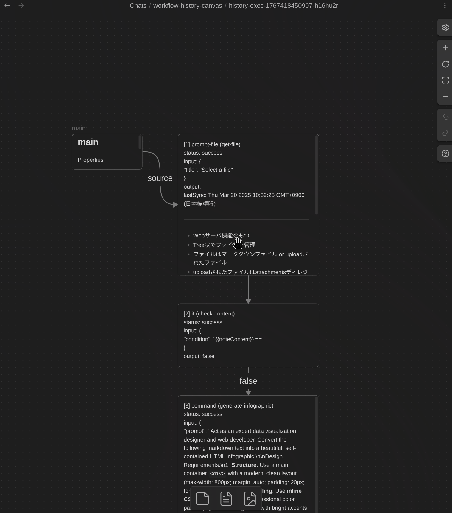

### Geração de Workflow com IA

**Criar Novo Workflow com IA:**
1. Selecione **+ New (AI)** no dropdown de workflow
2. Digite o nome do workflow e caminho de saída (suporta variável `{{name}}`)
3. Descreva o que o workflow deve fazer em linguagem natural
4. Selecione um modelo e clique em **Generate**
5. O workflow é automaticamente criado e salvo

> **Dica:** Ao usar **+ New (AI)** no dropdown em um arquivo que já tem workflows, o caminho de saída é definido como o arquivo atual por padrão. O workflow gerado será adicionado a esse arquivo.

**Criar workflow de qualquer arquivo:**

Ao abrir a aba Workflow com um arquivo que não tem bloco de código workflow, um botão **"Create workflow with AI"** é exibido. Clique para gerar um novo workflow (saída padrão: `workflows/{{name}}.md`).

**Referências de Arquivos com @:**

Digite `@` no campo de descrição para referenciar arquivos:
- `@{selection}` - Seleção atual do editor
- `@{content}` - Conteúdo da nota ativa
- `@path/to/file.md` - Qualquer arquivo do vault

Quando você clica em Generate, o conteúdo do arquivo é incorporado diretamente na solicitação da IA. O frontmatter YAML é automaticamente removido.

> **Dica:** Isso é útil para criar workflows baseados em exemplos ou templates de workflow existentes em seu vault.

**Anexos de Arquivos:**

Clique no botão de anexo para anexar arquivos (imagens, PDFs, arquivos de texto) à sua solicitação de geração de workflow. Isso é útil para fornecer contexto visual ou exemplos para a IA.

**Controles do Modal:**

O modal de workflow com IA suporta posicionamento por arrastar e soltar e redimensionamento pelos cantos para uma melhor experiência de edição.

**Histórico de Solicitações:**

Cada workflow gerado por IA salva uma entrada de histórico acima do bloco de código do workflow, incluindo:
- Timestamp e ação (Criado/Modificado)
- Sua descrição da solicitação
- Conteúdos de arquivos referenciados (em seções recolhíveis)


**Modificar Workflow Existente com IA:**
1. Carregue um workflow existente
2. Clique no botão **AI Modify** (ícone de brilho)
3. Descreva as alterações que você deseja
4. Revise a comparação antes/depois
5. Clique em **Apply Changes** para atualizar


**Referência ao Histórico de Execução:**

Ao modificar um workflow com IA, você pode referenciar resultados de execuções anteriores para ajudar a IA a entender problemas:

1. Clique no botão **Referenciar histórico de execução**
2. Selecione uma execução da lista (execuções com erros são destacadas)
3. Escolha quais passos incluir (passos com erros são pré-selecionados)
4. A IA recebe os dados de entrada/saída do passo para entender o que deu errado

Isso é especialmente útil para depurar workflows - você pode dizer à IA "Corrija o erro no passo 2" e ela verá exatamente qual entrada causou a falha.

**Histórico de Solicitações:**

Ao regenerar um workflow (clicando em "Não" na prévia), todas as solicitações anteriores da sessão são passadas para a IA. Isso ajuda a IA a entender o contexto completo das suas modificações ao longo de múltiplas iterações.

**Edição Manual de Workflow:**

Edite workflows diretamente no editor visual de nós com interface drag-and-drop.

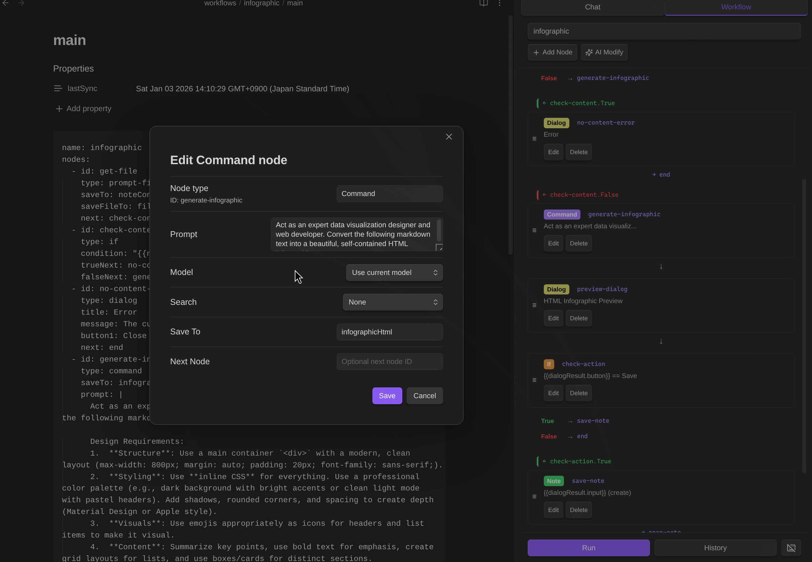

**Recarregar do Arquivo:**
- Selecione **Reload from file** no dropdown para reimportar o workflow do arquivo markdown

## Requisitos

- Obsidian v0.15.0+
- Chave de API do Google AI, ou ferramenta CLI (Gemini CLI / Claude CLI / Codex CLI)
- Desktop e mobile suportados (modo CLI: somente desktop)

## Privacidade

**Dados armazenados localmente:**
- Chave de API (armazenada nas configurações do Obsidian)
- Histórico de chat (como arquivos Markdown, opcionalmente criptografados)
- Histórico de execução de workflow (opcionalmente criptografado)
- Chaves de criptografia (chave privada criptografada com sua senha)

**Dados enviados ao Google:**
- Todas as mensagens de chat e anexos de arquivos são enviados à API do Google Gemini para processamento
- Quando RAG está habilitado, arquivos do vault são enviados ao Google File Search
- Quando Busca na Web está habilitada, consultas são enviadas ao Google Search

**Dados enviados a serviços de terceiros:**
- Nós `http` de workflow podem enviar dados para qualquer URL especificada no workflow

**Provedores CLI (opcional):**
- Quando o modo CLI está habilitado, ferramentas CLI externas (gemini, claude, codex) são executadas via child_process
- Isso só ocorre quando explicitamente configurado e verificado pelo usuário
- O modo CLI é somente para desktop (não disponível em mobile)

**Servidores MCP (opcional):**
- Servidores MCP (Model Context Protocol) podem ser configurados nas configurações do plugin para nós `mcp` de workflows
- Servidores MCP são serviços externos que fornecem ferramentas e capacidades adicionais

**Notas de segurança:**
- Revise workflows antes de executar - nós `http` podem transmitir dados do vault para endpoints externos
- Nós `note` de workflow mostram um diálogo de confirmação antes de gravar arquivos (comportamento padrão)
- Comandos de barra com `confirmEdits: false` aplicarão edições de arquivo automaticamente sem mostrar botões Apply/Discard
- Credenciais sensíveis: Não armazene chaves de API ou tokens diretamente no YAML do workflow (headers `http`, configurações `mcp`, etc.). Em vez disso, armazene-os em arquivos criptografados e use o nó `note-read` para recuperá-los em tempo de execução. Workflows podem ler arquivos criptografados com solicitação de senha.

Veja os [Termos de Serviço do Google AI](https://ai.google.dev/terms) para políticas de retenção de dados.

## Licença

MIT

## Links

- [Documentação da API Gemini](https://ai.google.dev/docs)
- [Documentação de Plugins do Obsidian](https://docs.obsidian.md/Plugins/Getting+started/Build+a+plugin)

## Apoie

Se você achar este plugin útil, considere me pagar um café!

[](https://buymeacoffee.com/takeshy)
