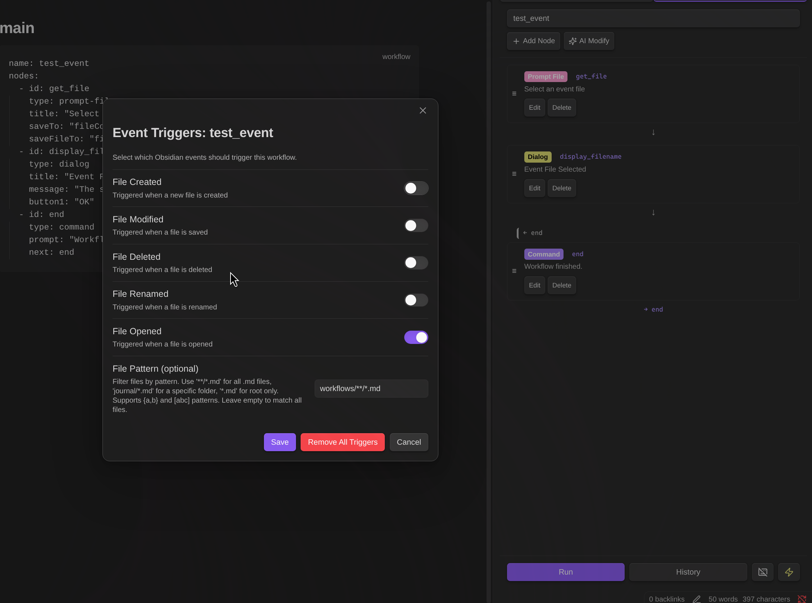

# Reference des Noeuds de Workflow

Ce document fournit les specifications detaillees de tous les types de noeuds de workflow. Pour la plupart des utilisateurs, **vous n'avez pas besoin d'apprendre ces details** - decrivez simplement ce que vous voulez en langage naturel, et l'IA creera ou modifiera les workflows pour vous.

## Apercu des Types de Noeuds

| Categorie | Noeuds | Description |
|-----------|--------|-------------|
| Variables | `variable`, `set` | Declarer et mettre a jour des variables |
| Controle | `if`, `while` | Branchement conditionnel et boucles |
| LLM | `command` | Executer des prompts avec options de modele/recherche |
| Donnees | `http`, `json` | Requetes HTTP et analyse JSON |
| Notes | `note`, `note-read`, `note-search`, `note-list`, `folder-list`, `open` | Operations sur le coffre |
| Fichiers | `file-explorer`, `file-save` | Selection et sauvegarde de fichiers (images, PDF, etc.) |
| Invites | `prompt-file`, `prompt-selection`, `dialog` | Dialogues de saisie utilisateur |
| Composition | `workflow` | Executer un autre workflow comme sous-workflow |
| RAG | `rag-sync` | Synchroniser les notes vers le store RAG |
| Externe | `mcp`, `obsidian-command` | Appeler des serveurs MCP externes ou des commandes Obsidian |

---

## Reference des Noeuds

### command

Executer un prompt LLM avec des parametres optionnels de modele et de recherche.

```yaml
- id: search
  type: command
  model: gemini-3-flash-preview  # Optional: specific model
  ragSetting: __websearch__      # Optional: __websearch__, __none__, or setting name
  prompt: "Search for {{topic}}"
  saveTo: result
```

| Propriete | Description |
|-----------|-------------|
| `prompt` | Le prompt a envoyer au LLM (requis) |
| `model` | Remplacer le modele actuel (ex: `gemini-3-flash-preview`, `gemini-3-pro-image-preview`) |
| `ragSetting` | `__websearch__` (recherche web), `__none__` (pas de recherche), nom du parametre, ou omettre pour l'actuel |
| `attachments` | Noms de variables separes par des virgules contenant FileExplorerData (du noeud `file-explorer`) |
| `saveTo` | Nom de variable pour stocker la reponse textuelle |
| `saveImageTo` | Nom de variable pour stocker l'image generee (format FileExplorerData, pour les modeles d'image) |

**Exemple de generation d'image**:
```yaml
- id: generate
  type: command
  prompt: "Generate a cute cat illustration"
  model: gemini-3-pro-image-preview
  saveImageTo: generatedImage
- id: save-image
  type: note
  path: "images/cat"
  content: ""
```

### note

Ecrire du contenu dans un fichier de note.

```yaml
- id: save
  type: note
  path: "output/{{filename}}.md"
  content: "{{result}}"
  mode: overwrite
  confirm: true
```

| Propriete | Description |
|-----------|-------------|
| `path` | Chemin du fichier (requis) |
| `content` | Contenu a ecrire |
| `mode` | `overwrite` (defaut), `append`, ou `create` (ignorer si existe) |
| `confirm` | `true` (defaut) affiche une boite de dialogue de confirmation, `false` ecrit immediatement |

### note-list

Lister les notes avec filtrage et tri.

```yaml
- id: list
  type: note-list
  folder: "Projects"
  recursive: true
  tags: "todo, project"
  tagMatch: all
  createdWithin: "7d"
  modifiedWithin: "24h"
  sortBy: modified
  sortOrder: desc
  limit: 20
  saveTo: noteList
```

| Propriete | Description |
|-----------|-------------|
| `folder` | Chemin du dossier (vide pour tout le coffre) |
| `recursive` | `true` inclut les sous-dossiers, `false` (defaut) uniquement les enfants directs |
| `tags` | Tags separes par des virgules a filtrer (avec ou sans `#`) |
| `tagMatch` | `any` (defaut) ou `all` les tags doivent correspondre |
| `createdWithin` | Filtrer par date de creation : `30m`, `24h`, `7d` |
| `modifiedWithin` | Filtrer par date de modification |
| `sortBy` | `created`, `modified`, ou `name` |
| `sortOrder` | `asc` ou `desc` (defaut) |
| `limit` | Nombre maximum de resultats (defaut : 50) |
| `saveTo` | Variable pour les resultats |

**Format de sortie :**
```json
{
  "count": 5,
  "totalCount": 12,
  "hasMore": true,
  "notes": [
    {"name": "Note1", "path": "folder/Note1.md", "created": 1234567890, "modified": 1234567900, "tags": ["#todo"]}
  ]
}
```

### http

Effectuer des requetes HTTP.

```yaml
- id: fetch
  type: http
  url: "https://api.example.com/data"
  method: POST
  contentType: json
  headers: '{"Authorization": "Bearer {{token}}"}'
  body: '{"query": "{{searchTerm}}"}'
  saveTo: response
  saveStatus: statusCode
  throwOnError: "true"
```

| Propriete | Description |
|-----------|-------------|
| `url` | URL de la requete (requis) |
| `method` | `GET` (defaut), `POST`, `PUT`, `PATCH`, `DELETE` |
| `contentType` | `json` (defaut), `form-data`, `text` |
| `headers` | Objet JSON ou format `Cle: Valeur` (un par ligne) |
| `body` | Corps de la requete (pour POST/PUT/PATCH) |
| `saveTo` | Variable pour le corps de la reponse |
| `saveStatus` | Variable pour le code de statut HTTP |
| `throwOnError` | `true` pour lever une erreur sur les reponses 4xx/5xx |

**Exemple form-data** (telechargement de fichier binaire avec file-explorer) :

```yaml
- id: select-pdf
  type: file-explorer
  path: "{{__eventFilePath__}}"
  extensions: "pdf,png,jpg"
  saveTo: fileData
- id: upload
  type: http
  url: "https://example.com/upload"
  method: POST
  contentType: form-data
  body: '{"file": "{{fileData}}"}'
  saveTo: response
```

Pour `form-data` :
- FileExplorerData (du noeud `file-explorer`) est auto-detecte et envoye en binaire
- Utilisez la syntaxe `nomChamp:nomFichier` pour les champs de fichiers texte (ex: `"file:report.html": "{{htmlContent}}"`)

### dialog

Afficher une boite de dialogue avec des options, des boutons et/ou une saisie de texte.

```yaml
- id: ask
  type: dialog
  title: Select Options
  message: Choose items to process
  markdown: true
  options: "Option A, Option B, Option C"
  multiSelect: true
  inputTitle: "Additional notes"
  multiline: true
  defaults: '{"input": "default text", "selected": ["Option A"]}'
  button1: Confirm
  button2: Cancel
  saveTo: dialogResult
```

| Propriete | Description |
|-----------|-------------|
| `title` | Titre de la boite de dialogue |
| `message` | Contenu du message (supporte `{{variables}}`) |
| `markdown` | `true` rend le message en Markdown |
| `options` | Liste de choix separes par des virgules (optionnel) |
| `multiSelect` | `true` pour des cases a cocher, `false` pour des boutons radio |
| `inputTitle` | Libelle du champ de saisie texte (affiche la saisie quand defini) |
| `multiline` | `true` pour une zone de texte multiligne |
| `defaults` | JSON avec les valeurs initiales `input` et `selected` |
| `button1` | Libelle du bouton principal (defaut : "OK") |
| `button2` | Libelle du bouton secondaire (optionnel) |
| `saveTo` | Variable pour le resultat : `{"button": "Confirm", "selected": [...], "input": "..."}` |

**Saisie de texte simple :**
```yaml
- id: input
  type: dialog
  title: Enter value
  inputTitle: Your input
  multiline: true
  saveTo: userInput
```

### workflow

Executer un autre workflow comme sous-workflow.

```yaml
- id: runSub
  type: workflow
  path: "workflows/summarize.md"
  name: "Summarizer"
  input: '{"text": "{{content}}"}'
  output: '{"result": "summary"}'
  prefix: "sub_"
```

| Propriete | Description |
|-----------|-------------|
| `path` | Chemin vers le fichier workflow (requis) |
| `name` | Nom du workflow (pour les fichiers avec plusieurs workflows) |
| `input` | Mappage JSON des variables du sous-workflow vers les valeurs |
| `output` | Mappage JSON des variables parentes vers les resultats du sous-workflow |
| `prefix` | Prefixe pour toutes les variables de sortie (quand `output` n'est pas specifie) |

### rag-sync

Synchroniser une note vers un store RAG.

```yaml
- id: sync
  type: rag-sync
  path: "{{fileInfo.path}}"
  ragSetting: "My RAG Store"
  saveTo: syncResult
```

| Propriete | Description |
|-----------|-------------|
| `path` | Chemin de la note a synchroniser (requis, supporte `{{variables}}`) |
| `ragSetting` | Nom du parametre RAG (requis) |
| `saveTo` | Variable pour stocker le resultat (optionnel) |

**Format de sortie :**
```json
{
  "path": "folder/note.md",
  "fileId": "abc123...",
  "ragSetting": "My RAG Store",
  "syncedAt": "2025-01-01T12:00:00.000Z"
}
```

### file-explorer

Selectionner un fichier du coffre ou entrer un nouveau chemin de fichier. Supporte tous les types de fichiers, y compris les images et les PDF.

```yaml
- id: selectImage
  type: file-explorer
  mode: select
  title: "Select an image"
  extensions: "png,jpg,jpeg,gif,webp"
  default: "images/"
  saveTo: imageData
  savePathTo: imagePath
```

| Propriete | Description |
|-----------|-------------|
| `path` | Chemin direct du fichier - ignore la boite de dialogue quand defini (supporte `{{variables}}`) |
| `mode` | `select` (choisir un fichier existant, defaut) ou `create` (entrer un nouveau chemin) |
| `title` | Titre de la boite de dialogue |
| `extensions` | Extensions autorisees separees par des virgules (ex: `pdf,png,jpg`) |
| `default` | Chemin par defaut (supporte `{{variables}}`) |
| `saveTo` | Variable pour le JSON FileExplorerData |
| `savePathTo` | Variable pour juste le chemin du fichier |

**Format FileExplorerData :**
```json
{
  "path": "folder/image.png",
  "basename": "image.png",
  "name": "image",
  "extension": "png",
  "mimeType": "image/png",
  "contentType": "binary",
  "data": "base64-encoded-content"
}
```

**Exemple : Analyse d'image (avec boite de dialogue)**
```yaml
- id: selectImage
  type: file-explorer
  title: "Select an image to analyze"
  extensions: "png,jpg,jpeg,gif,webp"
  saveTo: imageData
- id: analyze
  type: command
  prompt: "Describe this image in detail"
  attachments: imageData
  saveTo: analysis
- id: save
  type: note
  path: "analysis/{{imageData.name}}.md"
  content: "# Image Analysis\n\n{{analysis}}"
```

**Exemple : Declenchement par evenement (sans boite de dialogue)**
```yaml
- id: loadImage
  type: file-explorer
  path: "{{__eventFilePath__}}"
  saveTo: imageData
- id: analyze
  type: command
  prompt: "Describe this image"
  attachments: imageData
  saveTo: result
```

### file-save

Sauvegarder FileExplorerData comme fichier dans le coffre. Utile pour sauvegarder des images generees ou des fichiers copies.

```yaml
- id: saveImage
  type: file-save
  source: generatedImage
  path: "images/output"
  savePathTo: savedPath
```

| Propriete | Description |
|-----------|-------------|
| `source` | Nom de variable contenant FileExplorerData (requis) |
| `path` | Chemin pour sauvegarder le fichier (extension ajoutee automatiquement si manquante) |
| `savePathTo` | Variable pour stocker le chemin final du fichier (optionnel) |

**Exemple : Generer et sauvegarder une image**
```yaml
- id: generate
  type: command
  prompt: "Generate a landscape image"
  model: gemini-3-pro-image-preview
  saveImageTo: generatedImage
- id: save
  type: file-save
  source: generatedImage
  path: "images/landscape"
  savePathTo: savedPath
- id: showResult
  type: dialog
  title: "Image Saved"
  message: "Image saved to {{savedPath}}"
```

### prompt-file

Afficher le selecteur de fichiers ou utiliser le fichier actif en mode raccourci/evenement.

```yaml
- id: selectFile
  type: prompt-file
  title: Select a note
  default: "notes/"
  forcePrompt: "true"
  saveTo: content
  saveFileTo: fileInfo
```

| Propriete | Description |
|-----------|-------------|
| `title` | Titre de la boite de dialogue |
| `default` | Chemin par defaut |
| `forcePrompt` | `true` affiche toujours la boite de dialogue, meme en mode raccourci/evenement |
| `saveTo` | Variable pour le contenu du fichier |
| `saveFileTo` | Variable pour le JSON des informations du fichier |

**Format des informations du fichier :** `{"path": "folder/note.md", "basename": "note.md", "name": "note", "extension": "md"}`

**Comportement par mode de declenchement :**
| Mode | Comportement |
|------|--------------|
| Panel | Affiche la boite de dialogue du selecteur de fichiers |
| Raccourci | Utilise automatiquement le fichier actif |
| Evenement | Utilise automatiquement le fichier de l'evenement |

### prompt-selection

Obtenir le texte selectionne ou afficher la boite de dialogue de selection.

```yaml
- id: getSelection
  type: prompt-selection
  saveTo: text
  saveSelectionTo: selectionInfo
```

| Propriete | Description |
|-----------|-------------|
| `saveTo` | Variable pour le texte selectionne |
| `saveSelectionTo` | Variable pour le JSON des metadonnees de selection |

**Format des informations de selection :** `{"filePath": "...", "startLine": 1, "endLine": 1, "start": 0, "end": 10}`

**Comportement par mode de declenchement :**
| Mode | Comportement |
|------|--------------|
| Panel | Affiche la boite de dialogue de selection |
| Raccourci (avec selection) | Utilise la selection actuelle |
| Raccourci (sans selection) | Utilise le contenu complet du fichier |
| Evenement | Utilise le contenu complet du fichier |

### if / while

Branchement conditionnel et boucles.

```yaml
- id: branch
  type: if
  condition: "{{count}} > 10"
  trueNext: handleMany
  falseNext: handleFew

- id: loop
  type: while
  condition: "{{counter}} < {{total}}"
  trueNext: processItem
  falseNext: done
```

| Propriete | Description |
|-----------|-------------|
| `condition` | Expression avec operateurs : `==`, `!=`, `<`, `>`, `<=`, `>=`, `contains` |
| `trueNext` | ID du noeud quand la condition est vraie |
| `falseNext` | ID du noeud quand la condition est fausse |

> **Règle de référence arrière** : La propriété `next` ne peut référencer des noeuds antérieurs que si la cible est un noeud `while`. Cela évite le code spaghetti et garantit une structure de boucle appropriée.

### variable / set

Declarer et mettre a jour des variables.

```yaml
- id: init
  type: variable
  name: counter
  value: 0

- id: increment
  type: set
  name: counter
  value: "{{counter}} + 1"
```

### mcp

Appeler un outil de serveur MCP (Model Context Protocol) distant via HTTP.

```yaml
- id: search
  type: mcp
  url: "https://mcp.example.com/v1"
  tool: "web_search"
  args: '{"query": "{{searchTerm}}"}'
  headers: '{"Authorization": "Bearer {{apiKey}}"}'
  saveTo: searchResults
```

| Propriete | Description |
|-----------|-------------|
| `url` | URL du endpoint du serveur MCP (requis, supporte `{{variables}}`) |
| `tool` | Nom de l'outil a appeler sur le serveur MCP (requis) |
| `args` | Objet JSON avec les arguments de l'outil (supporte `{{variables}}`) |
| `headers` | Objet JSON avec les en-tetes HTTP (ex: pour l'authentification) |
| `saveTo` | Nom de variable pour le resultat |

**Cas d'utilisation :** Appeler des serveurs MCP distants pour des requetes RAG, recherche web, integrations API, etc.

### obsidian-command

Execute une commande Obsidian par son ID. Cela permet aux workflows de declencher n'importe quelle commande Obsidian, y compris les commandes d'autres plugins.

```yaml
- id: toggle-fold
  type: obsidian-command
  command: "editor:toggle-fold"
  saveTo: result
```

| Propriete | Description |
|-----------|-------------|
| `command` | ID de la commande a executer (requis, supporte `{{variables}}`) |
| `saveTo` | Variable pour stocker le resultat de l'execution (optionnel) |

**Trouver les IDs de commandes :**
1. Ouvrir les Parametres Obsidian → Raccourcis clavier
2. Rechercher la commande souhaitee
3. L'ID de la commande est affiche (ex., `editor:toggle-fold`, `app:reload`)

**IDs de commandes courants :**
| ID de Commande | Description |
|----------------|-------------|
| `editor:toggle-fold` | Basculer le pliage au curseur |
| `editor:fold-all` | Plier tous les titres |
| `editor:unfold-all` | Deplier tous les titres |
| `app:reload` | Recharger Obsidian |
| `workspace:close` | Fermer le panneau actuel |
| `file-explorer:reveal-active-file` | Reveler le fichier dans l'explorateur |

**Exemple : Workflow avec commande de plugin**
```yaml
name: Ecrire Journal de Travail
nodes:
  - id: get-content
    type: dialog
    inputTitle: "Entrez le contenu du journal"
    multiline: true
    saveTo: logContent
  - id: copy-to-clipboard
    type: set
    name: "_clipboard"
    value: "{{logContent.input}}"
  - id: write-to-log
    type: obsidian-command
    command: "work-log:write-from-clipboard"
```

**Cas d'utilisation :** Declencher des commandes principales d'Obsidian ou des commandes d'autres plugins dans le cadre d'un workflow.

---

**Exemple : Requete RAG avec ragujuary**

[ragujuary](https://github.com/takeshy/ragujuary) est un outil CLI pour gerer les Gemini File Search Stores avec support de serveur MCP.

1. Installation et configuration :
```bash
go install github.com/takeshy/ragujuary@latest
export GEMINI_API_KEY=your-api-key

# Create a store and upload files
ragujuary upload --create -s mystore ./docs

# Start MCP server (use --transport http, not sse)
ragujuary serve --transport http --port 8080 --serve-api-key mysecretkey
```

2. Exemple de workflow :
```yaml
name: RAG Search
nodes:
  - id: query
    type: mcp
    url: "http://localhost:8080"
    tool: "query"
    args: '{"store_name": "mystore", "question": "How does authentication work?", "show_citations": true}'
    headers: '{"X-API-Key": "mysecretkey"}'
    saveTo: result
  - id: show
    type: dialog
    title: "Search Result"
    message: "{{result}}"
    markdown: true
    button1: "OK"
```

### Autres Noeuds

| Noeud | Proprietes |
|-------|------------|
| `note-read` | `path`, `saveTo` |
| `note-search` | `query`, `searchContent`, `limit`, `saveTo` |
| `folder-list` | `folder`, `saveTo` |
| `open` | `path` |
| `json` | `source`, `saveTo` |

---

## Terminaison du Workflow

Utilisez `next: end` pour terminer explicitement le workflow :

```yaml
- id: save
  type: note
  path: "output.md"
  content: "{{result}}"
  next: end    # Workflow ends here

- id: branch
  type: if
  condition: "{{cancel}}"
  trueNext: end      # End workflow on true branch
  falseNext: continue
```

## Expansion des Variables

Utilisez la syntaxe `{{variable}}` pour referencer les variables :

```yaml
# Basic
path: "{{folder}}/{{filename}}.md"

# Object/Array access
url: "https://api.example.com?lat={{geo.latitude}}"
content: "{{items[0].name}}"

# Nested variables (for loops)
path: "{{parsed.notes[{{counter}}].path}}"
```

## Noeuds de Saisie Intelligents

Les noeuds `prompt-selection` et `prompt-file` detectent automatiquement le contexte d'execution :

| Noeud | Mode Panel | Mode Raccourci | Mode Evenement |
|-------|------------|----------------|----------------|
| `prompt-file` | Affiche le selecteur de fichiers | Utilise le fichier actif | Utilise le fichier de l'evenement |
| `prompt-selection` | Affiche la boite de dialogue de selection | Utilise la selection ou le fichier complet | Utilise le contenu complet du fichier |

---

## Declencheurs d'Evenements

Les workflows peuvent etre declenches automatiquement par les evenements Obsidian.



### Evenements Disponibles

| Evenement | Description |
|-----------|-------------|
| `create` | Fichier cree |
| `modify` | Fichier modifie/sauvegarde (avec anti-rebond de 5s) |
| `delete` | Fichier supprime |
| `rename` | Fichier renomme |
| `file-open` | Fichier ouvert |

### Variables d'Evenement

Lorsqu'il est declenche par un evenement, ces variables sont automatiquement definies :

| Variable | Description |
|----------|-------------|
| `__eventType__` | Type d'evenement : `create`, `modify`, `delete`, `rename`, `file-open` |
| `__eventFilePath__` | Chemin du fichier concerne |
| `__eventFile__` | JSON : `{"path": "...", "basename": "...", "name": "...", "extension": "..."}` |
| `__eventFileContent__` | Contenu du fichier (pour les evenements create/modify/file-open) |
| `__eventOldPath__` | Chemin precedent (uniquement pour les evenements rename) |

### Syntaxe des Motifs de Fichiers

Filtrer les evenements par chemin de fichier en utilisant des motifs glob :

| Motif | Correspondances |
|-------|-----------------|
| `**/*.md` | Tous les fichiers .md dans n'importe quel dossier |
| `journal/*.md` | Fichiers .md directement dans le dossier journal |
| `*.md` | Fichiers .md uniquement dans le dossier racine |
| `**/{daily,weekly}/*.md` | Fichiers dans les dossiers daily ou weekly |
| `projects/[a-z]*.md` | Fichiers commencant par une lettre minuscule |
| `docs/**` | Tous les fichiers sous le dossier docs |

### Exemple de Workflow Declenche par Evenement

````markdown
```workflow
name: Auto-Tag New Notes
nodes:
  - id: getContent
    type: prompt-selection
    saveTo: content
  - id: analyze
    type: command
    prompt: "Suggest 3 tags for this note:\n\n{{content}}"
    saveTo: tags
  - id: prepend
    type: note
    path: "{{__eventFilePath__}}"
    content: "---\ntags: {{tags}}\n---\n\n{{content}}"
    mode: overwrite
    confirm: false
```
````

**Configuration :** Cliquez sur le symbole eclair dans le panneau Workflow, activez "File Created", definissez le motif `**/*.md`

---

## Exemples Pratiques

### 1. Resume de Note

````markdown
```workflow
name: Note Summary
nodes:
  - id: select
    type: prompt-file
    title: Select note
    saveTo: content
    saveFileTo: fileInfo
  - id: parseFile
    type: json
    source: fileInfo
    saveTo: file
  - id: summarize
    type: command
    prompt: "Summarize this note:\n\n{{content}}"
    saveTo: summary
  - id: save
    type: note
    path: "summaries/{{file.name}}"
    content: "# Summary\n\n{{summary}}\n\n---\n*Source: {{file.path}}*"
    mode: create
```
````

### 2. Recherche Web

````markdown
```workflow
name: Web Research
nodes:
  - id: topic
    type: dialog
    title: Research topic
    inputTitle: Topic
    saveTo: input
  - id: search
    type: command
    model: gemini-3-flash-preview
    ragSetting: __websearch__
    prompt: |
      Search the web for: {{input.input}}

      Include key facts, recent developments, and sources.
    saveTo: research
  - id: save
    type: note
    path: "research/{{input.input}}.md"
    content: "# {{input.input}}\n\n{{research}}"
    mode: overwrite
```
````

### 3. Traitement Conditionnel

````markdown
```workflow
name: Smart Summarizer
nodes:
  - id: input
    type: dialog
    title: Enter text to process
    inputTitle: Text
    multiline: true
    saveTo: userInput
  - id: branch
    type: if
    condition: "{{userInput.input.length}} > 500"
    trueNext: summarize
    falseNext: enhance
  - id: summarize
    type: command
    prompt: "Summarize this long text:\n\n{{userInput.input}}"
    saveTo: result
    next: save
  - id: enhance
    type: command
    prompt: "Expand and enhance this short text:\n\n{{userInput.input}}"
    saveTo: result
    next: save
  - id: save
    type: note
    path: "processed/output.md"
    content: "{{result}}"
    mode: overwrite
```
````

### 4. Traitement par Lots de Notes

````markdown
```workflow
name: Tag Analyzer
nodes:
  - id: init
    type: variable
    name: counter
    value: 0
  - id: initReport
    type: variable
    name: report
    value: "# Tag Suggestions\n\n"
  - id: list
    type: note-list
    folder: Clippings
    limit: 5
    saveTo: notes
  - id: json
    type: json
    source: notes
    saveTo: parsed
  - id: loop
    type: while
    condition: "{{counter}} < {{parsed.count}}"
    trueNext: read
    falseNext: finish
  - id: read
    type: note-read
    path: "{{parsed.notes[{{counter}}].path}}"
    saveTo: content
  - id: analyze
    type: command
    prompt: "Suggest 3 tags for:\n\n{{content}}"
    saveTo: tags
  - id: append
    type: set
    name: report
    value: "{{report}}## {{parsed.notes[{{counter}}].name}}\n{{tags}}\n\n"
  - id: increment
    type: set
    name: counter
    value: "{{counter}} + 1"
    next: loop
  - id: finish
    type: note
    path: "reports/tag-suggestions.md"
    content: "{{report}}"
    mode: overwrite
```
````

### 5. Integration API

````markdown
```workflow
name: Weather Report
nodes:
  - id: city
    type: dialog
    title: City name
    inputTitle: City
    saveTo: cityInput
  - id: geocode
    type: http
    url: "https://geocoding-api.open-meteo.com/v1/search?name={{cityInput.input}}&count=1"
    method: GET
    saveTo: geoResponse
  - id: parseGeo
    type: json
    source: geoResponse
    saveTo: geo
  - id: weather
    type: http
    url: "https://api.open-meteo.com/v1/forecast?latitude={{geo.results[0].latitude}}&longitude={{geo.results[0].longitude}}&current=temperature_2m,weather_code&daily=temperature_2m_max,temperature_2m_min&timezone=auto"
    method: GET
    saveTo: weatherData
  - id: parse
    type: json
    source: weatherData
    saveTo: data
  - id: report
    type: command
    prompt: "Create a weather report:\n{{data}}"
    saveTo: summary
  - id: save
    type: note
    path: "weather/{{cityInput.input}}.md"
    content: "# Weather: {{cityInput.input}}\n\n{{summary}}"
    mode: overwrite
```
````

### 6. Traduire la Selection (avec Raccourci)

````markdown
```workflow
name: Translate Selection
nodes:
  - id: getSelection
    type: prompt-selection
    saveTo: text
  - id: translate
    type: command
    prompt: "Translate the following text to English:\n\n{{text}}"
    saveTo: translated
  - id: output
    type: note
    path: "translations/translated.md"
    content: "## Original\n{{text}}\n\n## Translation\n{{translated}}\n\n---\n"
    mode: append
  - id: show
    type: open
    path: "translations/translated.md"
```
````

**Configuration du raccourci :**
1. Ajoutez un champ `name:` a votre workflow
2. Ouvrez le fichier workflow et selectionnez le workflow dans le menu deroulant
3. Cliquez sur l'icone clavier dans le pied de page du panneau Workflow
4. Allez dans Parametres, Raccourcis, recherchez "Workflow: Translate Selection"
5. Assignez un raccourci (ex: `Ctrl+Shift+T`)

### 7. Composition de Sous-Workflows

**Fichier : `workflows/translate.md`**
````markdown
```workflow
name: Translator
nodes:
  - id: translate
    type: command
    prompt: "Translate to {{targetLang}}:\n\n{{text}}"
    saveTo: translated
```
````

**Fichier : `workflows/main.md`**
````markdown
```workflow
name: Multi-Language Export
nodes:
  - id: input
    type: dialog
    title: Enter text to translate
    inputTitle: Text
    multiline: true
    saveTo: userInput
  - id: toJapanese
    type: workflow
    path: "workflows/translate.md"
    name: "Translator"
    input: '{"text": "{{userInput.input}}", "targetLang": "Japanese"}'
    output: '{"japaneseText": "translated"}'
  - id: toSpanish
    type: workflow
    path: "workflows/translate.md"
    name: "Translator"
    input: '{"text": "{{userInput.input}}", "targetLang": "Spanish"}'
    output: '{"spanishText": "translated"}'
  - id: save
    type: note
    path: "translations/output.md"
    content: |
      # Original
      {{userInput.input}}

      ## Japanese
      {{japaneseText}}

      ## Spanish
      {{spanishText}}
    mode: overwrite
```
````

### 8. Selection Interactive de Taches

````markdown
```workflow
name: Task Processor
nodes:
  - id: selectTasks
    type: dialog
    title: Select Tasks
    message: Choose which tasks to perform on the current note
    options: "Summarize, Extract key points, Translate to English, Fix grammar"
    multiSelect: true
    button1: Process
    button2: Cancel
    saveTo: selection
  - id: checkCancel
    type: if
    condition: "{{selection.button}} == 'Cancel'"
    trueNext: cancelled
    falseNext: getFile
  - id: getFile
    type: prompt-file
    saveTo: content
  - id: process
    type: command
    prompt: |
      Perform the following tasks on this text:
      Tasks: {{selection.selected}}

      Text:
      {{content}}
    saveTo: result
  - id: save
    type: note
    path: "processed/result.md"
    content: "{{result}}"
    mode: create
    next: end
  - id: cancelled
    type: dialog
    title: Cancelled
    message: Operation was cancelled by user.
    button1: OK
    next: end
```
````
