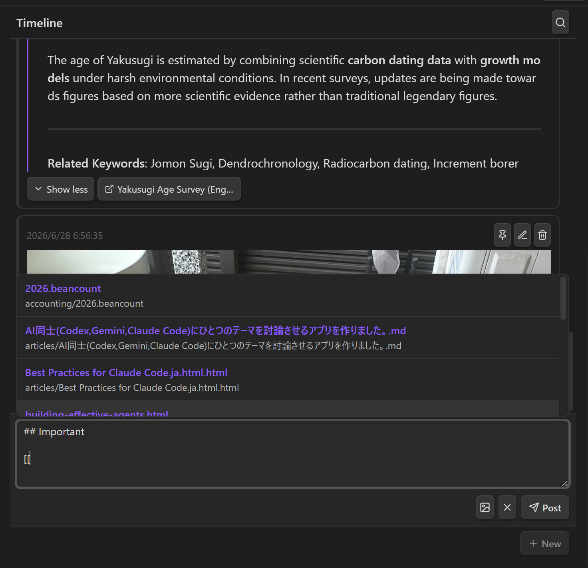
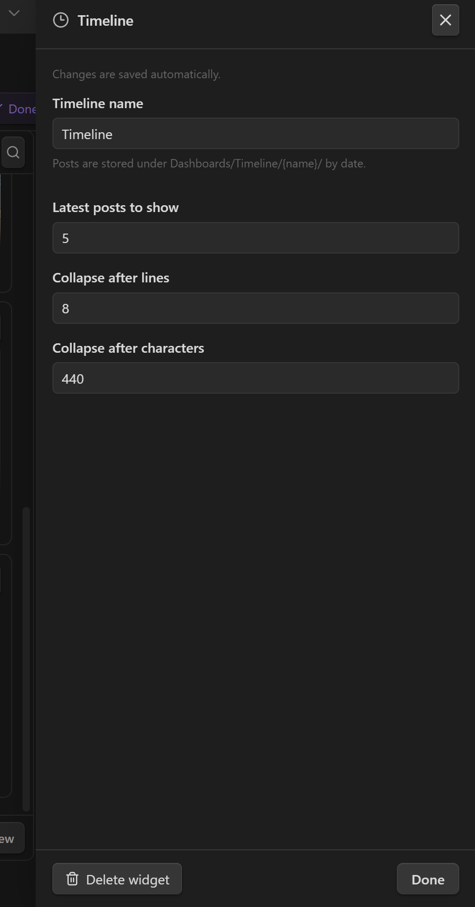
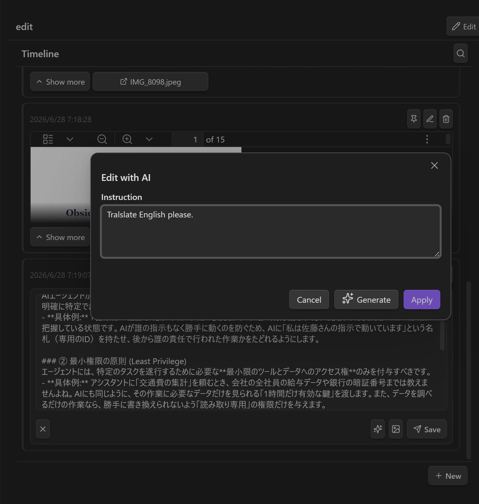

# Panel

Construye una **página de inicio / resumen** personal desde una cuadrícula adaptable de widgets. Un panel es un archivo `.dashboard` que organiza **vistas de Bases**, **notas**, **páginas web**, **timelines**, **tableros Kanban** y **salida de workflow** en una cuadrícula que se puede arrastrar y redimensionar. Ábrelo como cualquier nota para obtener un tablero vivo y editable.


---

## Panel vs Canvas

El **Canvas** de Obsidian y un Panel parecen similares pero resuelven problemas distintos:

| | Panel | Canvas |
|---|-----------|--------|
| **Contenido** | **En vivo** — vistas Bases, timelines, tableros Kanban, salida de workflow y notas se actualizan | **Estático** — las tarjetas son instantáneas colocadas a mano |
| **Diseño** | Cuadrícula adaptable (12 columnas; se reorganiza en una sola columna en pantallas estrechas) | Plano infinito de forma libre con posiciones absolutas |
| **Propósito** | Una **página de inicio / resumen** estructurada que abres para comprobar el estado | Un espacio para **pensar** — organizar ideas y conectarlas con flechas |
| **IA** | Creado desde el chat (la skill `dashboard` construye el archivo y sus datos `.base` subyacentes) | Colocación manual |
| **Visualización** | Un modo de visualización de solo lectura que no se puede alterar | Siempre editable |

En resumen: usa un **Panel** para un resumen en vivo de un vistazo (tareas, resúmenes generados, páginas incrustadas); usa un **Canvas** para pensar de forma libre y espacial y establecer relaciones. Las compensaciones clave son **dinámico vs estático** y **cuadrícula adaptable vs colocación libre**.

---

## Crear un panel

Hay dos maneras de crear un panel:

1. **Comando** — ejecuta **«Gemini Helper: Crear panel»** desde la paleta de comandos. Esto crea un nuevo archivo en la carpeta `Dashboards/` (con nombre `Dashboard`, `Dashboard 2`, …) y lo abre.
2. **Pedir a la IA** — el plugin incluye una skill de agente integrada **`dashboard`**. Actívala en el chat y describe lo que quieres (*«una página de inicio con mis tareas activas, una nota de bienvenida y el clima de hoy»*). La IA crea el archivo `.dashboard` — y cualquier archivo `.base` subyacente — por ti.

Los paneles se almacenan como archivos `.dashboard` simples en tu bóveda, por lo que se sincronizan y versionan como cualquier otra nota. Los resultados de widgets Workflow se guardan aparte bajo `Dashboards/Data/` como archivos normales de la bóveda.

---

## Modo de edición

Cada panel se abre en **modo de visualización**. Usa la barra de herramientas para cambiar:

- **Editar** — entra en el modo de edición: arrastra los widgets para moverlos, arrastra la esquina inferior derecha de un widget para redimensionarlo, haz clic en el **engranaje** para configurar un widget y en la **papelera** para eliminarlo.
- **+ Agregar widget** — abre la paleta de widgets (solo en modo de edición).
- **Deshacer / Rehacer** — recorre los cambios de diseño realizados en esta sesión.
- **Listo** — vuelve al modo de visualización.

> Todos los cambios se **guardan automáticamente** — no hay un botón de guardar separado.

---

## Tipos de widget

Haz clic en **+ Agregar widget** en el modo de edición para elegir un tipo de widget:


### Base — incrustar una vista de Bases

Renderiza una vista con nombre de un archivo `.base` mediante la **UI nativa de Bases** de Obsidian (tabla / tarjetas / lista / mapa). Este es el widget de datos principal — úsalo para cualquier lista, tabla o vista de tarjetas de notas en lugar de reimplementarlas.


| Ajuste | Descripción |
|---------|-------------|
| **Archivo base** | Ruta de bóveda al archivo `.base` |
| **Vista** | El nombre de la vista a renderizar; déjalo vacío para usar la primera vista de la base |
| **New Base** | Create a new `.base` file under `Dashboards/Bases/` |
| **View editor** | Edit the selected view's name, type, order, sort, limit, filters, card image, list indentation, and raw YAML |
| **Create with AI / Edit with AI** | Author a new `.base` file or propose edits to the selected one with a diff before applying |

The same `.base` file can be referenced by multiple Base widgets — for example, one widget per view (Active / Done / Backlog). If the `.base` file changes outside the settings panel, the editor reloads it before saving so it does not overwrite newer content with stale state.

### Markdown — incrustar una nota

Renderiza una nota Markdown existente en línea como una incrustación de solo lectura (con un enlace para abrir la nota completa).


| Ajuste | Descripción |
|---------|-------------|
| **Nota markdown** | Ruta de bóveda a la nota a incrustar (selector con búsqueda) |

### Web Embed — incrustar una página web

Incrusta una página web en un iframe.


| Ajuste | Descripción |
|---------|-------------|
| **URL** | La página a incrustar |
| **Show header** | Show a compact header with the URL and a browser-open button. Existing widgets default to on. |

> [!NOTE]
> Algunos sitios envían encabezados `X-Frame-Options` / `Content-Security-Policy` que bloquean la incrustación y aparecerán en blanco.

### Workflow — renderizar la salida de un workflow

Ejecuta un [workflow](WORKFLOW_NODES_es.md) existente de forma **headless** y renderiza su salida como Markdown o HTML. Esto te permite poner contenido dinámico y generado (resúmenes, informes) en un panel.


| Ajuste | Descripción |
|---------|-------------|
| **Formato de salida** | `Markdown` o `HTML` (HTML se renderiza en un iframe en sandbox) |
| **Workflow** | La nota de workflow a ejecutar |
| **Crear con IA** | Crear un nuevo workflow (o editar el seleccionado) para este widget |
| **Variable de salida** | La variable del workflow que contiene la cadena de salida (predeterminado `result`) |
| **Ejecutar** | Ejecutar el workflow ahora y almacenar el resultado en caché |
| **Intervalo de actualización automática (minutos)** | `0` = solo manual; de lo contrario se ejecuta una vez al abrir si el resultado en caché es más antiguo que esto |

> [!IMPORTANT]
> **Los widgets de workflow se renderizan desde una caché, no en vivo.** Para evitar volver a ejecutar workflows pesados cada vez que se abre el tablero, la ruta de renderizado lee **solo** de un resultado en caché. Una ejecución solo ocurre cuando:
> - haces clic en **Ejecutar** (en el encabezado del widget o el panel de ajustes), o
> - abres el panel y el resultado en caché es más antiguo que el intervalo de actualización automática.
>
> Los resultados se almacenan en `Dashboards/Data/<encoded dashboard path>.json` como archivo normal de la bóveda. Así la salida sobrevive a la reapertura sin inflar el archivo `.dashboard`, y puede sincronizarse, subirse/bajarse, revisarse o versionarse como cualquier otro archivo. El workflow debe almacenar su salida Markdown/HTML en una variable de cadena (predeterminado `result`) — no se admiten salidas de tarjetas/tablas. Como se ejecuta sin supervisión, no debe usar nodos interactivos (`prompt-*`, `dialog`).

### Kanban — arrastra tarjetas para cambiar el estado

Renderiza las notas que coinciden con un filtro de **etiqueta** y/o **carpeta** como tarjetas agrupadas en columnas por una **propiedad de estado** del frontmatter. Arrastra una tarjeta a otra columna para actualizar el estado de esa nota (escrito mediante `processFrontMatter`). Drag a card up/down within a column to persist a manual order for that board. Haz clic en una tarjeta para previsualizar su nota en un diálogo; el icono de apertura del diálogo abre la nota en una pestaña nueva. El tablero es interactivo en **modo de visualización** — no es necesario entrar en modo de edición para arrastrar tarjetas.


El encabezado del tablero muestra un **título** opcional (útil cuando un panel contiene varios tableros) y un botón **Nueva**. Nueva abre un pequeño diálogo para introducir el título de la tarjeta y elegir su columna, y luego crea una nota que ya coincide con los filtros de este tablero — colocada en la carpeta configurada, etiquetada con la etiqueta configurada y con el estado de la columna elegida. La nueva tarjeta aparece en el tablero (permaneces en el panel); haz clic en ella cuando quieras abrir la nota.

Configura el tablero desde los ajustes del widget en modo de edición:


| Ajuste | Descripción |
|---------|-------------|
| **Título del tablero** | Se muestra en el encabezado del tablero. Útil cuando varios tableros comparten un panel. |
| **Filtro de etiqueta** | Mostrar solo notas con esta etiqueta (sin `#`). Vacío = todas las etiquetas. |
| **Filtro de carpeta** | Mostrar solo notas cuya ruta empieza con este prefijo. Vacío = todo el vault. |
| **Propiedad de estado** | Propiedad del frontmatter que contiene el estado de la tarjeta (predeterminado `status`). |
| **Propiedad de título** | Propiedad del frontmatter que se muestra como título de la tarjeta. Vacío = nombre del archivo. |
| **Columnas** | Lista ordenada de valores de estado. Cada columna tiene un **valor** (comparado con la propiedad) y una **etiqueta** (mostrada como encabezado). |
| **Campos visibles** | Lista ordenada de nombres de propiedades del frontmatter que se muestran en cada tarjeta debajo del título (p. ej. `priority`, `due`). Cada una se muestra como `name: value`; los valores vacíos se omiten y las listas se unen con comas. |
| **Mostrar columna de tarjetas sin coincidencia** | Cuando está activado, las tarjetas cuyo estado no coincide con ninguna columna aparecen en una columna adicional «Sin especificar» (predeterminado activado). |

### Timeline — capturar publicaciones fechadas

Guarda publicaciones breves fechadas en `Dashboards/Timeline/<name>/`, un archivo Markdown por día. Las publicaciones pueden incluir `#tags`, imágenes adjuntas y elementos fijados. El widget muestra un feed en orden cronológico inverso con filtros de texto/etiqueta/fecha y un composer para nuevas publicaciones. Las publicaciones largas y las notas incrustadas se contraen de forma predeterminada, con controles **Mostrar más / Mostrar menos**. El composer y el editor en línea también incluyen **Editar con IA** junto al botón de imágenes adjuntas: introduce una instrucción, revisa el diff generado en un modal y luego aplícalo de vuelta al textarea.



| Configuración | Descripción |
|---------|-------------|
| **Nombre de la timeline** | Nombre de carpeta bajo `Dashboards/Timeline/` |
| **Publicaciones recientes a mostrar** | Número inicial de publicaciones recientes antes de cargar entradas anteriores |
| **Contraer después de líneas** | Umbral estimado de líneas visibles para mostrar la vista previa contraída (predeterminado `8`) |
| **Contraer después de caracteres** | Umbral de caracteres para mostrar la vista previa contraída (predeterminado `440`) |

Cada archivo diario se llama `<YYYY-MM-DD>.md`. Las publicaciones se separan con `---` solo cuando el separador va seguido de un marcador de timeline o una marca temporal ISO, por lo que las líneas horizontales normales de Markdown dentro del cuerpo se conservan.



Usa **Editar con IA** desde el composer o el editor en línea para enviar el borrador actual y tu instrucción al modelo. La reescritura generada se muestra como diff antes de aplicarse al textarea.



Los tipos de widget desconocidos (p. ej., de una versión más reciente del plugin) se **conservan al guardar** y se renderizan como un marcador de posición, de modo que editar un panel desconocido nunca pierde datos.

---

## Diseño adaptable

La cuadrícula tiene dos puntos de quiebre, alternados según el ancho del contenedor:

| Punto de quiebre | Cuándo | Diseño |
|------------|------|--------|
| **`lg`** (ancho) | ≥ 768px | El diseño que organizas en el modo de edición (predeterminado 12 columnas) |
| **`sm`** (estrecho) | < 768px | Los widgets se reorganizan en una **única columna de ancho completo**, apilados de arriba a abajo |

De forma predeterminada, el diseño `sm` se **deriva automáticamente** del diseño ancho (ordenado por posición vertical). Si mueves widgets mientras estás en una pantalla estrecha, esas posiciones `sm` explícitas se conservan y los widgets restantes llenan los huecos a su alrededor.

---

## Crear widgets con IA

Tanto el widget **Base** como el **Workflow** tienen un botón **Crear con IA** en su panel de ajustes:

- Para un widget **Base**, abre el diálogo de creación con IA para un archivo `.base`. La IA puede inspeccionar tus notas con herramientas de solo lectura (leer, buscar, listar) para descubrir las propiedades de frontmatter adecuadas antes de crearla; por ejemplo, pedir una vista de tarjetas con imágenes de portada funciona sin que tengas que nombrar la propiedad. Si ya hay una base seleccionada, el botón se convierte en **Editar con IA**: muestra un **diff** de la `.base` propuesta frente a la actual, con un cuadro de **instrucciones adicionales** para refinarla antes de **Aplicar**.
- Para un widget **Workflow**, genera (o edita) un workflow adaptado al widget — se le indica a la IA que produzca una única cadena Markdown/HTML en la variable de salida y que evite los nodos interactivos, de modo que el resultado se renderice de forma headless. Después de generar, el widget se **ejecuta y actualiza automáticamente**.

También puedes crear un panel completo desde el chat usando la skill de agente integrada **`dashboard`**, que conoce el esquema `.dashboard` y la referencia de creación de Bases.

---

## El formato de archivo `.dashboard`

Un archivo `.dashboard` es YAML. Normalmente nunca lo editas a mano (el editor visual y la IA lo gestionan), pero el esquema se documenta aquí como referencia y para la seguridad de ida y vuelta.

```yaml
version: 1
grid:
  cols: 12        # column count (default 12)
  rowHeight: 80   # pixels per grid row
  gap: 8          # pixels between cells
widgets:
  - id: <uuid>                            # unique id (UUID-like string)
    type: base | markdown | web | workflow | kanban | timeline
    layout:
      lg: { x: 0, y: 0, w: 6, h: 4 }      # required: position on the wide grid
      sm: { x: 0, y: 0, w: 12, h: 4 }     # optional: auto-derived (stacked) if omitted
    config: { ... }                       # per-widget-type config (see below)
```

- **`layout.lg`** es la posición en la cuadrícula ancha (≥768px). `x`/`y` son la celda superior izquierda basada en 0; `w`/`h` son ancho/alto en celdas de la cuadrícula.
- **`layout.sm`** es la posición en pantallas estrechas. Omítela para apilar automáticamente con el ancho completo de la cuadrícula.
- Coloca los widgets de modo que no se superpongan; apílalos verticalmente aumentando `y`.

### `config` por widget

```yaml
# base
config:
  base: Dashboards/Bases/Tasks.base   # vault path to the .base file
  view: Active                     # view name; omit/empty = first view

# markdown
config:
  path: Home.md                    # vault path to a markdown note

# web
config:
  url: https://example.com
  showHeader: true                    # optional; false hides the URL/open header

# workflow
config:
  workflow: workflows/Daily Digest.md  # vault path to the workflow note
  output: markdown                     # markdown | html
  outputVariable: result               # variable holding the output string
  refreshInterval: 60                  # minutes; 0/omit = manual refresh only

# kanban
config:
  tag: task                            # optional tag filter (without #)
  folder: ""                           # optional folder path prefix
  statusProperty: status               # frontmatter property holding the status
  titleProperty: ""                    # frontmatter property for card title (empty = file name)
  displayFields: [priority, due]       # frontmatter properties shown on each card
  cardOrder: [Tasks/A.md, Tasks/B.md]   # optional manual order persisted by drag/drop
  columns:                             # ordered list of status values
    - value: todo
      label: To Do
    - value: in-progress
      label: In Progress
    - value: done
      label: Done
  showUnspecified: true                # show cards with no/unknown status
# timeline
config:
  name: Journal                        # stores posts under Dashboards/Timeline/Journal/
  latestCount: 20
```

### Ejemplo completo

```yaml
version: 1
grid:
  cols: 12
  rowHeight: 80
  gap: 8
widgets:
  - id: tasks-active
    type: base
    layout: { lg: { x: 0, y: 0, w: 8, h: 6 } }
    config:
      base: Dashboards/Bases/Tasks.base
      view: Active
  - id: readme
    type: markdown
    layout: { lg: { x: 8, y: 0, w: 4, h: 6 } }
    config:
      path: Home.md
  - id: docs
    type: web
    layout: { lg: { x: 0, y: 6, w: 12, h: 4 } }
    config:
      url: https://help.obsidian.md
  - id: journal
    type: timeline
    layout: { lg: { x: 0, y: 10, w: 6, h: 6 } }
    config:
      name: Journal
      latestCount: 20
```

---

## Consejos y notas

- **Crea primero los datos.** Para un widget Base, crea el archivo `.base` (y sus vistas) antes de apuntar un widget hacia él. La skill de panel con IA hace esto en una sola pasada.
- **Agrupa por vista.** Reutiliza un `.base` en varios widgets Base (Active / Done / Backlog) en lugar de duplicar datos.
- **Mantén baratos los widgets de workflow.** Almacenan resultados en caché; establece un **intervalo de actualización automática** sensato en lugar de ejecutarlos en cada apertura, y almacena la salida en `result`.
- **Solo escritorio.** Los paneles (como el resto del plugin) se ejecutan en Obsidian de escritorio.
- **Los archivos viven en tu bóveda.** Los paneles se guardan bajo `Dashboards/` como archivos `.dashboard`, los resultados de workflow bajo `Dashboards/Data/`, las publicaciones timeline bajo `Dashboards/Timeline/` y las Bases generadas bajo `Dashboards/Bases/`. Son archivos normales de la bóveda y se sincronizan/versionan con tus notas.

> Véase también: [Nodos de workflow](WORKFLOW_NODES_es.md) · [Skills de agente](SKILLS_es.md)
