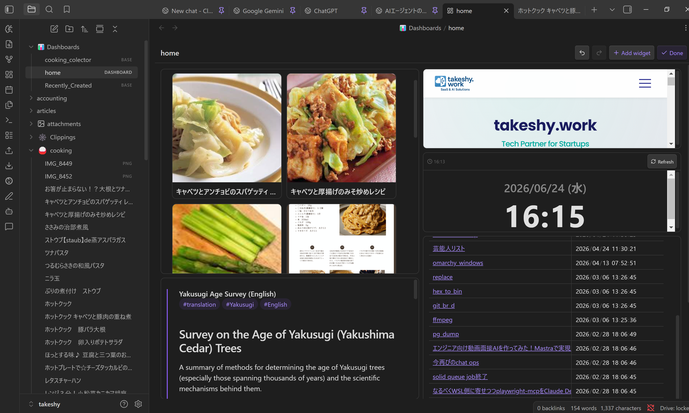
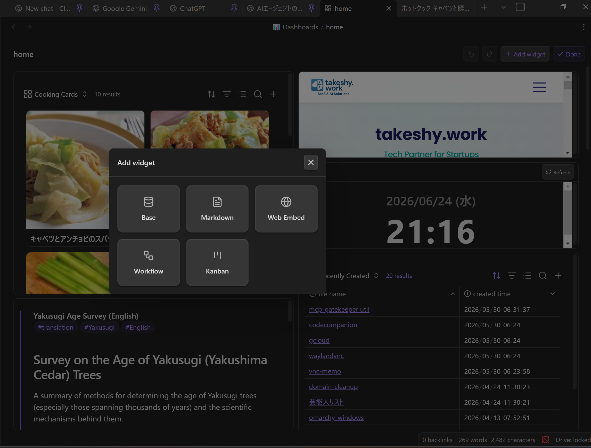
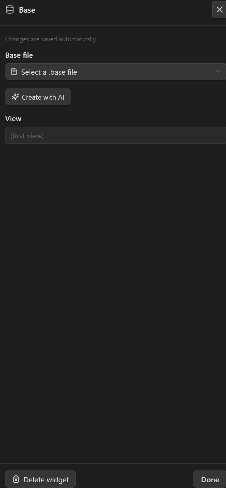
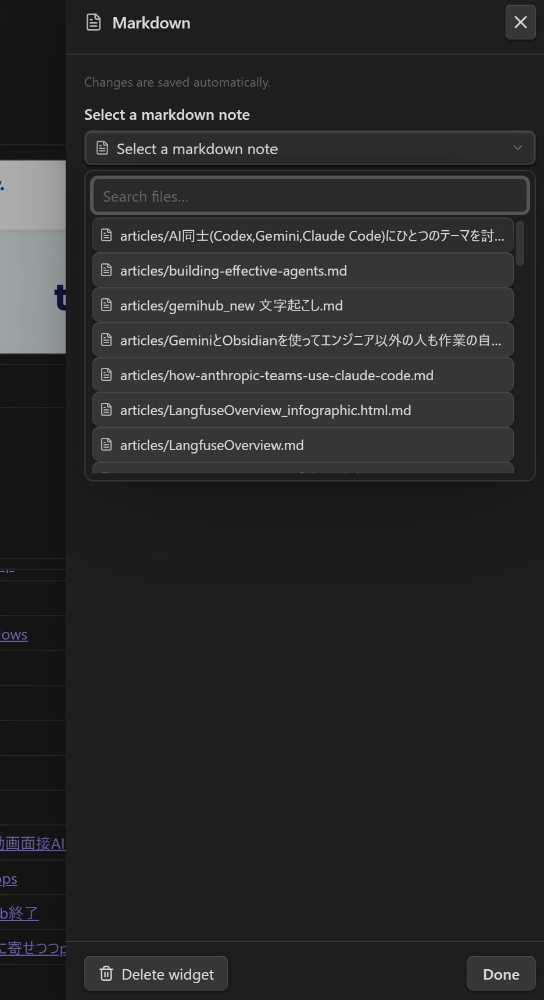
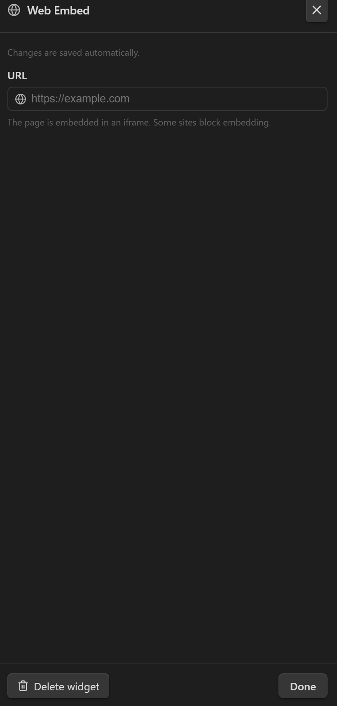
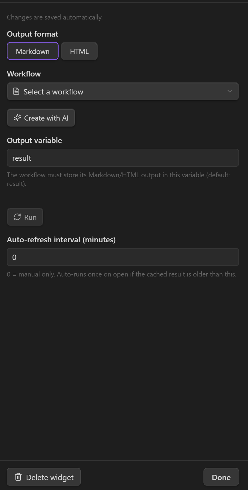
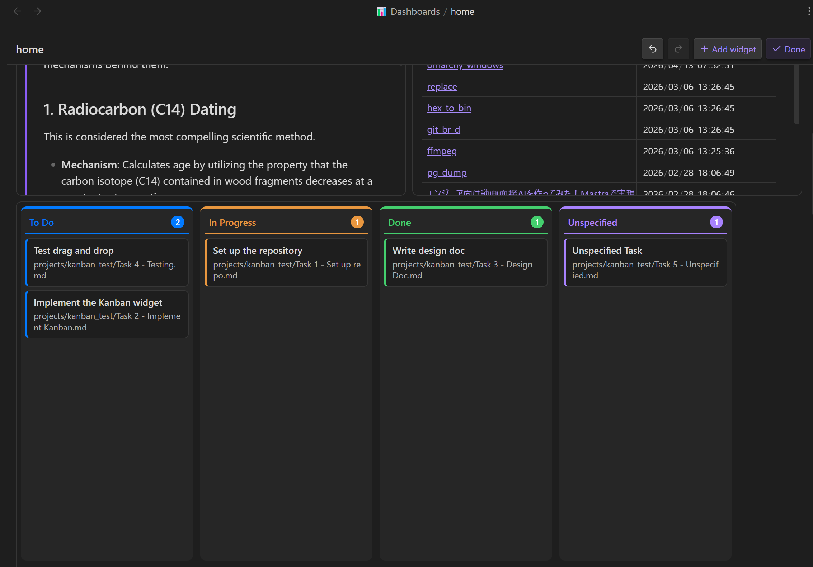
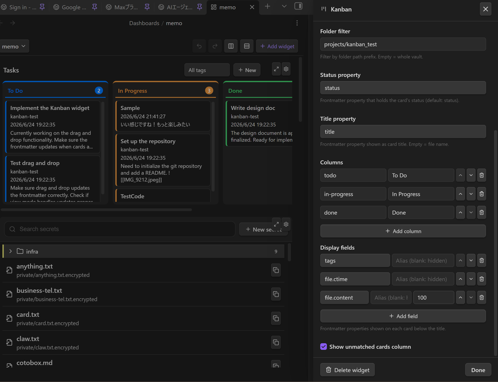

# Tableau de bord

Créez une **page d'accueil / vue d'ensemble** personnelle à partir d'une grille responsive de widgets. Un tableau de bord est un fichier `.dashboard` qui organise des **vues Bases**, des **notes**, des **pages web**, des **timelines**, des **tableaux Kanban** et des **sorties de workflow** dans une grille déplaçable et redimensionnable. Ouvrez-le comme n'importe quelle note pour obtenir un tableau vivant et modifiable.



---

## Tableau de bord vs Canvas

Le **Canvas** d'Obsidian et un tableau de bord se ressemblent mais résolvent des problèmes différents :

| | Tableau de bord | Canvas |
|---|-----------|--------|
| **Contenu** | **Live** — vues Bases, timelines, tableaux Kanban, sorties de workflow et notes se mettent à jour | **Statique** — les cartes sont des instantanés placés à la main |
| **Disposition** | Grille responsive (12 colonnes ; se réorganise en une seule colonne sur les écrans étroits) | Plan infini libre avec positions absolues |
| **Objectif** | Une **page d'accueil / de synthèse** structurée que vous ouvrez pour vérifier le statut | Un espace pour **réfléchir** — organiser des idées et les relier par des flèches |
| **IA** | Créé depuis le chat (le skill `dashboard` construit le fichier et ses données `.base` sous-jacentes) | Placement manuel |
| **Affichage** | Un mode d'affichage en lecture seule qui ne peut pas être perturbé | Toujours modifiable |

En bref : utilisez un **tableau de bord** pour un aperçu en direct d'un coup d'œil (tâches, résumés générés, pages intégrées) ; utilisez un **Canvas** pour une réflexion libre et spatiale et les relations. Les compromis clés sont **dynamique vs statique** et **grille responsive vs placement libre**.

---

## Créer un tableau de bord

Il existe deux façons de créer un tableau de bord :

1. **Commande** — exécutez **« Gemini Helper : Créer un tableau de bord »** depuis la palette de commandes. Cela crée un nouveau fichier dans le dossier `Dashboards/` (nommé `Dashboard`, `Dashboard 2`, …) et l'ouvre.
2. **Demander à l'IA** — le plugin fournit un skill d'agent intégré **`dashboard`**. Activez-le dans le chat et décrivez ce que vous voulez (*« une page d'accueil avec mes tâches actives, une note de bienvenue et la météo du jour »*). L'IA crée le fichier `.dashboard` — et tous les fichiers `.base` sous-jacents — pour vous.

Les tableaux de bord sont stockés comme fichiers `.dashboard` simples dans votre coffre, ils se synchronisent et se versionnent comme les autres notes. Les résultats des widgets Workflow sont stockés séparément sous `Dashboards/Data/` comme fichiers normaux du coffre.

---

## Mode édition

Chaque tableau de bord s'ouvre en **mode affichage**. Utilisez la barre d'outils pour basculer :

- **Modifier** — entrer en mode édition : faites glisser les widgets pour les déplacer, faites glisser le coin inférieur droit d'un widget pour le redimensionner, cliquez sur l'**engrenage** pour configurer un widget et sur la **corbeille** pour le supprimer.
- **+ Ajouter un widget** — ouvrir la palette de widgets (mode édition uniquement).
- **Annuler / Rétablir** — parcourir les modifications de disposition effectuées au cours de cette session.
- **Terminé** — revenir au mode affichage.

> Toutes les modifications sont **enregistrées automatiquement** — il n'y a pas de bouton d'enregistrement séparé.

---

## Types de widget

Cliquez sur **+ Ajouter un widget** en mode édition pour choisir un type de widget :



### Base — intégrer une vue Bases

Affiche une vue nommée d'un fichier `.base` via l'**interface Bases native** d'Obsidian (tableau / cartes / liste / carte). C'est le widget de données principal — utilisez-le pour toute liste, tableau ou vue en cartes de notes plutôt que de les réimplémenter.



| Paramètre | Description |
|---------|-------------|
| **Fichier base** | Chemin du coffre vers le fichier `.base` |
| **Vue** | Le nom de la vue à afficher ; laissez vide pour utiliser la première vue de la base |
| **New Base** | Create a new `.base` file under `Dashboards/Bases/` |
| **View editor** | Edit the selected view's name, type, order, sort, limit, filters, card image, list indentation, and raw YAML |
| **Create with AI / Edit with AI** | Author a new `.base` file or propose edits to the selected one with a diff before applying |

The same `.base` file can be referenced by multiple Base widgets — for example, one widget per view (Active / Done / Backlog). If the `.base` file changes outside the settings panel, the editor reloads it before saving so it does not overwrite newer content with stale state.

### Markdown — intégrer une note

Affiche une note Markdown existante en ligne sous forme d'intégration en lecture seule (avec un lien pour ouvrir la note complète).



| Paramètre | Description |
|---------|-------------|
| **Note markdown** | Chemin du coffre vers la note à intégrer (sélecteur avec recherche) |

### Web Embed — intégrer une page web

Intègre une page web dans un iframe.



| Paramètre | Description |
|---------|-------------|
| **URL** | La page à intégrer |
| **Show header** | Show a compact header with the URL and a browser-open button. Existing widgets default to on. |

> [!NOTE]
> Certains sites envoient des en-têtes `X-Frame-Options` / `Content-Security-Policy` qui bloquent l'intégration et apparaîtront vides.

### Workflow — afficher la sortie d'un workflow

Exécute un [workflow](WORKFLOW_NODES_fr.md) existant en mode **headless** et affiche sa sortie en Markdown ou HTML. Cela vous permet de placer du contenu dynamique et généré (synthèses, rapports) sur un tableau de bord.



| Paramètre | Description |
|---------|-------------|
| **Format de sortie** | `Markdown` ou `HTML` (le HTML est affiché dans un iframe en sandbox) |
| **Workflow** | La note de workflow à exécuter |
| **Créer avec l'IA** | Créer un nouveau workflow (ou modifier celui sélectionné) pour ce widget |
| **Variable de sortie** | La variable du workflow qui contient la chaîne de sortie (par défaut `result`) |
| **Exécuter** | Exécuter le workflow maintenant et mettre le résultat en cache |
| **Intervalle d'actualisation automatique (minutes)** | `0` = manuel uniquement ; sinon s'exécute une fois à l'ouverture si le résultat en cache est plus ancien que cela |

> [!IMPORTANT]
> **Les widgets de workflow s'affichent depuis un cache, pas en direct.** Pour éviter de réexécuter des workflows lourds à chaque ouverture du tableau, le chemin de rendu lit **uniquement** depuis un résultat en cache. Une exécution ne se produit que lorsque vous :
> - cliquez sur **Exécuter** (dans l'en-tête du widget ou le panneau des paramètres), ou
> - ouvrez le tableau de bord et que le résultat en cache est plus ancien que l'intervalle d'actualisation automatique.
>
> Les résultats sont stockés dans `Dashboards/Data/<encoded dashboard path>.json` comme fichier normal du coffre. La sortie survit donc à la réouverture sans gonfler le fichier `.dashboard`, et peut être synchronisée, poussée/tirée, revue ou versionnée comme tout autre fichier. Le workflow doit stocker sa sortie Markdown/HTML dans une variable de chaîne (par défaut `result`) — les sorties en cartes/tableaux ne sont pas prises en charge. Comme il s'exécute sans surveillance, le workflow ne doit pas utiliser de nœuds interactifs (`prompt-*`, `dialog`).

### Kanban — faites glisser les cartes pour changer le statut

Affiche les notes correspondant à un filtre par **tag** et/ou **dossier** sous forme de cartes regroupées en colonnes selon une **propriété de statut** du frontmatter. Faites glisser une carte vers une autre colonne pour mettre à jour le statut de cette note (écrit via `processFrontMatter`). Drag a card up/down within a column to persist a manual order for that board. Cliquez sur une carte pour prévisualiser sa note dans une boîte de dialogue ; l'icône d'ouverture de la boîte ouvre la note dans un nouvel onglet. Le tableau est interactif en **mode affichage** — pas besoin d'entrer en mode édition pour déplacer les cartes.



L'en-tête du tableau affiche un **titre** optionnel (pratique lorsqu'un tableau de bord contient plusieurs tableaux) et un bouton **Nouveau**. Nouveau ouvre une petite boîte de dialogue pour saisir le titre de la carte et choisir sa colonne, puis crée une note correspondant déjà aux filtres de ce tableau — placée dans le dossier configuré, dotée du tag configuré et définie sur le statut de la colonne choisie. La nouvelle carte apparaît sur le tableau (vous restez sur le tableau de bord) ; cliquez dessus lorsque vous souhaitez ouvrir la note.

Configurez le tableau depuis les paramètres du widget en mode édition :



| Paramètre | Description |
|---------|-------------|
| **Titre du tableau** | Affiché dans l'en-tête du tableau. Utile lorsque plusieurs tableaux partagent un tableau de bord. |
| **Filtre par tag** | N'afficher que les notes avec ce tag (sans `#`). Vide = tous les tags. |
| **Filtre par dossier** | N'afficher que les notes dont le chemin commence par ce préfixe. Vide = tout le vault. |
| **Propriété de statut** | Propriété du frontmatter contenant le statut de la carte (par défaut `status`). |
| **Propriété de titre** | Propriété du frontmatter affichée comme titre de la carte. Vide = nom du fichier. |
| **Colonnes** | Liste ordonnée de valeurs de statut. Chaque colonne a une **valeur** (comparée à la propriété) et un **libellé** (affiché en en-tête). |
| **Champs affichés** | Liste ordonnée de noms de propriétés frontmatter affichées sur chaque carte sous le titre (par ex. `priority`, `due`). Chacune s'affiche sous la forme `name: value` ; les valeurs vides sont ignorées et les listes sont jointes par des virgules. |
| **Afficher la colonne des cartes non classées** | Lorsque activé, les cartes dont le statut ne correspond à aucune colonne apparaissent dans une colonne supplémentaire « Non spécifié » (activé par défaut). |

Les types de widget inconnus (par exemple, d'une version plus récente du plugin) sont **conservés à l'enregistrement** et affichés comme un espace réservé, de sorte que la modification d'un tableau de bord inconnu ne perd jamais de données.

---

## Disposition responsive

La grille comporte deux points de rupture, basculés selon la largeur du conteneur :

| Point de rupture | Quand | Disposition |
|------------|------|--------|
| **`lg`** (large) | ≥ 768px | La disposition que vous arrangez en mode édition (par défaut 12 colonnes) |
| **`sm`** (étroit) | < 768px | Les widgets se réorganisent en une **seule colonne pleine largeur**, empilés de haut en bas |

Par défaut, la disposition `sm` est **dérivée automatiquement** de la disposition large (ordonnée par position verticale). Si vous déplacez des widgets sur un écran étroit, ces positions `sm` explicites sont conservées et les widgets restants comblent les espaces autour d'eux.

---

## Créer des widgets avec l'IA

Les widgets **Base** et **Workflow** disposent tous deux d'un bouton **Créer avec l'IA** dans leur panneau de paramètres :

- Pour un widget **Base**, il ouvre la boîte de dialogue de création par IA pour un fichier `.base`. L'IA peut inspecter vos notes avec des outils en lecture seule (lire, rechercher, lister) afin de découvrir les bonnes propriétés frontmatter avant la création ; par exemple, demander une vue en cartes avec images de couverture fonctionne sans nommer la propriété. Si une base est déjà sélectionnée, le bouton devient **Modifier avec l'IA** : il affiche un **diff** de la `.base` proposée par rapport à l'actuelle, avec un champ d'**instructions supplémentaires** pour l'affiner avant d'**Appliquer**.
- Pour un widget **Workflow**, il génère (ou modifie) un workflow adapté au widget — il est demandé à l'IA de produire une seule chaîne Markdown/HTML dans la variable de sortie et d'éviter les nœuds interactifs, de sorte que le résultat s'affiche en headless. Après la génération, le widget est **exécuté et actualisé automatiquement**.

Vous pouvez aussi créer un tableau de bord entier depuis le chat en utilisant le skill d'agent intégré **`dashboard`**, qui connaît le schéma `.dashboard` et la référence de création de Bases.

---

## Le format de fichier `.dashboard`

Un fichier `.dashboard` est du YAML. Normalement, vous ne le modifiez jamais à la main (l'éditeur visuel et l'IA le gèrent), mais le schéma est documenté ici à titre de référence et pour la sécurité de l'aller-retour.

```yaml
version: 1
grid:
  cols: 12        # column count (default 12)
  rowHeight: 80   # pixels per grid row
  gap: 8          # pixels between cells
widgets:
  - id: <uuid>                            # unique id (UUID-like string)
    type: base | markdown | web | workflow | kanban | timeline
    layout:
      lg: { x: 0, y: 0, w: 6, h: 4 }      # required: position on the wide grid
      sm: { x: 0, y: 0, w: 12, h: 4 }     # optional: auto-derived (stacked) if omitted
    config: { ... }                       # per-widget-type config (see below)
```

- **`layout.lg`** est la position sur la grille large (≥768px). `x`/`y` sont la cellule supérieure gauche basée sur 0 ; `w`/`h` sont la largeur/hauteur en cellules de grille.
- **`layout.sm`** est la position sur écrans étroits. Omettez-la pour empiler automatiquement sur toute la largeur de la grille.
- Placez les widgets de manière à ce qu'ils ne se chevauchent pas ; empilez-les verticalement en augmentant `y`.

### `config` par widget

```yaml
# base
config:
  base: Dashboards/Bases/Tasks.base   # vault path to the .base file
  view: Active                     # view name; omit/empty = first view

# markdown
config:
  path: Home.md                    # vault path to a markdown note

# web
config:
  url: https://example.com
  showHeader: true                    # optional; false hides the URL/open header

# workflow
config:
  workflow: workflows/Daily Digest.md  # vault path to the workflow note
  output: markdown                     # markdown | html
  outputVariable: result               # variable holding the output string
  refreshInterval: 60                  # minutes; 0/omit = manual refresh only

# kanban
config:
  tag: task                            # optional tag filter (without #)
  folder: ""                           # optional folder path prefix
  statusProperty: status               # frontmatter property holding the status
  titleProperty: ""                    # frontmatter property for card title (empty = file name)
  displayFields: [priority, due]       # frontmatter properties shown on each card
  cardOrder: [Tasks/A.md, Tasks/B.md]   # optional manual order persisted by drag/drop
  columns:                             # ordered list of status values
    - value: todo
      label: To Do
    - value: in-progress
      label: In Progress
    - value: done
      label: Done
  showUnspecified: true                # show cards with no/unknown status
# timeline
config:
  name: Journal                        # stores posts under Dashboards/Timeline/Journal/
  latestCount: 20
```

### Exemple complet

```yaml
version: 1
grid:
  cols: 12
  rowHeight: 80
  gap: 8
widgets:
  - id: tasks-active
    type: base
    layout: { lg: { x: 0, y: 0, w: 8, h: 6 } }
    config:
      base: Dashboards/Bases/Tasks.base
      view: Active
  - id: readme
    type: markdown
    layout: { lg: { x: 8, y: 0, w: 4, h: 6 } }
    config:
      path: Home.md
  - id: docs
    type: web
    layout: { lg: { x: 0, y: 6, w: 12, h: 4 } }
    config:
      url: https://help.obsidian.md
  - id: journal
    type: timeline
    layout: { lg: { x: 0, y: 10, w: 6, h: 6 } }
    config:
      name: Journal
      latestCount: 20
```

---

## Conseils et remarques

- **Créez d'abord les données.** Pour un widget Base, créez le fichier `.base` (et ses vues) avant d'y diriger un widget. Le skill de tableau de bord par IA le fait en une seule passe.
- **Regroupez par vue.** Réutilisez un `.base` sur plusieurs widgets Base (Active / Done / Backlog) au lieu de dupliquer les données.
- **Gardez les widgets de workflow légers.** Ils mettent les résultats en cache ; définissez un **intervalle d'actualisation automatique** raisonnable au lieu de les exécuter à chaque ouverture, et stockez la sortie dans `result`.
- **Bureau uniquement.** Les tableaux de bord (comme le reste du plugin) fonctionnent sur Obsidian bureau.
- **Les fichiers se trouvent dans votre coffre.** Les tableaux de bord sont stockés sous `Dashboards/` en fichiers `.dashboard`, les résultats de workflow sous `Dashboards/Data/`, les publications timeline sous `Dashboards/Timeline/`, et les Bases générées sous `Dashboards/Bases/`. Ce sont des fichiers normaux du coffre, synchronisés/versionnés avec vos notes.

> Voir aussi : [Nœuds de workflow](WORKFLOW_NODES_fr.md) · [Skills d'agent](SKILLS_fr.md)
