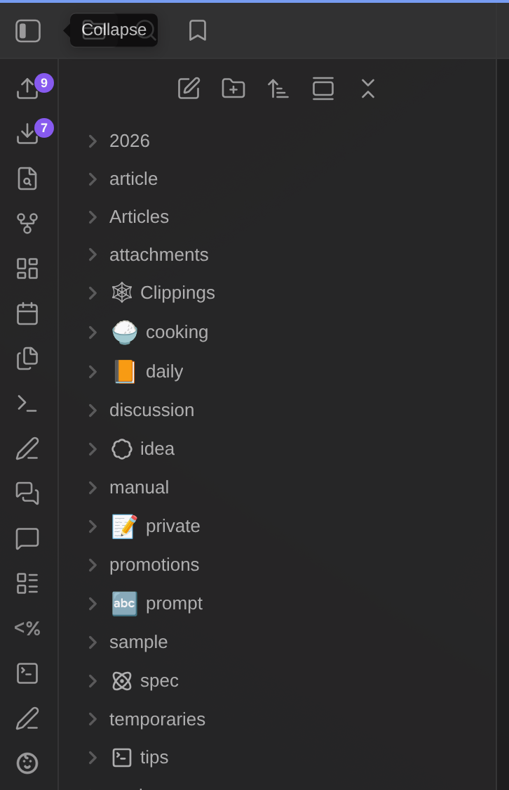
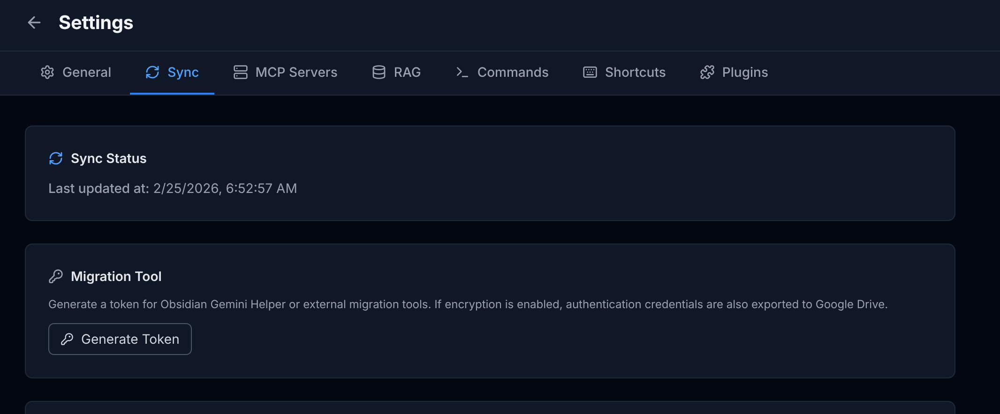
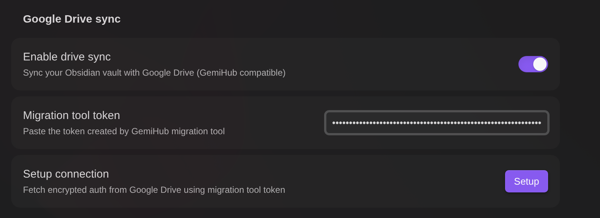
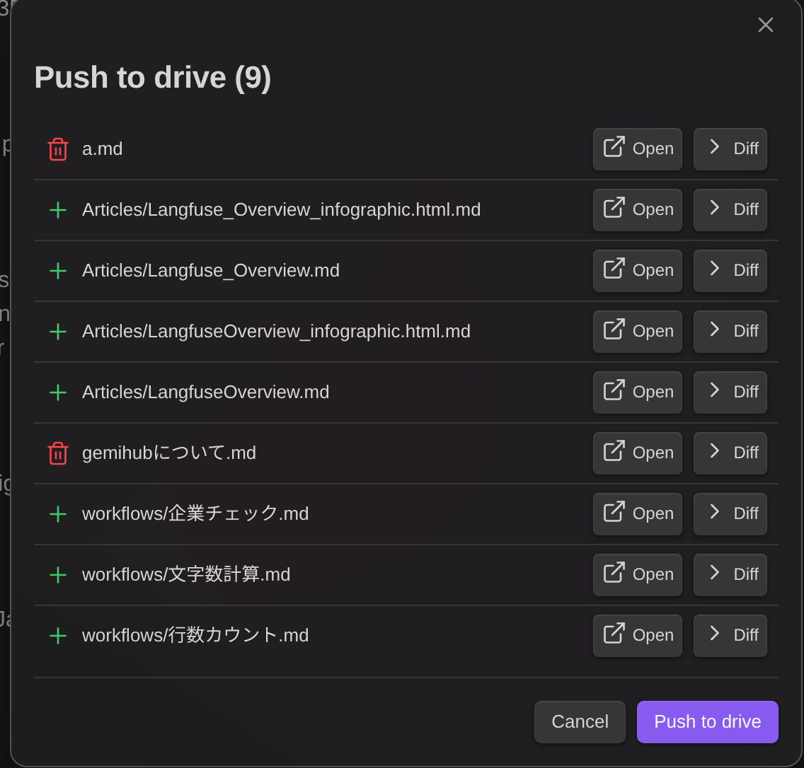
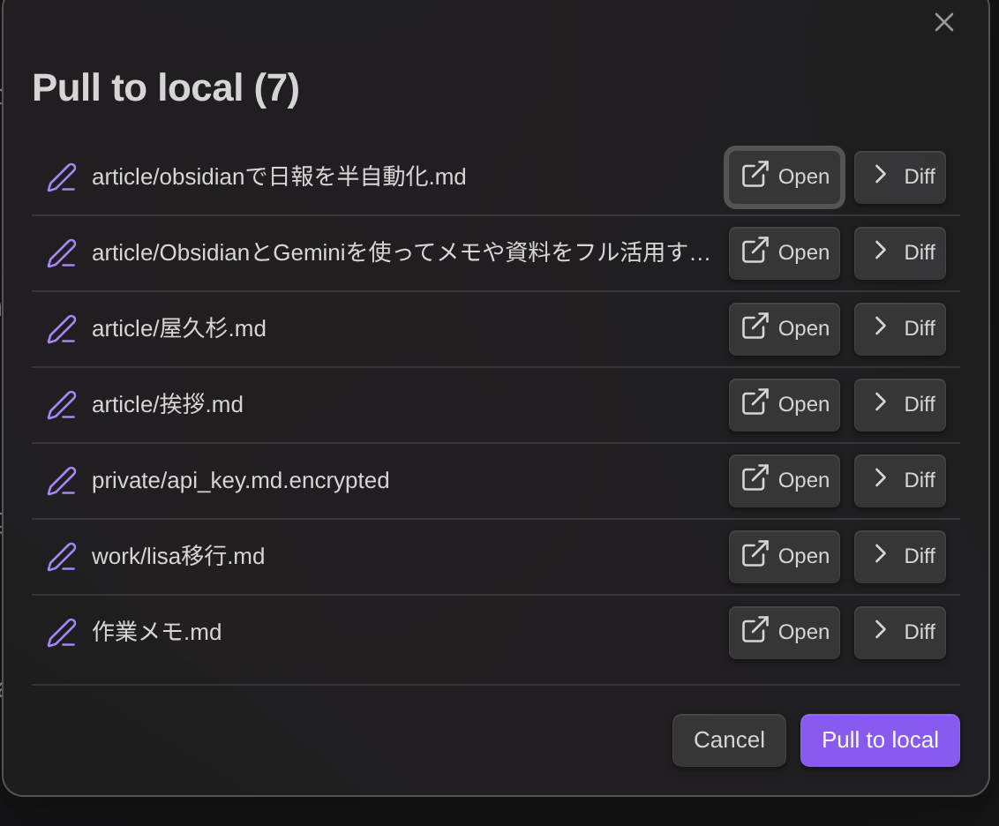
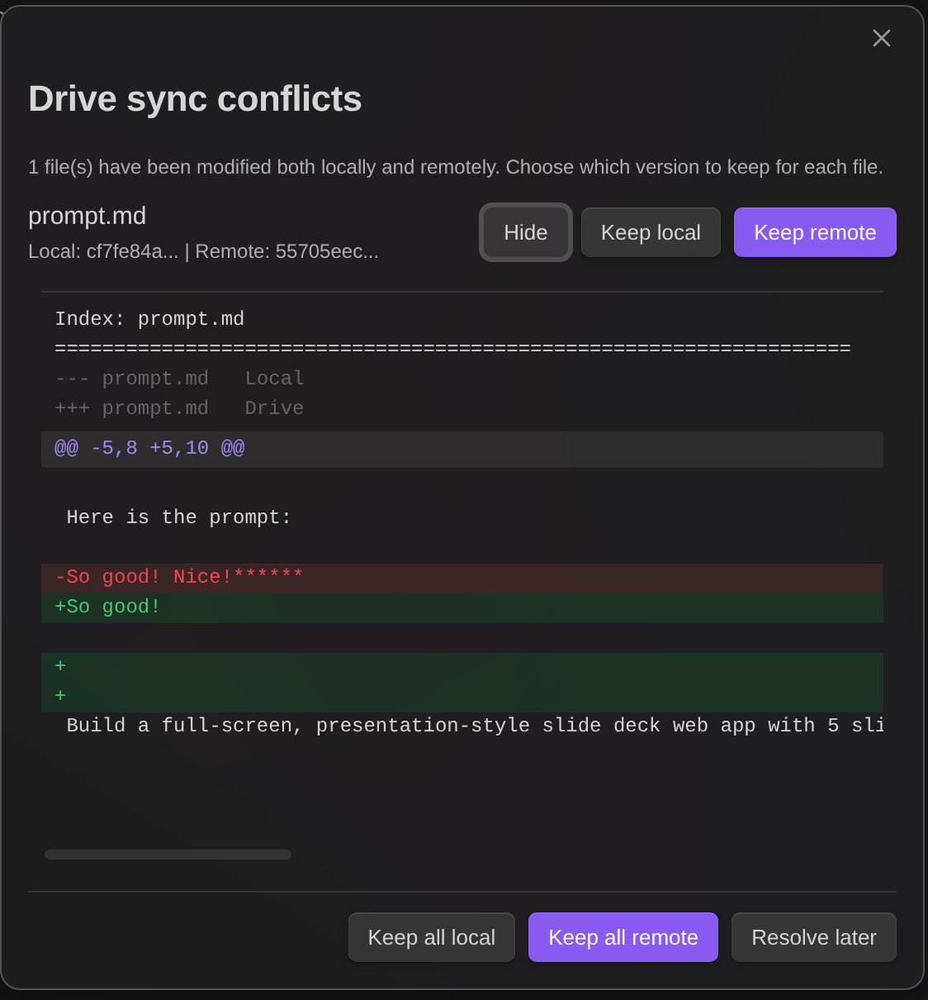
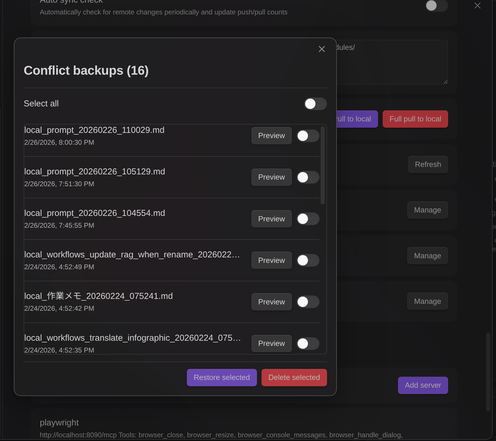

# GemiHub-Verbindung (Google Drive Sync)

Synchronisieren Sie Ihren Obsidian-Vault mit Google Drive, vollständig kompatibel mit [GemiHub](https://gemihub.online). Bearbeiten Sie Notizen in Obsidian und greifen Sie über die GemiHub-Weboberfläche darauf zu, oder umgekehrt.

## Was ist GemiHub?

[GemiHub](https://gemihub.online) ist eine Webanwendung, die Google Gemini in einen persönlichen KI-Assistenten verwandelt, der mit Ihrem Google Drive integriert ist.

### GemiHub-exklusive Funktionen

Diese Funktionen sind nur über die GemiHub-Weboberfläche verfügbar und können nicht allein durch das Obsidian-Plugin repliziert werden:

- **Automatisches RAG** - Dateien, die mit GemiHub synchronisiert werden, werden automatisch für die semantische Suche indiziert. Im Gegensatz zur manuellen RAG-Synchronisierung des Obsidian-Plugins indiziert GemiHub Dateien bei jeder Synchronisierung ohne zusätzliche Einrichtung.
- **OAuth2-fähiges MCP** - Verwenden Sie MCP-Server, die OAuth2-Authentifizierung erfordern (z.B. Google Calendar, Gmail, Google Docs). Das Obsidian-Plugin unterstützt nur Header-basierte MCP-Authentifizierung.
- **Markdown zu PDF/HTML-Konvertierung** - Konvertieren Sie Ihre Markdown-Notizen direkt in GemiHub in formatierte PDF- oder HTML-Dokumente.
- **Öffentliche Veröffentlichung** - Veröffentlichen Sie konvertierte HTML/PDF-Dokumente mit einer teilbaren öffentlichen URL, um Notizen einfach extern zu teilen.

### Funktionen, die Obsidian durch die Verbindung erhält

Durch die Aktivierung der Google Drive-Synchronisierung werden diese Funktionen auf der Obsidian-Seite verfügbar:

- **Bidirektionale Synchronisierung mit Diff-Vorschau** - Dateien pushen und pullen mit detaillierter Dateiliste und Unified-Diff-Ansicht vor dem Übernehmen von Änderungen
- **Konfliktlösung mit Diff** - Wenn dieselbe Datei auf beiden Seiten bearbeitet wurde, zeigt ein Konflikt-Modal einen farbcodierten Unified Diff an, um bei der Entscheidung zu helfen, welche Version beibehalten werden soll
- **Drive-Bearbeitungsverlauf** - Verfolgen Sie Änderungen, die sowohl in Obsidian als auch in GemiHub vorgenommen wurden, mit Dateiverlaufseinträgen und Herkunftsanzeige (lokal/remote)
- **Konflikt-Backup-Verwaltung** - Durchsuchen, Vorschau und Wiederherstellung von Konflikt-Backups, die auf Drive gespeichert sind

## Synchronisierungs-Überblick

- **Bidirektionale Synchronisierung** - Lokale Änderungen zu Drive pushen, Remote-Änderungen nach Obsidian pullen
- **GemiHub-kompatibel** - Verwendet dasselbe `_sync-meta.json`-Format und die verschlüsselte Authentifizierung von GemiHub
- **Konfliktlösung** - Erkennt und löst Konflikte, wenn beide Seiten dieselbe Datei bearbeiten
- **Selektive Synchronisierung** - Dateien/Ordner mit Musterabgleich ausschließen
- **Binärdatei-Unterstützung** - Synchronisiert Bilder, PDFs und andere Binärdateien

## Voraussetzungen

Sie benötigen ein [GemiHub](https://gemihub.online)-Konto mit konfigurierter Google Drive-Synchronisierung. Das Plugin verwendet den verschlüsselten Authentifizierungstoken von GemiHub, um sich mit Ihrem Google Drive zu verbinden.

1. Melden Sie sich bei GemiHub an
2. Gehen Sie zu **Settings** → Abschnitt **Obsidian Sync**
3. Kopieren Sie den **Migration Tool token**

## Einrichtung

1. Öffnen Sie Obsidian **Einstellungen** → **Gemini Helper** → scrollen Sie zu **Google Drive sync**
2. Aktivieren Sie **Enable drive sync**

3. Fügen Sie den **Migration Tool token** von GemiHub ein
4. Klicken Sie auf **Setup**, um die verschlüsselte Authentifizierung von Google Drive abzurufen

5. Geben Sie Ihr **Passwort** ein, um die Synchronisierung für die aktuelle Sitzung freizuschalten

> Bei jedem Neustart von Obsidian werden Sie aufgefordert, Ihr Passwort einzugeben, um die Synchronisierungssitzung freizuschalten.

## So funktioniert die Synchronisierung

### Dateispeicherung auf Drive

Alle Vault-Dateien werden **flach** im Stammordner auf Drive gespeichert. Der Dateiname auf Drive enthält den vollständigen Vault-Pfad:

| Vault-Pfad | Drive-Dateiname |
|---|---|
| `notes.md` | `notes.md` |
| `daily/2024-01-15.md` | `daily/2024-01-15.md` |
| `attachments/image.png` | `attachments/image.png` |

Das bedeutet, es gibt keine Unterordner auf Drive (außer Systemordnern wie `trash/`, `sync_conflicts/`, `__TEMP__/`). GemiHub verwendet dieselbe flache Struktur.

### Synchronisierungs-Metadaten

Zwei Metadaten-Dateien verfolgen den Synchronisierungsstatus:

- **`_sync-meta.json`** (auf Drive) - Wird mit GemiHub geteilt. Enthält Datei-IDs, Prüfsummen und Zeitstempel für alle synchronisierten Dateien.
- **`{workspaceFolder}/drive-sync-meta.json`** (lokal) - Ordnet Vault-Pfade Drive-Datei-IDs zu und speichert zuletzt synchronisierte Prüfsummen.

### Push

Lädt lokale Änderungen auf Google Drive hoch.

1. Berechnet MD5-Prüfsummen für alle Vault-Dateien
2. Vergleicht mit lokalen Synchronisierungs-Metadaten, um geänderte Dateien zu finden
3. Wenn Remote ausstehende Änderungen hat, wird der Push abgelehnt (zuerst Pull erforderlich)
4. Lädt neue/geänderte Dateien auf Drive hoch
5. Verschiebt lokal gelöschte Dateien in `trash/` auf Drive (weiches Löschen)
6. Aktualisiert `_sync-meta.json` auf Drive

### Pull

Lädt Remote-Änderungen in den Vault herunter.

1. Ruft die Remote-`_sync-meta.json` ab
2. Berechnet lokale Prüfsummen, um lokale Änderungen zu erkennen
3. Wenn Konflikte bestehen, wird das Konfliktlösungs-Modal angezeigt
4. Löscht nur-lokal vorhandene Dateien (werden in den Obsidian-Papierkorb verschoben)
5. Lädt neue/geänderte Remote-Dateien in den Vault herunter
6. Aktualisiert lokale Synchronisierungs-Metadaten

### Vollständiger Pull

Ersetzt alle lokalen Dateien durch Remote-Versionen. Verwenden Sie dies, um Ihren Vault auf den Stand von Drive zurückzusetzen.

> **Warnung:** Dies löscht lokale Dateien, die nicht auf Drive vorhanden sind (werden in den Obsidian-Papierkorb verschoben).

### Konfliktlösung

Wenn dieselbe Datei sowohl lokal als auch remote geändert wurde:

- Ein Modal zeigt alle konfliktbehafteten Dateien an
- Wählen Sie für jede Datei **Keep local** oder **Keep remote**
- Die nicht gewählte Version wird in `sync_conflicts/` auf Drive gesichert
- **Bearbeitungs-Lösch-Konflikte** (lokal bearbeitet, remote gelöscht) bieten **Restore (push to drive)** oder **Accept delete** an
- Massenaktionen: **Keep all local** / **Keep all remote**

Klicken Sie auf **Diff**, um einen farbcodierten Unified Diff zwischen lokaler und Remote-Version anzuzeigen:

## Datenverwaltung

### Papierkorb

Dateien, die während der Synchronisierung gelöscht werden, werden in den `trash/`-Ordner auf Drive verschoben, anstatt dauerhaft gelöscht zu werden. In den Einstellungen können Sie:

- **Wiederherstellen** - Dateien aus dem Papierkorb zurück in den Stammordner verschieben
- **Dauerhaft löschen** - Dateien dauerhaft von Drive entfernen

### Konflikt-Backups

Wenn Konflikte gelöst werden, wird die nicht gewählte Version in `sync_conflicts/` auf Drive gespeichert. Sie können:

- **Wiederherstellen** - Ein Backup in den Stammordner zurückspielen (überschreibt die aktuelle Version)
- **Löschen** - Backups dauerhaft entfernen

### Temporäre Dateien

Dateien, die von GemiHub temporär gespeichert werden, befinden sich in `__TEMP__/` auf Drive. Sie können:

- **Anwenden** - Temporären Dateiinhalt auf die entsprechende Drive-Datei übernehmen
- **Löschen** - Temporäre Dateien entfernen

Alle drei Verwaltungs-Modale unterstützen Dateivorschau und Stapeloperationen.

## Einstellungen

| Einstellung | Beschreibung | Standard |
|---|---|---|
| **Enable drive sync** | Synchronisierungsfunktion aktivieren/deaktivieren | Aus |
| **Migration Tool token** | Aus den GemiHub-Einstellungen einfügen (Abschnitt Obsidian Sync) | - |
| **Auto sync check** | Periodisch auf Remote-Änderungen prüfen und Zähler aktualisieren | Aus |
| **Sync check interval** | Prüfintervall (Minuten) | 5 |
| **Exclude patterns** | Auszuschließende Pfade (einer pro Zeile, unterstützt `*`-Platzhalter) | `node_modules/` |

## Befehle

Vier Befehle sind über die Befehlspalette verfügbar:

| Befehl | Beschreibung |
|---|---|
| **Drive sync: push to drive** | Lokale Änderungen auf Drive pushen |
| **Drive sync: pull to local** | Remote-Änderungen in den Vault pullen |
| **Drive sync: full push to drive** | Alle lokalen Dateien auf Drive pushen |
| **Drive sync: full pull to local** | Alle lokalen Dateien durch Remote-Versionen ersetzen |

## Ausgeschlossene Dateien

Folgende Dateien werden immer von der Synchronisierung ausgeschlossen:

- `_sync-meta.json`, `settings.json`
- `history/`, `trash/`, `sync_conflicts/`, `__TEMP__/`, `plugins/`, `.trash/`, `node_modules/`
- Obsidian-Konfigurationsverzeichnis (`.obsidian/` oder benutzerdefiniert)
- Benutzerdefinierte Ausschlussmuster aus den Einstellungen

### Syntax für Ausschlussmuster

- `folder/` - Einen Ordner und dessen Inhalte ausschließen
- `*.tmp` - Glob-Muster (entspricht allen `.tmp`-Dateien)
- `*.log` - Glob-Muster (entspricht allen `.log`-Dateien)
- `drafts/` - Den `drafts`-Ordner ausschließen

## Fehlerbehebung

### "Remote has pending changes. Please pull first."

Das Remote-Drive hat Änderungen, die noch nicht gepullt wurden. Führen Sie **Pull to local** aus, bevor Sie pushen.

### "Drive sync: no remote data found. Push first."

Es existiert keine `_sync-meta.json` auf Drive. Führen Sie **Push to drive** aus, um die Synchronisierung zu initialisieren.

### Passwort-Freischaltung schlägt fehl

- Vergewissern Sie sich, dass Sie dasselbe Passwort wie in GemiHub verwenden
- Wenn Sie Ihr Passwort in GemiHub geändert haben, verwenden Sie **Reset auth** in den Einstellungen und richten Sie es mit einem neuen Migration Tool token erneut ein

### Konflikt-Modal erscheint wiederholt

Beide Seiten haben Änderungen. Lösen Sie alle Konflikte, indem Sie für jede Datei lokal oder remote wählen. Nach der Lösung aller Konflikte wird der Pull automatisch fortgesetzt.
