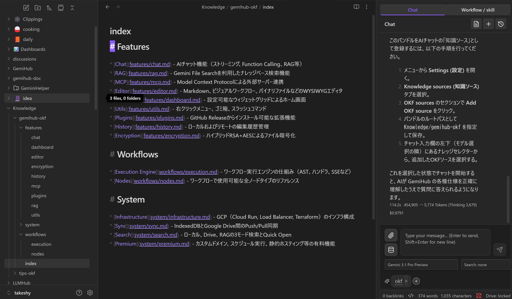

# OKF Knowledge Sources

Gemini Helper can use Open Knowledge Format (OKF) bundles as chat knowledge sources.

OKF is separate from Agent Skills. Skills define reusable behavior, references, and optional workflows. OKF provides curated domain knowledge, such as concepts, metrics, datasets, glossaries, and playbooks, that should be available to chat across conversations.

## Configure OKF

1. Open Gemini Helper settings.
2. Go to **Knowledge sources**.
3. Turn **OKF** on.
4. Set the OKF directory path.


Paths can be:

- `Knowledge` (default)
- `.Knowledge` if you want Obsidian to hide the folder
- Another vault-relative directory, such as `Knowledge/okf`
- An absolute desktop path, such as `C:\repos\knowledge-catalog\okf`

Absolute paths require desktop Obsidian because mobile Obsidian does not expose filesystem access outside the vault.

## OKF Format

OKF is a Markdown-based knowledge bundle format. Each concept is usually a Markdown file with YAML frontmatter:

```markdown
---
type: Metric
title: Monthly recurring revenue
description: Recurring subscription revenue normalized to a monthly value.
tags:
  - revenue
  - finance
---

# Monthly recurring revenue

MRR is calculated from active paid subscriptions...
```


## What Gets Loaded

When OKF is enabled, Gemini Helper reads Markdown files from the configured directory recursively and injects a compact summary into the chat system prompt. This gives Gemini curated domain context without requiring a separate server.

The loader includes:

- `type`
- `title`
- `description`
- `tags`
- file path
- a short excerpt from the body

`log.md` is skipped. `index.md` is treated as an index document. The loader uses conservative limits so large OKF bundles do not overwhelm the model context.

## Recommended Layout

```text
Knowledge/
  index.md
  metrics/
    mrr.md
    churn-rate.md
  datasets/
    subscriptions.md
  playbooks/
    investigate-revenue-drop.md
  log.md
```

Recommended frontmatter:

```yaml
---
type: Metric
title: Churn rate
description: Percentage of customers lost during a period.
tags:
  - revenue
  - retention
resource: bigquery://project.dataset.table
timestamp: 2026-06-29
---
```

Use normal Markdown links for relationships between OKF documents. If the OKF bundle lives inside the vault, Obsidian wikilinks are also usable, but plain Markdown links are more portable.

## OKF With Skills

Use OKF when you want Gemini to understand a domain consistently. Use a skill when you want Gemini to follow a specific process or run an action. Use both when the AI needs domain context and repeatable behavior.



Example:

1. Maintain product metrics, dataset definitions, and incident playbooks in `Knowledge/`.
2. Enable OKF in **Settings -> Knowledge sources**.
3. Install or create a skill that knows when to use that knowledge and which workflow to run.

## Suggested Workflow

1. Maintain an OKF bundle in `Knowledge`, `.Knowledge`, or another directory.
2. Enable OKF in Gemini Helper settings.
3. Combine OKF with skills when the task needs both domain context and reusable actions.

## Limitations

- OKF content is injected as prompt context, not uploaded to Gemini File Search automatically.
- Large OKF bundles are summarized with file and character limits.
- Absolute filesystem paths only work on desktop Obsidian.
